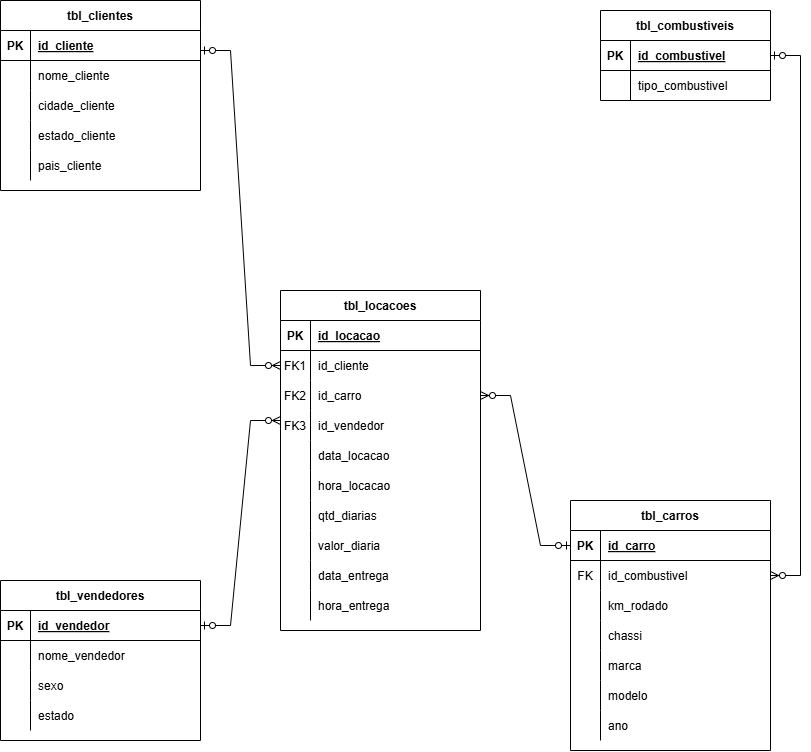
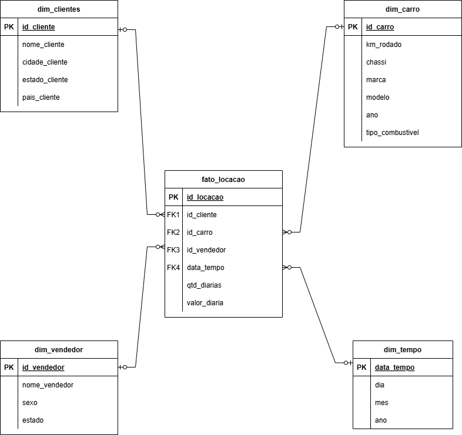

# 🚀 Desafio 

## 📌 Resumo

Por meio desse desafio pude ter meu primeiro contato com uma atividade voltada à modelagem de dados. A seguir estarei compartilhando o passo a passo de como foi o processo de construção do modelo relacional e dimensional:

### Modelo relacional
Para a construção do modelo relacional é necessário fazer a normalização de dados, com o objetivo de evitar redundâncias, garantir integridade e facilitar futuras análises. Inicialmente foi necessário compreender a base de dados concessionária observando as entidades, os dados e sua formatação. Após essa identificação fui criando uma tabela para as principais entidades com seus respectivos atributos, criando uma chave primária (de identificação) para cada uma, além disso, também criei chaves estrangeiras para realizar ligação entre tabelas. Após esse tratamento o modelo está mais organizado e reduziu redundâncias. Segue o código utilizado:

[Modelo Relacional](./etapa-1/modelo_relacional.sql)

Para a construção do diagrama entidade-relacionamento utilizei a ferramenta draw.io, onde fiz a ligação entre tabelas informando o tipo de ligação. Como pode ver a seguir:

### Modelo Dimensional

Nesse modelo vamos construir as tabelas no formato de fatos, contém os dados quantitativos e métricas que queremos analisar, e dimensões, os detalhes descritivos que ajudam a entender os fatos. A partir do modelo relacional anterior criei views que representam as tabelas no formato de estrela. A primeira tabela foi a dimensão tempo, onde foi criada a partir da data da locação, ela separa a data em  dia, mês e ano, ficando mais fácil fazer análises temporais. A segunda foi a dimensão cliente, em que copiou os dados do cliente direto da tabela original, permitindo cruzar métricas com características dos cliente. A terceira foi a dimensão carro, na qual junta dados dos carros com o tipo de combustível, que originalmente estava em outra tabela. A última dimensão foi  vendedor, onde mostra os dados dos vendedores. Por fim, criei a tabela fato locação na qual incluí as métricas principais, além dos IDs das dimensões para realizar a ligação entre elas. Segue o código utilizado:

[Modelo Dimensional](./etapa-2/modelo_dimensional.sql)

Para a construção do diagrama entidade-relacionamento utilizei a ferramenta draw.io, onde fiz a ligação entre tabelas informando o tipo de ligação. Como pode ver a seguir:

Dessa forma, consegui tratar a base de dados fornecida inicialmente, tornando a análise  mais simples, rápida e eficiente.