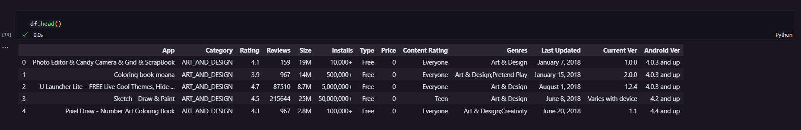
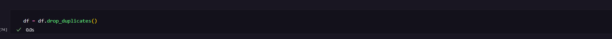
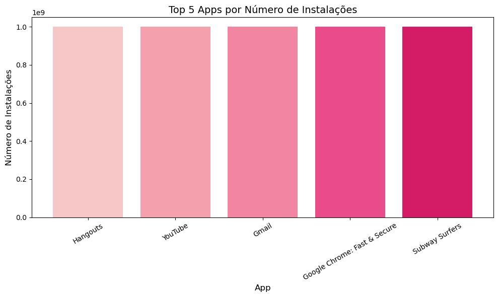
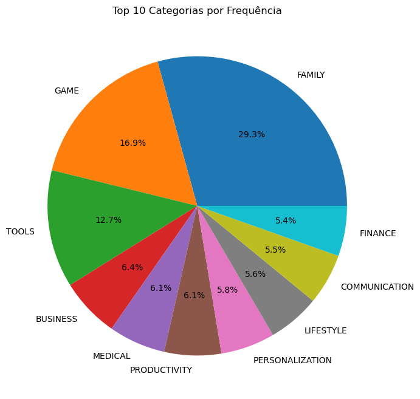
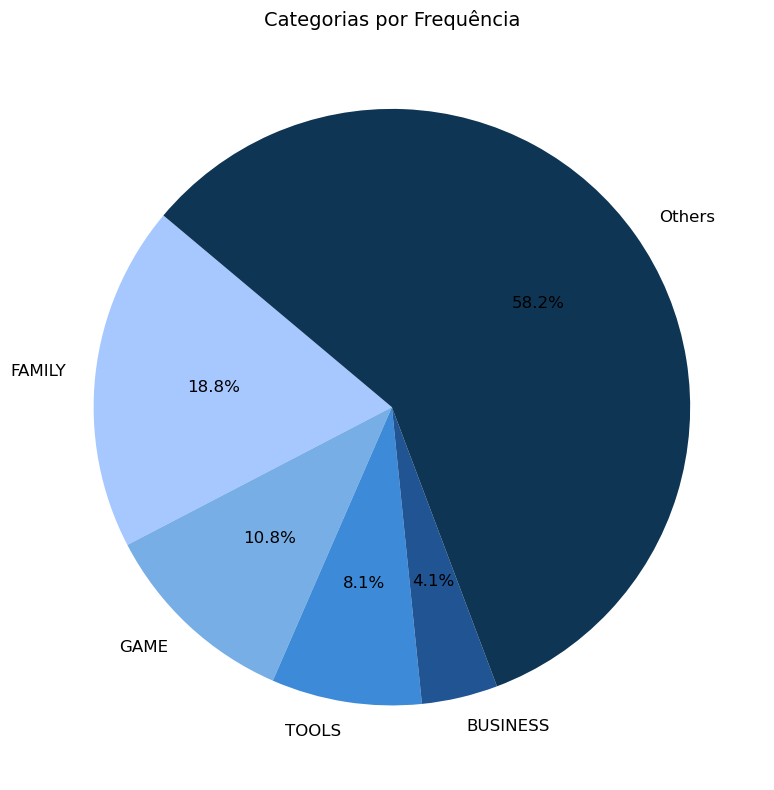
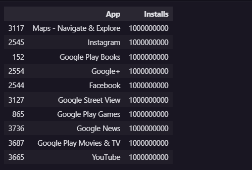
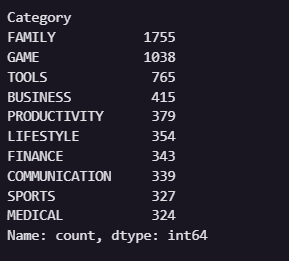
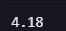
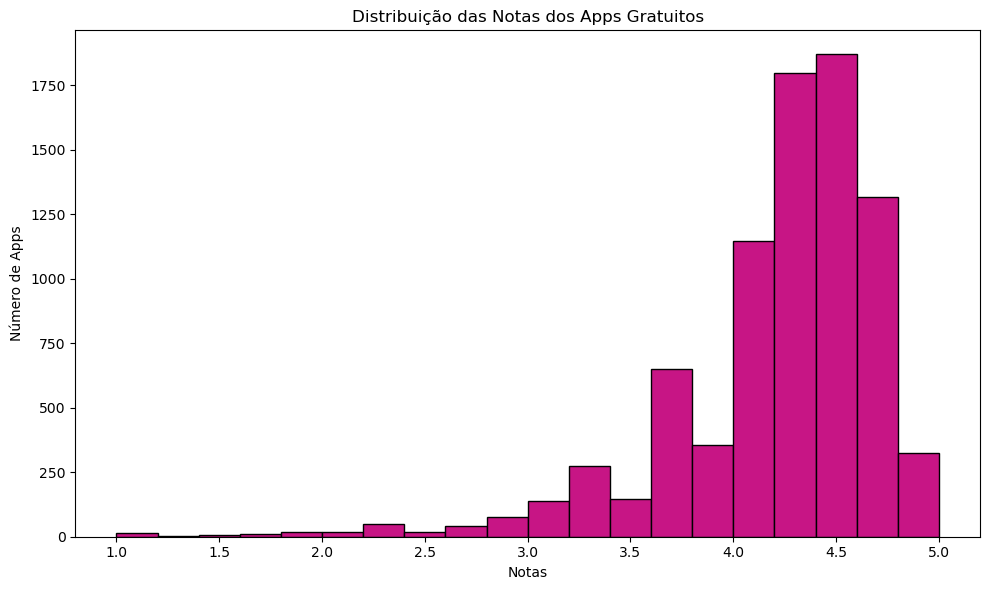
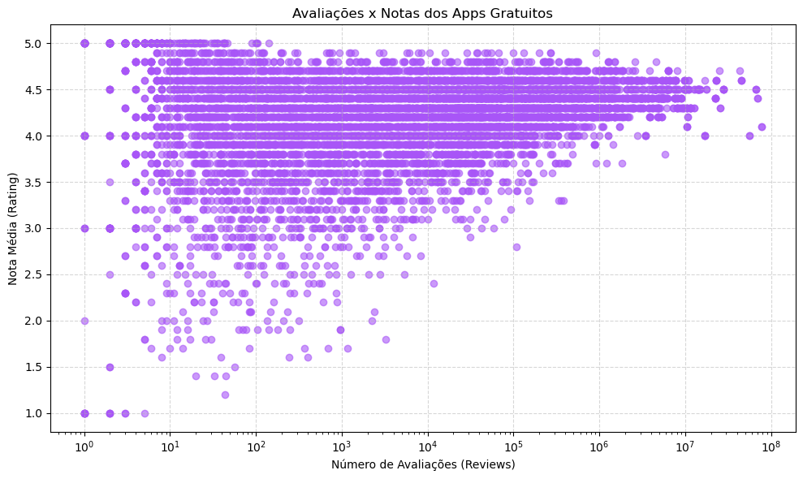

# 🚀 Desafio 

## 📌 Resumo

Nesse desafio, foi realizada a leitura do arquivo de estatísticas da Loja Google (googleplaystore.csv) a fim de processar seus dados e gerar gráficos para análises. Para seu desenvolvimento, utilizei as bibliotecas Pandas e Matplotlib. Além disso, também segui uma sequência de ações nas quais estarei detalhando um pouco mais sobre os códigos que usei para execução dos passos. Utilizei o Jupyter para resolução do desafio. Compartilho a seguir o *Arquivo Jupyter* e o arquivo  *googleplaystore.csv*:

- [Arquivo Jupyter](./etl_googleplaystore.ipynb) 
- [googleplaystore.csv](./googleplaystore.csv) 

 

---
## Etapas do Desafio

Antes de começar de fato as etapas do desafio, fiz a preparação do ambiente, onde baixei o Anaconda, a extensão do Jupyter no VSCode e as instalações das bibliotecas Pandas e Matplotlib. Após isso, fiz o download do arquivo de estatísticas da Loja do Google *googleplaystore.csv*. 

 

> ###  Análise inicial: 

Inicialmente importei as bibliotecas Pandas, que será usada para carregar, manipular e tratar os dados, e Matplotlib, que será usada para criar gráficos. Para ler o arquivo e armazená-lo no DataFrame (df) utilizei a biblioteca Pandas e fiz a análise inicial dos dados.

Para analisar os dados do CSV comecei com df.head() para visualizar as primeiras linhas e entender um pouco mais sobre as colunas e como os dados estão organizados, por meio do df.shape vi suas dimensões, com df.info() pude ver outras informações da base, usei df.nunique() para verificar os valores únicos existentes em cada coluna e com df.isnull().sum() visualizei quantidade dos valores vazios das colunas.

Segue as informações referentes às primeiras linhas:

 

> ###  Etapa 1: 

Após a análise inicial dos dados e compreendendo um pouco mais sobre a nossa base segui com as etapas solicitadas no desafio. Inicialmente é pedido a remoção de linhas duplicadas, assim, utilizei a função df.drop_duplicates() que remove linhas duplicadas em um DataFrame.

 

> ###  Etapa 2: 

Nessa etapa, é pedido um gráfico de barras contendo os top 5 apps por número de instalações. No entanto, na primeira tentativa de rodar o código foi observado que na coluna Installs existia uma linha que continha valor não numérico, com a palavra "Free" que provavelmente ocorreu por erro no preenchimento. Assim, seria necessário conversar com o time de negócio para verificar a importância dessa linha na análise final ou se pode ser excluída. Para fins do exercício eu estarei filtrando apenas os valores válidos na coluna, utilizei a função str.contains() e passei o padrão dos valores, também usei o argumento na=False para ignorar valores nulos. Em seguida, por meio do str.replace() removi os sinais de vírgula e +, o que permitiu a conversão para inteiro, assim, é possível fazer a ordenação posteriormente.

Para elaboração do gráfico primeiramente fiz a ordenação do top 5 intalações, onde usei a função sort_values() com o parâmetro ascending=False para ficar de forma decrescente e head(5) para selecionar o top 5. Quanto ao gráfico, defini uma paleta de cores com  códigos hexadecimais, criei uma figura com tamanho ajustado, por meio da função plt.bar() gerei o gráfico de barras verticais, incluí o título do gráfico com plt.title(), fiz a definição dos rótulos dos eixos x e y e, para melhorar a visualização dos nomes dos apps, girei o rótulo em 30°. Finalizei ajustando automaticamente o layout e pedindo para exibir.

 

> ###  Etapa 3: 

Nessa etapa, pede-se para fazer um gráfico de pizza mostrando as categorias de apps existentes no dataset de acordo com a frequência em que elas aparecem. Na primeira vez que fiz a construção do gráfico achei um pouco poluído visualmente, assim, fiz um outro gráfico selecionando as top 4 categorias por frequência e classificando o que sobrou como 'others' como uma forma de deixar mais limpo a visualização. Dessa forma, entregaria os dois gráficos para o time de negócios e eles avaliariam qual seria mais interessante naquele momento.

- Primeiro Gráfico:

Para construção do gráfico, primeiramente utilizei o método value_counts() para contar a frequência de cada categoria presente na coluna Category. Em seguida, defini o tamanho da figura e com a função plt.pie() para criei um gráfico de pizza com as 10 categorias mais frequentes, depois coloquei o título e pedi para exibir o resultado.

- Seguno Gráfico:

Para construção desse segundo gráfico, selecionei as 4 categorias mais frequentes com fatiamento e para as outras categorias  que sobraram somei os valores restantes e armazenei na variável others, depois fiz a concatenação desse top 4 com others. 
Para visualização do gráfico defini uma paleta azul associando uma cor para cada fatia, utilizei plt.pie() para criar o gráfico de pizza e configurei os rótulos, cores, porcentagens automaticas, ângulo de início do gráfico, além de ajustar a fonte e o layout final.

 

> ###  Etapa 4: 

Nessa etapa é solicitado mostrar o app mais caro existente no DataFrame. Para resolução dessa questão será utilizada a coluna Price, observando o formato dos valores dessa coluna vi que possuíam o $. Dessa forma, usei str.replace() para remover o símbolo e transformei os valores em números. Depois, usei uma filtragem condicional para localizar o app com o maior valor no DataFrame, finalizei com a exibição das colunas App e Price.

 

> ###  Etapa 5: 

É pedido para mostrar quantos apps são classificados como 'Mature 17+*. Para essa questão filtrei o DataFrame para selecionar apenas as linhas onde a coluna Content Rating é igual a Mature 17+. Depois, usei .shape[0] para contar quantas linhas existem nesse novo DataFrame, o que equivale à quantidade de apps com essa classificação. 

 

> ###  Etapa 6: 

É solicitado o top 10 apps por número de reviews bem como o respectivo número, além de ordenar a lista de forma decrescente por número de reviews. Primeiramente converti a coluna Reviews para valores numéricos, uma vez que antes era do tipo object, usei também o argumento errors='coerce' para transformar em NaN os registros que não puderem ser convertidos. Em seguida, ordenei o DataFrame pela coluna Reviews, em ordem decrescente e selecionei os 10 primeiros registros da lista ordenada, finalizei exibindo as colunas App e Reviews.

 

> ###  Etapa 7: 

É solicitado a criação de pelo menos mais 2 cálculos sobre o dataset e apresentar um em formato de lista e outro em formato de valor.

- Top 10 apps gratuitos com maior número de instalações: 
Comecei a questão filtrando apenas os aplicativos gratuitos no DataFrame original, utilizei drop_duplicates() para remover registros duplicados com base no nome do app, para que cada aplicativo apareça apenas uma vez na análise. Após isso, ordenei os apps pelo número de instalações de forma decrescente e selecionei os 10 primeiros registros. Por fim, exibi as colunas App e Installs para apresentar os resultados.

    

- top 10 categorias com mais apps gratuitos:
Para resolução dessa questão usei a mesma variável da questão anterior (apps_gratuitos). Para contar quantos apps gratuitos existem em cada categoria utilizei value_counts() sobre a coluna Category e selecionei apenas as 10 categorias com mais ocorrências. Por fim, exibi diretamente o  resultado, que mostra as categorias e as respectivas quantidades de apps gratuitos.

    

- Média das notas dos apps gratuitos:
Utilizei a mesma variável usada anteriormente (apps_gratuitos), assim, calculei a média das notas por meio do .mean() na coluna Rating e arredondei o valor resultante para duas casas decimais com a função round(). 

    

 

> ###  Etapa 8: 

Nessa etapa é solicitado a elaboração de pelo menos outras 2 formas gráficas de exibição dos indicadores acima utilizando a biblioteca Matplotlib.

- Distribuição das Notas dos Apps Gratuitos:
Este gráfico (histograma) mostra a distribuição das notas dos apps gratuitos, permitindo visualizar como as avaliações estão distribuídas. Para sua construção, inicialmente utilizei a função plt.figure() para definir o tamanho do gráfico. Considerando a elaboração do histograma, usei a função plt.hist() e passei a coluna Rating dos apps gratuitos como base, definindo 20 faixas de agrupamento. Depois, ajustei as cores da barra, contorno, os rótulos dos eixos, o título principal e finalizei ajustando o layout com plt.tight_layout() para evitar sobreposição de elementos e exibi o gráfico.

    
    

- Relação entre Avaliações e Notas dos Apps Gratuitos:
Esse gráfico (dispersão) permite visualizar a relação entre o número de avaliações e a nota média dos apps gratuitos. Assim poderemos analisar se apps com muitas avaliações tendem a ter notas mais altas ou mais baixas, se há algum padrão entre popularidade e qualidade percebida, se existem outliers, dentre outros. Para construção desse gráfico utilizei a função plt.scatter() para criar um gráfico de dispersão, para o eixo X coloquei o número de Reviews e, no eixo Y, as notas médias dos apps gratuitos. Além disso, utilizei a função plt.xscale('log'), que aplica escala logarítmica no eixo X, já que o número de avaliações varia muito entre os apps, adicionei um nível de transparência para facilitar a visualização de sobreposição de pontos e adicionei uma grade ao fundo com plt.grid() para facilitar a leitura dos valores. Finalizei com título e rótulos nos eixos, e por fim, exibi o gráfico.

    