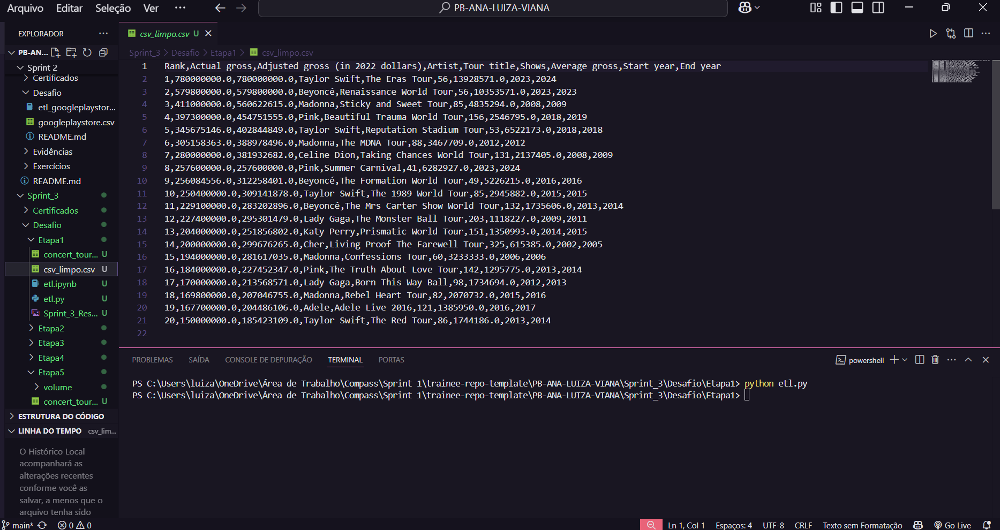
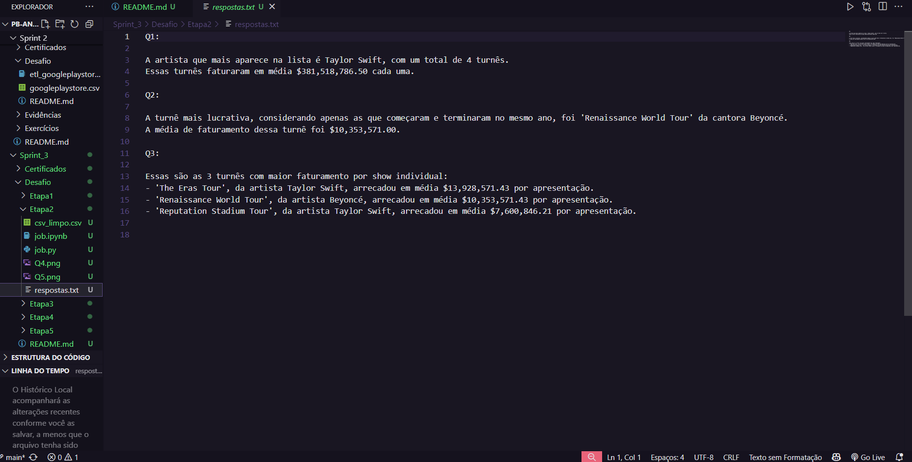
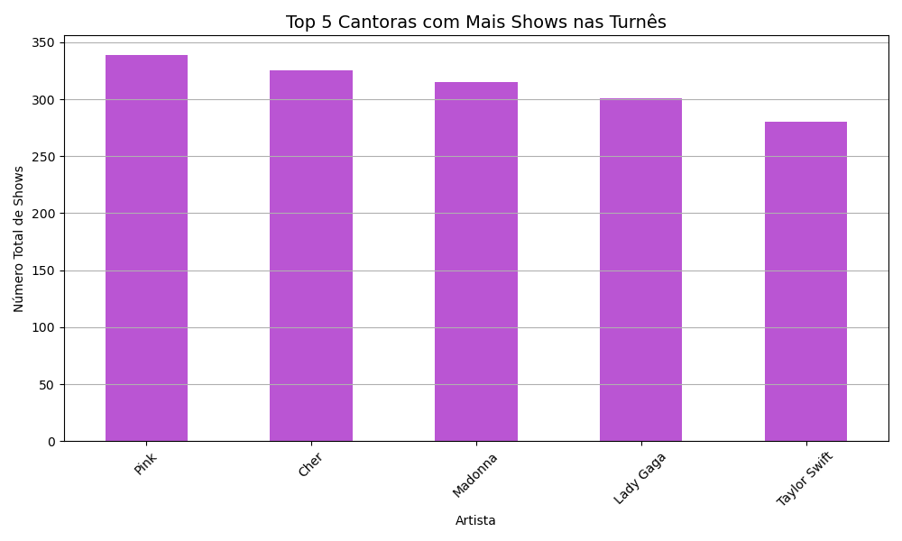
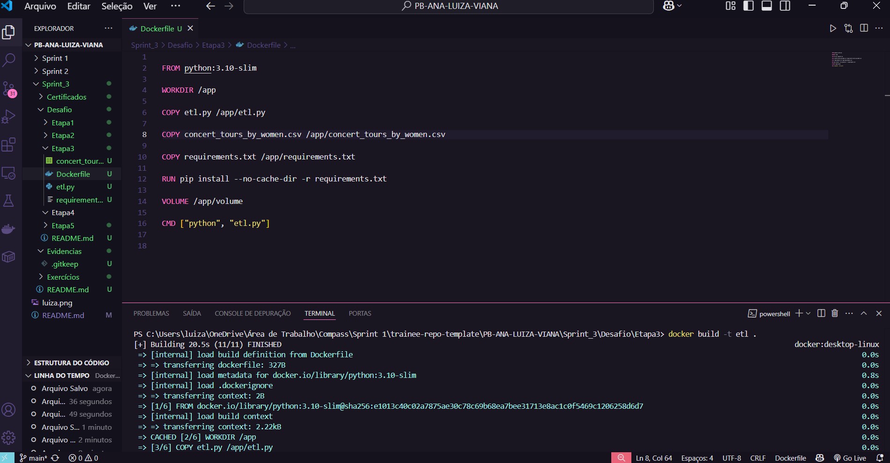
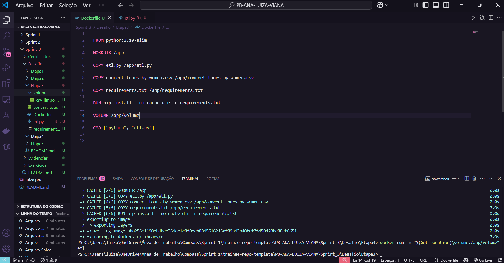
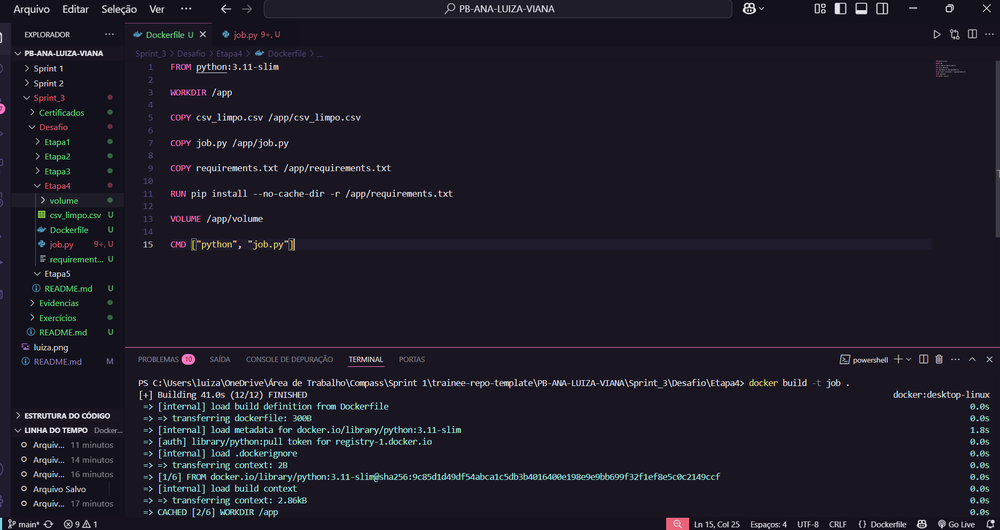
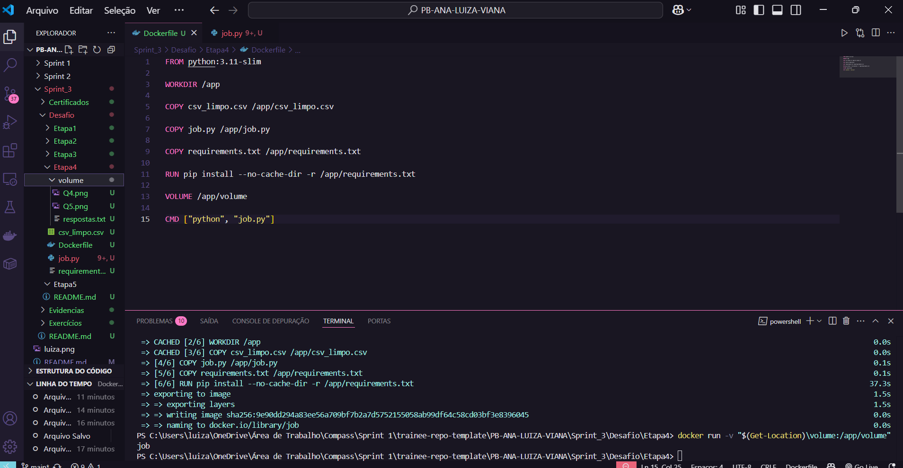
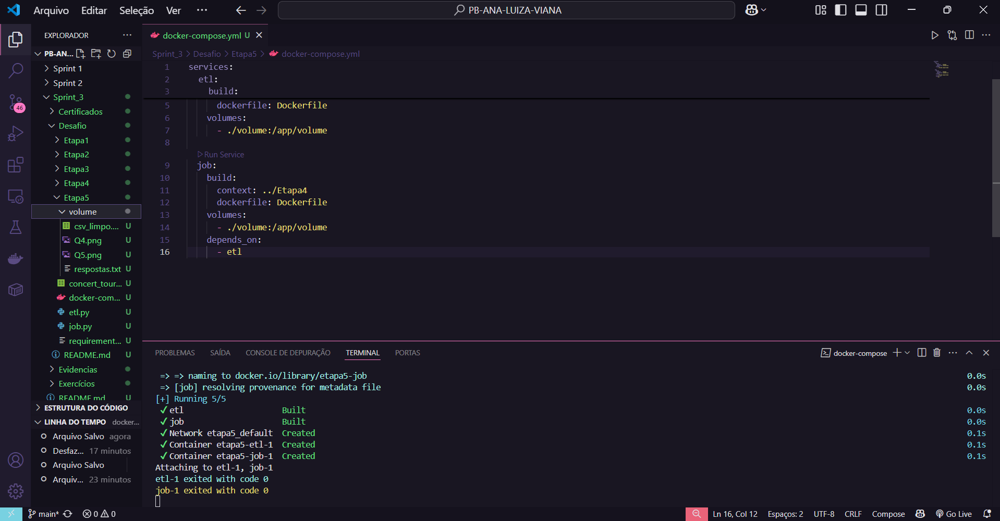

# 🚀 Desafio 

## 📌 Resumo

Nesse desafio, 

Neste desafio da Sprint 3, realizei o processamento de dados do arquivo "concert_tours_by_women.csv" sobre turnês de artistas femininas, com o objetivo de limpar, transformar e analisar os dados, além de gerar visualizações gráficas e reponder algumas questões.

Para isso, realizei um script em python chamado *etl.py* que fez a limpeza dos dados. Em seguida, desenvolvi um segundo script, o *job.py* para realizar análises e gerar respostas e gráficos com auxílio das bibliotecas Pandas e Matplotlib.

Todo o projeto foi containerizado com Docker e orquestrado com Docker Compose, simulando um ambiente realista de execução em múltiplos containers, com compartilhamento de dados via volume. O desenvolvimento foi organizado em etapas, desde a prototipação inicial até a execução final integrada, detalhadas nas seções a seguir.

## 🗂️ Sumário 

1. [Etapa 1](#etapa-1)
2. [Etapa 2](#etapa-2)
3. [Etapa 3](#etapa-3)
4. [Etapa 4](#etapa-4)
5. [Etapa 5](#etapa-5)

 

---

# Etapa 1

Nessa etapa do desafio, foi realizada a leitura de um arquivo oriundo de webscraping, o csv *concert_tours_by_women.csv* em que possui dados referentes às turnês de cantoras. Assim,  fiz um tratamento de dados inicial para posteriormente analisar as informações contidas no mesmo. Segui uma sequência de ações no Jupyter Notebook denominado *etl.ipynb* onde usei como protótipo do código para detalhar um pouco mais textualmente sobre os códigos que usei para execução dos passos, além de ir acompanhando os resultados. Após finalizar, passei o código completo para o *etl.py*, segui o modelo da imagem fornecida no desafio para que ao final fosse obtido o arquivo *csv_limpo.csv*. Para verificar se ocorreu tudo certo coloquei o comando "python etl.py" no terminal onde me retornou o *csv_limpo.csv*.

| Arquivo | Link |
|--------|------|
| concert_tours_by_women | [🔗 concert_tours_by_women](./Etapa1/concert_tours_by_women.csv) |
| etl.ipynb| [🔗 etl.ipynb](./Etapa1/etl.ipynb) |
| etl.py | [🔗 etl.py](./Etapa1/etl.py) |
| csv_limpo | [🔗 csv_limpo](./Etapa1/csv_limpo.csv) |

 

*Resultado final:*

 

---

# Etapa 2

Nessa 2° etapa do desafio, será realizada a leitura do arquivo "csv_limpo.csv" que limpamos na Etapa 1 e, logo após, realizado o processamento de dados para gerar as respostas das perguntas Q1, Q2, Q3, Q4 e Q5 na formatação pedida. Assim, como o arquivo já estava tratado eu não precisei realizar o tratamento, porém, usei o Jupyter Notebook *job.ipynb* para já poder ir visualizando os resultados das perguntas e também detalhar o meu passo a passo. Após finalizar, passei o código completo para o *job.py*. Para verificar se ocorreu tudo certo coloquei o comando "python job.py" no terminal onde me retornou os arquivos *respostas.txt*, *Q4.png* e *Q5.png*.

| Arquivo | Link |
|--------|------|
| csv_limpo | [🔗 csv_limpo](./Etapa2/csv_limpo.csv) |
| job.ipynb| [🔗 job.ipynb](./Etapa2/job.ipynb) |
| job.py | [🔗 job.py](./Etapa2/job.py) |

 

> *Resultado final:*

- [respostas.txt](./Etapa2/job.py) 

 

- Q4.png 

 

- Q5.png 

 

---
# Etapa 3

Nesta etapa do desafio, o objetivo foi criar um container Docker para executar o script etl.py, responsável pela limpeza dos dados. Para isso, organizei os arquivos na pasta Etapa3, incluindo o script etl.py, o arquivo original concert_tours_by_women.csv, o requirements.txt com a biblioteca pandas, e uma pasta volume destinada ao armazenamento do arquivo de saída csv_limpo.csv.

Criei um Dockerfile utilizando a imagem base python:3.10-slim, que oferece um ambiente enxuto e funcional. Depois disso, defini o diretório de trabalho do container com o comando WORKDIR /app, estabelecendo que todas as ações subsequentes aconteceriam dentro desse diretório. A partir daí, copiei para dentro do container os arquivos essenciais para a execução: o script etl.py, o CSV original e o requirements.txt. Com os arquivos no ambiente do container, instalei as dependências usando o comando de instalação do pip, que leu o requirements.txt e instalou o pacote necessário, evitando o uso de cache para manter a imagem mais leve.

Para garantir que o arquivo de saída pudesse ser acessado externamente, adicionei um volume no caminho /app/volume. Esse volume foi pensado para permitir que a saída do processo de ETL, o arquivo csv_limpo.csv, fosse salva fora do container, possibilitando o uso em etapas posteriores. Também modifiquei o script etl.py para que escrevesse a saída diretamente dentro da pasta /app/volume.

Após configurar o Dockerfile, utilizei o terminal para construir a imagem com o comando docker build -t etl ., dentro da pasta Etapa3. Com a imagem criada, executei o container utilizando docker run -v "$(Get-Location)\volume:/app/volume" etl, que conecta a pasta local volume ao volume do container, garantindo o compartilhamento do arquivo de saída. Ao final da execução, confirmei que o arquivo csv_limpo.csv foi gerado corretamente na pasta local volume, validando que o processo de ETL foi executado com sucesso dentro do ambiente Docker.

| Arquivo | Link |
|--------|------|
| concert_tours_by_women | [🔗 concert_tours_by_women](./Etapa3/concert_tours_by_women.csv) |
| etl.py | [🔗 etl.py](./Etapa3/etl.py) |
| Dockerfile | [🔗 Dockerfile](./Etapa3/Dockerfile) |
| Requirements | [🔗 Requirements](./Etapa3/Requirements.txt) |
| csv_limpo | [🔗 csv_limpo](./Etapa3/csv_limpo) |

 

> *Resultado final:*

- Construção da Imagem

 

- Execução do Container

 

---
# Etapa 4

Nesta etapa do desafio, o objetivo foi criar um container Docker para executar o script job.py, responsável pelo processamento dos dados e geração das respostas e gráficos com base no arquivo csv_limpo.csv, produzido na etapa anterior. Para isso, organizei a pasta Etapa4 incluindo o arquivo csv_limpo.csv, o script job.py, o requirements.txt com as bibliotecas pandas e matplotlib e uma pasta volume onde seriam salvos os arquivos de saída.

Criei um Dockerfile com base na imagem python:3.11-slim, que oferece leveza e compatibilidade com as bibliotecas utilizadas. Defini o diretório de trabalho como /app e copiei os arquivos para dentro do container: o script job.py, o CSV limpo e o requirements.txt. Em seguida, instalei as dependências com pip, sem armazenar cache, para manter a imagem final mais leve. Também configurei um volume em /app/volume e adaptei o script job.py para que todos os arquivos gerados, o respostas.txt, Q4.png e Q5.png, fossem salvos diretamente nessa pasta.

Com a estrutura pronta, utilizei o comando pipreqs para gerar o requirements.txt com as bibliotecas exatas utilizadas. Depois, construí a imagem Docker com docker build -t job . e executei o container utilizando docker run -v "$(Get-Location)\volume:/app/volume" job, conectando a pasta local volume ao volume do container. Após a execução, os arquivos de saída foram corretamente salvos na pasta local.

| Arquivo | Link |
|--------|------|
| csv_limpo | [🔗 csv_limpo](./Etapa4/csv_limpo) |
| job.py | [🔗 job.py](./Etapa4/job.py) |
| Dockerfile | [🔗 Dockerfile](./Etapa4/Dockerfile) |
| Requirements | [🔗 Requirements](./Etapa4/Requirements.txt) |

 

> *Resultado final:*

- Construção da Imagem

 

- Execução do Container

 

---

# Etapa 5

Nesta etapa do desafio, foi solicitado que a execução do processo completo ocorresse exclusivamente por meio de um arquivo docker-compose, conectando os dois containers construídos nas etapas anteriores. Para isso, organizei todos os arquivos necessários dentro da pasta da Etapa 5, incluindo o arquivo original concert_tours_by_women.csv, o script etl.py da Etapa 3 e o job.py da Etapa 4. Também criei um novo arquivo requirements.txt contendo todas as dependências utilizadas pelos dois scripts.

A estrutura do docker-compose.yml foi construída definindo dois serviços principais que representam cada etapa do processo. O primeiro serviço, chamado etl, é responsável por construir e executar o container que realiza a etapa de extração e transformação dos dados, utilizando o Dockerfile presente na Etapa 3. Já o segundo serviço, chamado job, é encarregado de rodar o container responsável pelo processamento dos dados e geração dos arquivos requeridos, com base no Dockerfile da Etapa 4. Ambos os serviços compartilham um volume chamado /volume, que funciona como um diretório comum para que os arquivos de saída gerados pela etapa etl possam ser acessados diretamente pela etapa job. Além disso, defini a dependência entre os serviços por meio da instrução depends_on, garantindo que o serviço job só inicie após a execução do etl.

Para executar utilizei o comando docker-compose up --build no terminal. Com isso, o pipeline foi executado com sucesso, gerando os arquivos finais esperados na pasta /volume: csv_limpo.csv, respostas.txt, Q4.png e Q5.png.

| Arquivo | Link |
|--------|------|
| concert_tours_by_women | [🔗 concert_tours_by_women](./Etapa5/concert_tours_by_women.csv) |
| etl.py | [🔗 etl.py](./Etapa5/etl.py) |
| job.py | [🔗 job.py](./Etapa5/job.py) |
| docker-compose | [🔗 docker-compose](./Etapa5/docker-compose.yml) |
| Requirements | [🔗 Requirements](./Etapa5/Requirements.txt) |
| csv_limpo | [🔗 csv_limpo](./Etapa5/volume/csv_limpo.csv) |
| respostas.txt| [🔗 respostas.txt](./Etapa5/volume/respostas.txt) |
| Q4.png | [🔗 Q4.png](./Etapa5/volume/Q4.png) |
| Q5.png | [🔗 Q5.png](./Etapa5/volume/Q5.png) |

 

> *Resultado final:*

- Construção da Imagem

 