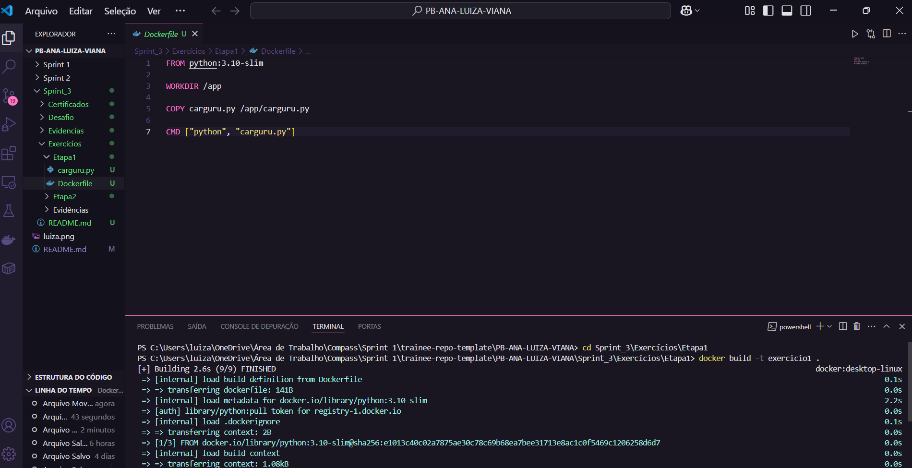
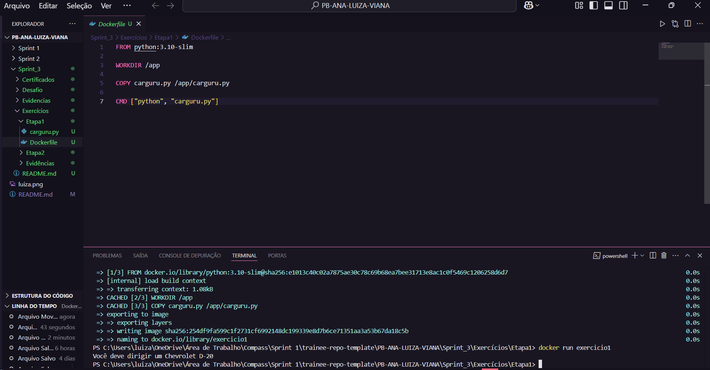
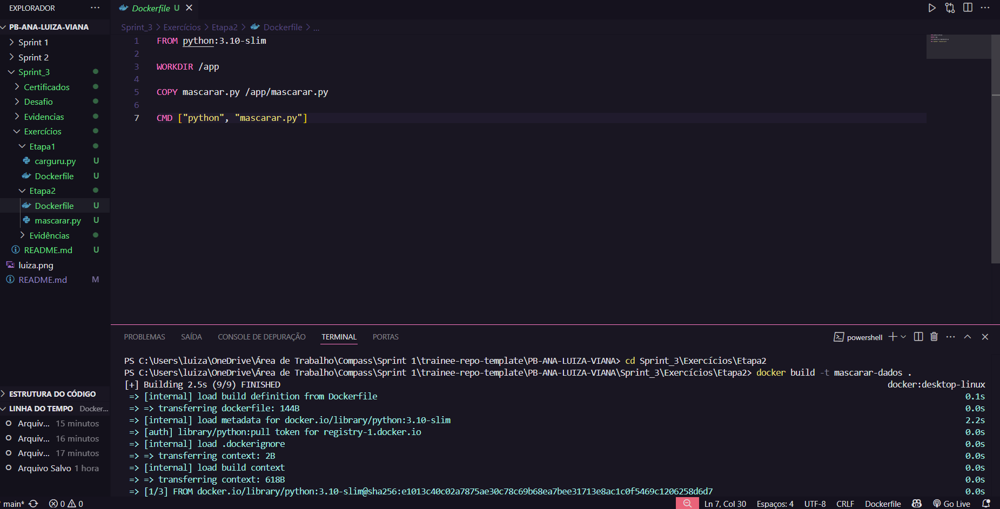
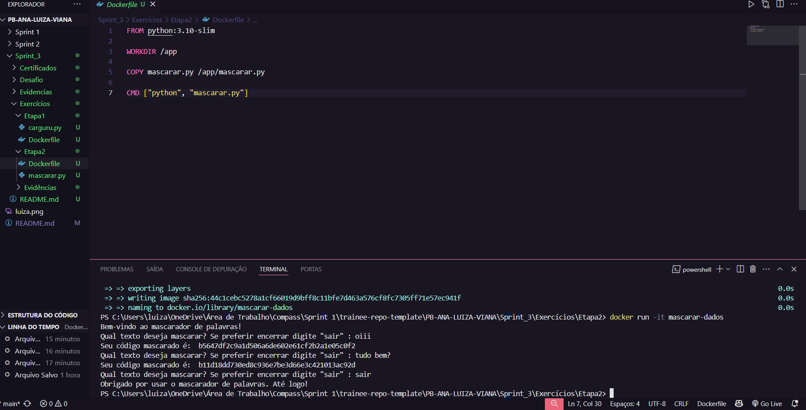

# 🚀 Sprint 3

## 📌 Resumo

Durante a Sprint 3, aprofundei meus conhecimentos em Docker, Regex e alguns conceitos da AWS, por meio de cursos, exercícios e do desafio proposto. Foi meu primeiro contato com esses temas, e essa experiência me permitiu consolidar o aprendizado de maneira prática, dinâmica e colaborativa. As discussões frequentes com os colegas da squad foram essenciais para superar dificuldades e reforçar o entendimento dos conteúdos. Outro ponto positivo foi a monitoria, que proporcionou trocas enriquecedoras e debates interessantes sobre o uso do Docker no dia a dia. A seguir, apresento um resumo dos principais tópicos abordados:

- **Data & Analytics**: Com base nas orientações iniciais, consegui realizar a instalação do Docker e, a partir dos exercícios disponibilizados na Udemy, aprofundei e pratiquei os conceitos aprendidos. Além disso, recebi as instruções necessárias para acessar o AWS Skill Builder e efetuar a inscrição nos cursos indicados.

- **AWS Partner: Accreditation (Technical) (Português)**: Inicialmente, fui direcionada a realizar o curso introdutório AWS Technical Essentials, que me proporcionou uma visao geral dos fundamentos da plataforma. Durante o curso, me familiarizei com o console de gerenciamento da AWS e aprofundei conhecimentos em áreas como banco de dados, armazenamento, redes, monitoramento e segurança. Após concluir essa etapa, dei continuidade com o Accreditation, onde explorei sobre  AWS Cloud Adoption Framework (CAF),  aprendi sobre estratégias de migração de cargas de trabalho para a nuvem e conheci as práticas recomendadas de arquitetura baseadas no AWS Well-Architected Framework.

- **Docker para Desenvolvedores (com Docker Swarm e Kubernetes)**: Esse curso foi bastante completo, pois me permitiu não apenas instalar e configurar o Docker, mas também explorar uma série de funcionalidades essenciais. Aprendi a criar imagens e containers, trabalhar com volumes, utilizar o Docker Compose e o Docker Swarm, criar networks, realizar a orquestração de containers, Kubernetes, além de aplicar o Docker Swarm na AWS. Também tive contato com a linguagem YAML, fundamental para definir configurações nesses ambientes.

- **Guia Completo sobre Regex com Python**: Através desse vídeo, pude aprender sobre expressões regulares, compreendendo sua definição, aplicações e exemplos práticos. Esse conteúdo foi especialmente útil durante a resolução do desafio, facilitando a identificação e o uso adequado das regex.

🤔 *Reflexões*

A Sprint 3 foi especialmente desafiadora para mim, já que foi meu primeiro contato com Docker e AWS. No início, enfrentei algumas dificuldades na configuração do Docker, mas consegui superá-las com o apoio do meu squad. À medida que fui avançando nos exercícios, fui ganhando mais confiança, e concluir o desafio final foi bastante gratificante. Percebo também que já estou conseguindo gerenciar melhor meu tempo em relação às sprints anteriores. A monitoria teve um papel fundamental nesse processo, pois me permitiu acompanhar o uso do Docker na prática e esclarecer diversas dúvidas. Além disso, me sinto muito grata por todo o suporte que venho recebendo dos monitores, da Scrum Master, do meu time e dos demais membros da PB.

 

---

## 🗂️ Sumário 

1. [Desafio](#desafio)
2. [Exercícios](#exercícios)
    - 2.1 [Etapa 1](#21-etapa-1)
    - 2.2 [Etapa 2](#)

3. [Evidências](#evidências)
    - 3.1 [Etapa 1](#31-etapa-1)
    - 3.2 [Etapa 2](#32-etapa-2)

4. [Certificados](#certificados)

 

---

# [Desafio](./Desafio/) 

Nesse desafio da Sprint 3, o objetivo foi colocar em prática os conceitos de ETL, análise de dados e conteinerização com Docker, integrando conhecimentos adquiridos durante o PB e aprofundados em estudos complementares. 

Para realizá-lo, precisei revisar alguns conteúdos de Python, manipulação de arquivos CSV, criação de gráficos e, principalmente, compreender o uso de Docker e Docker Compose para isolar e orquestrar os serviços.

Os arquivos utilizados para a realização do desafio estão organizados em pastas por etapas, acompanhando as fases do desenvolvimento, e podem ser encontrados na *Pasta Desafio*. As evidências do processo estão armazenadas na *Pasta Evidências*, enquanto os resultados finais gerados pela execução do Docker Compose, que simula o compartilhamento de dados entre os containers, estão disponíveis na *Pasta Volume*. Para um detalhamento completo do desafio, recomendo consultar o README da pasta *Readme Desafio*. Seguem os links:

- [Pasta Desafio](./Desafio/) 
- [Pasta Evidências](./Evidências/)
- [Pasta Volume](./Desafio/Etapa5/volume)
- [Readme Desafio](./Desafio/README.md)

Esse desafio foi desafiador e enriquecedor, principalmente pela gama de aprendizado que pude absorver com o Docker e orquestração de containers. Foi gratificante ver tudo funcionando de forma automatizada ao final. Contar com a ajuda dos colegas da Squad e da monitora foi fundamental para a conclusão.

 

---

# [Exercícios](./Exercícios/)

## 2.1 Etapa 1

> Construa uma imagem a partir de um arquivo de instruções Dockerfile que execute o código carguru.py. Após a criação, execute um container a partir da imagem criada.

**Resolução Dockerfile:** 

Criei um Dockerfile na mesma pasta do script carguru.py para montar a imagem Docker. Usei FROM python:3.10-slim como base leve do Python e defini /app como diretório de trabalho com WORKDIR, copiei o script para o container com COPY carguru.py /app/carguru.py e defini o comando padrão de execução com CMD ["python", "carguru.py"].

No terminal, acessei a pasta do projeto com cd e construí a imagem com docker build -t exercicio1 . . Depois, executei com docker run exercicio1, e o container rodou o script com sucesso, exibindo uma frase aleatória. Seguem os arquivos utilizados nessa etapa:

| Arquivo | Link |
|--------|------|
| Script | [🔗 Carguru.py](./Exercícios/Etapa1/carguru.py) |
| Dockerfile | [🔗 Dockerfile](./Exercícios/Etapa1/Dockerfile) |

 

---
## 2.2 Etapa 2

> Agora vamos exercitar a criação dde um container que permita receber inputs durante sua execução. Criar um novo script Python que implementa o algoritmo a seguir: 

>1. Receber uma string via input
>2. Gerar o hash da string por meio do algoritmo SHA-1
>3. Imprimir o hash em tela, utilizando o método hexdigest
>4. Retornar ao passo 1.

>Criar uma imagem Docker chamada mascarar-dados que execute o script Python criado anteriormente. Iniciar um container a partir da imagem, enviando algumas palavras para mascaramento.

**Resolução Script:**

Comecei a questão importando o módulo hashlib, que permite aplicar funções de hash como SHA-1 para mascarar textos. Em seguida, utilizei um laço while True para permitir múltiplas entradas até que o usuário digite "sair".

A entrada é capturada com input() e armazenada na variável input_usuario. Em seguida, é verificado se o texto digitado é "sair" e, se for, o programa exibe uma mensagem de despedida e encerra com break. Caso contrário, aplica-se hashlib.sha1() sobre a string codificada, convertendo o resultado para hexadecimal com .hexdigest(), que é armazenado na variável codigo_mascarado e exibido com print(). Além disso, toda a lógica está protegida por um bloco try/except para tratar possíveis erros de execução.

**Resolução Dockerfile:**

Criei um Dockerfile para construir uma imagem com base na versão leve do Python 3.10, após isso, defini o diretório de trabalho como /app com WORKDIR, copiei o script mascarar.py para dentro da imagem com COPY, e usei CMD para que o script fosse executado automaticamente ao iniciar o container.

No terminal do VSCode, acessei a pasta do projeto com cd e executei docker build -t mascarar-dados . para criar a imagem. Depois, rodei o container com docker run -it mascarar-dados, permitindo interação com o terminal.Durante a execução, inseri textos para mascarar com SHA-1. O programa continuou funcionando até que eu digitasse "sair", encerrando com uma mensagem de despedida. Seguem os arquivos:

| Arquivo | Link |
|--------|------|
| Script | [🔗 Mascarar.py](./Exercícios/Etapa2/mascarar.py) |
| Dockerfile | [🔗 Dockerfile](./Exercícios/Etapa2/Dockerfile) |

 

--- 

# Evidências

## 3.1 Etapa 1

1. Após criar o Dockerfile, abri o terminal no VSCode e utilizei o comando cd Sprint_3\Exercícios\Etapa1 para navegar até a pasta onde salvei os arquivos. Em seguida, executei o comando docker build -t exercicio1 . para construir a imagem com o nome exercicio1.

 

2. Depois que a imagem foi criada com sucesso, utilizei o comando docker run exercicio1 para iniciar um container a partir dessa imagem. Durante a execução, o script carguru.py foi executado automaticamente e exibiu uma mensagem aleatória "Você deve dirigir um Chevrolet D-20". Isso confirma que o container executou corretamente o código Python dentro do ambiente isolado criado pela imagem Docker. Conforme podemos ver na imagem a seguir:

 

---
## 3.2 Etapa 2

1. Após finalizar o Dockerfile, abri o terminal do VSCode e naveguei até o diretório do projeto com cd Sprint_3\Exercícios\Etapa2 , garantindo que o terminal estivesse na mesma pasta do Dockerfile e do script Python. Em seguida, utilizei o comando docker build -t mascarar-dados . para construir a imagem. 

 

2. Depois da imagem criada com sucesso, executei o container com o comando docker run -it mascarar-dados. A flag -it permite a interação com o terminal do container, o que é necessário neste caso, pois o script mascarar.py exige entrada do usuário.

Ao rodar o container, fui capaz de interagir com o programa, digitando palavras para mascarar com SHA-1 e visualizando os respectivos códigos gerados. O programa continuou rodando em loop até que eu digitasse "sair", o que resultou em uma mensagem de despedida antes do encerramento do container. Conforme podemos ver na imagem a seguir:

 

---

# Certificados

Durante essa sprint, concluí os cursos AWS Partner: Accreditation (Technical) (Português) e AWS Technical Essentials. A seguir, compartilho os certificados correspondentes:

| Certificado | Link |
|--------|------|
|AWS Partner: Accreditation | [🔗 Accreditation](./Certificados/Certificado%20AWS%20Partner%20Accreditation%20(Technical)%20(Português).png) |
|AWS Technical Essentials | [🔗 Essentials](./Certificados/Certificado%20AWS%20Technical%20Essentials.png) |
