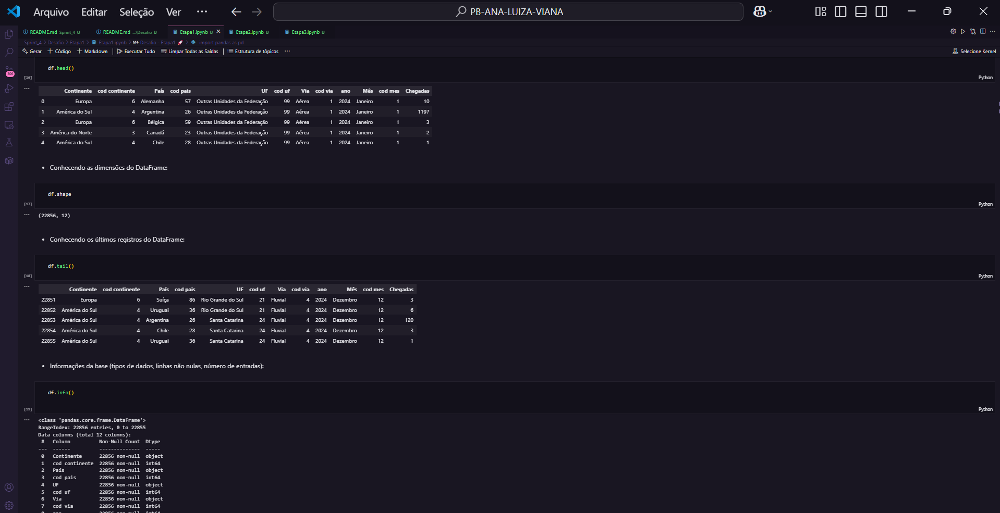
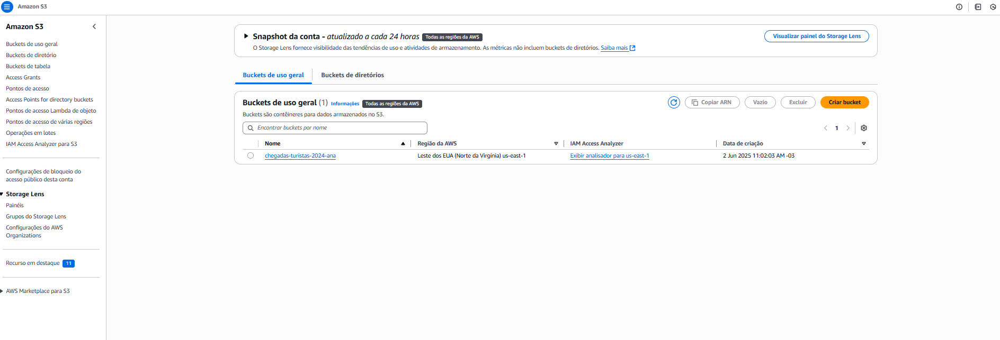
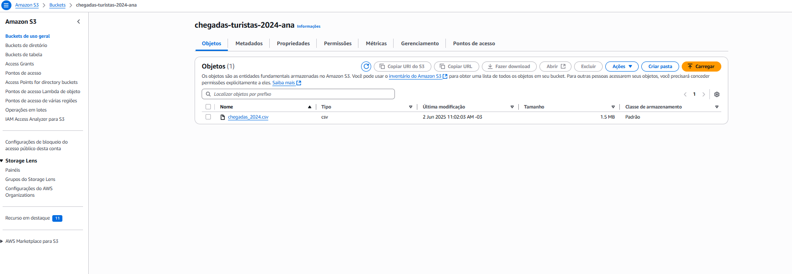
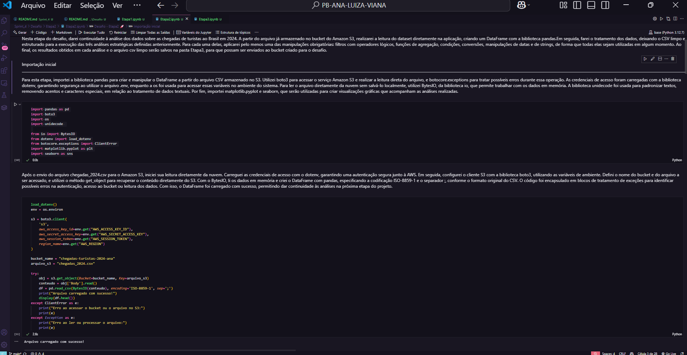
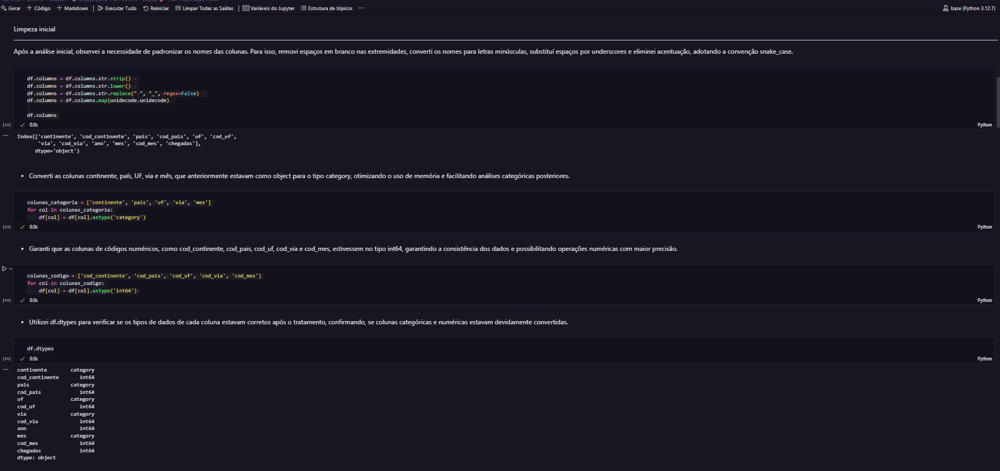
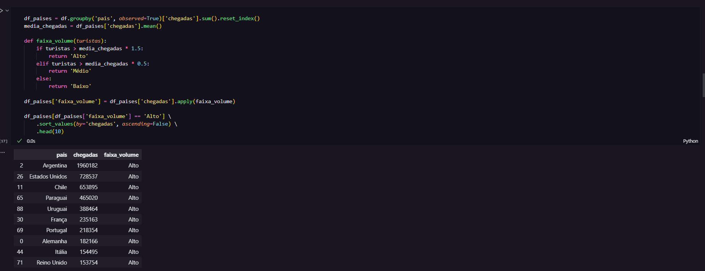
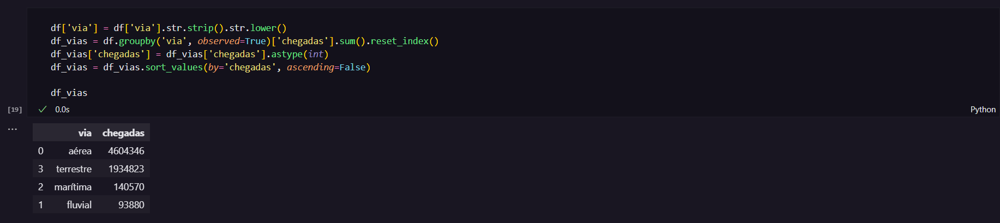
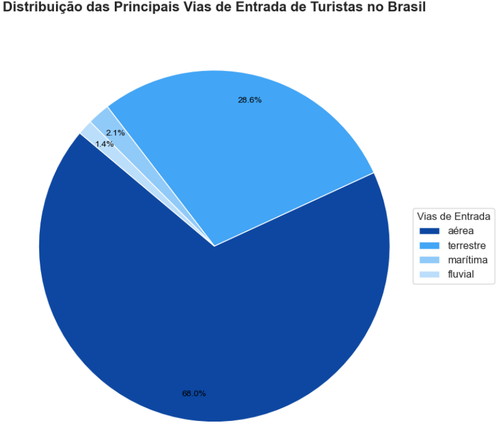
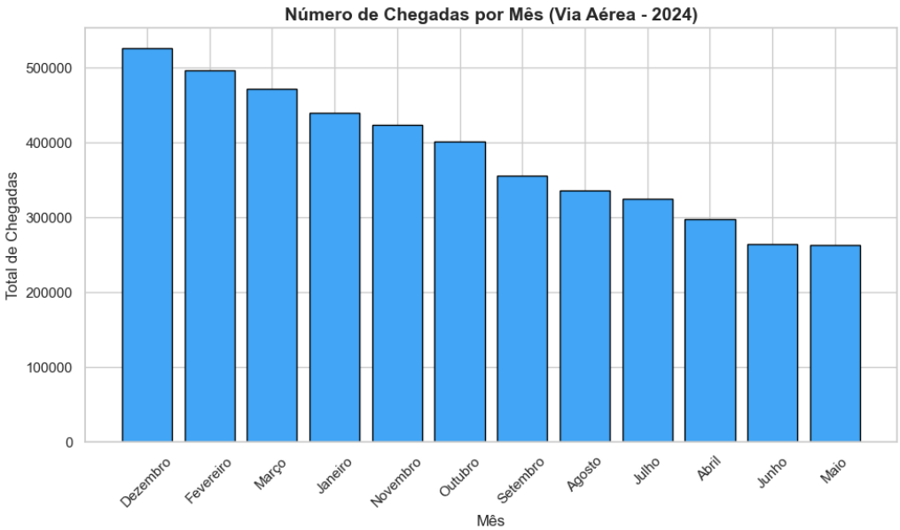
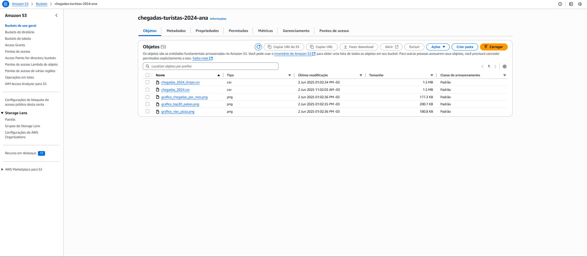

# 🚀 Desafio 

## 📌 Resumo

Neste desafio da Sprint 4, trabalhei com o conjunto de dados "chegadas_2024.csv", que reúne informações sobre a chegada de turistas ao Brasil em 2024. O objetivo foi realizar o tratamento, análise e visualização dos dados, respondendo a questionamentos estratégicos definidos previamente. Na primeira etapa, realizei uma análise exploratória inicial com pandas no Jupyter Notebook. Por meio da análise inicial do arquivo, foi possível identificar as principais informações para compreender o comportamento da chegada de turistas ao Brasil ao longo do ano, baseado nisso, selecionei três questionamentos principais que considerei estratégicos para gerar insights sobre o fluxo turístico no país. Após isso,criei um bucket S3 via script em Python e enviei o arquivo original para a nuvem. 

Na etapa seguinte, li o arquivo do bucket, tratei os dados e apliquei seis tipos de manipulações obrigatórias (filtros com operadores lógicos, funções de agregação, condições, conversões, manipulações de datas e de strings), respondendo aos três questionamentos, também foi gerado gráficos com Matplotlib. Ao final, os resultados obtidos em cada análise e o arquivo csv limpo foram salvos na pasta Etapa3, para que pudessem ser enviados ao bucket criado para o desafio.

Na última etapa, desenvolvi um script para enviar o CSV limpo e os gráficos gerados para o bucket criado anteriormente, utilizando as bibliotecas boto3 e dotenv para autenticação e integração com a AWS. O desenvolvimento foi organizado em etapas, desde a prototipação inicial até a execução final integrada, detalhadas nas seções a seguir, contendo os arquivos e as evidências de cada etapa:

## 🗂️ Sumário 

1. [Etapa 1](#etapa-1)
2. [Etapa 2](#etapa-2)
3. [Etapa 3](#etapa-3)

 

---

# Etapa 1

Nessa etapa do desafio, foi realizada a leitura de um arquivo oriundo do portal de dados públicos do Governo Brasileiro, o csv "chegadas_2024.csv" em que reúne dados relativos às estimativas do fluxo de chegadas de turistas internacionais (incluindo turistas estrangeiros e brasileiros que residem no exterior) ao Brasil, desagregadas por país de residência permanente, por mês e via de acesso (aérea, terrestre, marítima ou fluvial). Assim, foi feito um tratamento de dados inicial para posteriormente analisar as informações contidas no mesmo. Segui uma sequência de ações nas quais estarei detalhando um pouco mais sobre os códigos que usei para execução dos passos. Seguem os arquivos utilizados nessa etapa:

| Arquivo | Link |
|--------|------|
| chegadas_2024 | [🔗 chegadas_2024](./Etapa1/chegadas_2024.csv) |
| Etapa1.ipynb| [🔗 Etapa1.ipynb](./Etapa1/Etapa1.ipynb) |

 

> Explicação do código

**Análise inicial**

Inicialmente importei a biblioteca pandas para análise e tratamento dos dados, durante a análise inicial do conjunto de dados chegadas_2024.csv, ao tentar carregá-lo com pd.read_csv(), ocorreu um erro relacionado à codificação do arquivo. Para identificar o encoding correto, utilizei a biblioteca chardet, que indicou a codificação 'ISO-8859-1'. Após ajustar o parâmetro de codificação, ainda enfrentei um erro de tokenização devido ao separador de colunas, que não era a vírgula padrão. Especificando o separador como ';', foi possível realizar a leitura correta do arquivo e visualizar suas primeiras entradas e informações gerais.

Além disso, importei as bibliotecas boto3 e botocore.exceptions para realizar operações com o serviço Amazon S3, como a criação do bucket e o envio de arquivos para a nuvem. Também utilizei dotenv para carregar variáveis de ambiente armazenadas no arquivo .env, garantindo segurança e flexibilidade na autenticação, a biblioteca os também foi utilizada para acessar essas variáveis carregadas.

Após a leitura bem-sucedida do arquivo, iniciei a exploração preliminar do conjunto de dados com o objetivo de compreender sua estrutura, características gerais e identificar possíveis necessidades de limpeza ou transformação. Utilizei as seguintes funções do pandas: df.head(), df.tail(), df.shape, df.info(), df.nunique() e df.isnull().sum(). 

 

**Questionamentos**

Por meio da análise inicial do arquivo, foi possível identificar as principais informações para compreender o comportamento da chegada de turistas ao Brasil ao longo do ano. Com base nisso, selecionei três questionamentos principais que considero estratégicos para gerar insights sobre o fluxo turístico no país:

1. Classificação dos países por faixas de volume de turistas: a partir dessa análise é possível identificar quais países enviaram mais turistas ao Brasil e quais apresentam menor representatividade;
2. Principais vias de entrada de turistas no Brasil: ajuda a entender por quais principais vias os turistas mais chegam ao país;
3. Meses com maior número de chegadas de turistas via aérea em 2024: mostra a sazonalidade do turismo ao longo do ano por meio das vias aéreas.

 

**Criação do bucket e upload do arquivo**

Após a análise exploratória dos dados do arquivo chegadas_2024.csv, realizei o envio do mesmo para a nuvem utilizando o serviço Amazon S3, garantindo que os dados estejam acessíveis para as próximas etapas do projeto. Inicialmente, carreguei as variáveis de ambiente armazenadas no arquivo .env com a função load_dotenv(), assegurando a segurança das credenciais de autenticação (chave de acesso, segredo e token da sessão). Essas credenciais foram usadas para configurar o cliente do S3 via biblioteca boto3. Defini o nome do bucket como chegadas-turistas-2024-ana e, em seguida, executei sua criação por meio de um bloco try-except, tratando o cenário em que o bucket já exista e seja de minha propriedade. Vale ressaltar que, como a região utilizada foi a us-east-1, a criação do bucket foi realizada sem o parâmetro explícito de região, em conformidade com as regras da AWS para essa localidade. Com o bucket validado, o próximo passo foi o upload do arquivo chegadas_2024.csv, também encapsulado em um bloco de tratamento de exceções para lidar com possíveis falhas durante o envio.

Bucket criado:

Upload do arquivo CSV:

 

# Etapa 2

Nesta etapa do desafio, dei continuidade à análise dos dados sobre as chegadas de turistas ao Brasil em 2024. A partir do arquivo já armazenado no bucket do Amazon S3, realizei a leitura do dataset diretamente na aplicação, criando um DataFrame com a biblioteca pandas.Em seguida, fiz o tratamento dos dados, deixando o CSV limpo e estruturado para a execução das três análises estratégicas definidas anteriormente. Para cada uma delas, apliquei pelo menos uma das manipulações obrigatórias: filtros com operadores lógicos, funções de agregação, condições, conversões, manipulações de datas e de strings, de forma que todas elas fossem utilizadas em algum momento. Ao final, os resultados obtidos em cada análise e o arquivo csv limpo foram salvos na pasta Etapa3, para que pudessem ser enviados ao bucket criado para o desafio.

| Arquivo | Link |
|--------|------|
| Etapa2.ipynb| [🔗 Etapa2.ipynb](./Etapa2/Etapa2.ipynb) |

 

> Explicação do código

**Importação inicial**

Para esta etapa, importei a biblioteca pandas para criar e manipular o DataFrame a partir do arquivo CSV armazenado no S3. Utilizei boto3 para acessar o serviço Amazon S3 e realizar a leitura direta do arquivo, e botocore.exceptions para tratar possíveis erros durante essa operação. As credenciais de acesso foram carregadas com a biblioteca dotenv, garantindo segurança ao utilizar o arquivo .env, enquanto a os foi usada para acessar essas variáveis no ambiente do sistema. Para ler o arquivo diretamente da nuvem sem salvá-lo localmente, utilizei BytesIO, da biblioteca io, que permite trabalhar com os dados em memória. A biblioteca unidecode foi usada para padronizar textos, removendo acentos e caracteres especiais, em relação ao tratamento de dados textuais. Por fim, importei matplotlib.pyplot e seaborn, que foram utilizadas para criar visualizações gráficas que acompanham as análises realizadas.

Após o envio do arquivo chegadas_2024.csv para o Amazon S3, iniciei sua leitura diretamente da nuvem. Carreguei as credenciais de acesso com o dotenv, garantindo uma autenticação segura junto à AWS. Em seguida, configurei o cliente S3 com a biblioteca boto3, utilizando as variáveis de ambiente. Defini o nome do bucket e do arquivo a ser acessado, e utilizei o método get_object para recuperar o conteúdo diretamente do S3. Com o BytesIO, li os dados em memória e criei o DataFrame com pandas, especificando a codificação ISO-8859-1 e o separador ;, conforme o formato original do CSV. O código foi encapsulado em blocos de tratamento de exceções para identificar possíveis erros na autenticação, acesso ao bucket ou leitura dos dados. Com isso, o DataFrame foi carregado com sucesso, permitindo dar continuidade às análises na próxima etapa do projeto.

 

**Limpeza inicial**

Após a análise inicial, observei a necessidade de padronizar os nomes das colunas. Para isso, removi espaços em branco nas extremidades, converti os nomes para letras minúsculas, substituí espaços por underscores e eliminei acentuação, adotando a convenção snake_case.

Converti as colunas continente, país, UF, via e mês, que anteriormente estavam como object para o tipo category, otimizando o uso de memória e facilitando análises categóricas posteriores. Garanti que as colunas de códigos numéricos, como cod_continente, cod_pais, cod_uf, cod_via e cod_mes, estivessem no tipo int64, garantindo a consistência dos dados e possibilitando operações numéricas com maior precisão. Por fim, utilizei df.dtypes para verificar se os tipos de dados de cada coluna estavam corretos após o tratamento, confirmando, se colunas categóricas e numéricas estavam devidamente convertidas.

Após concluir o tratamento inicial dos dados, salvei o DataFrame resultante em um novo arquivo CSV chamado chegadas_2024_limpo.csv, localizado na pasta Etapa3. Utilizei os parâmetros sep=';' e encoding='ISO-8859-1' para manter a compatibilidade com o formato original. O argumento index=False foi especificado para evitar que o índice do DataFrame fosse adicionado como uma coluna no arquivo. Essa versão limpa do dataset também será utilizada nas próximas análises da etapa 2.

 

**Q1: Classificação dos países por faixas de volume de turistas**

Nesta análise, utilizei a função groupby para agrupar os dados por país e somar o total de chegadas de turistas por nacionalidade, consolidando as informações em uma linha por país. Em seguida, calculei a média geral de turistas entre todos os países com mean(), que serviu de base para classificar o volume de chegadas. Para isso, defini a função condicional faixa_volume, que classifica os países em três categorias: Alto, Médio e Baixo, com base em múltiplos da média geral (mais de 1,5 vezes a média é “Alto”, entre 0,5 e 1,5 vezes é “Médio”, abaixo de 0,5 é “Baixo”). A função foi aplicada à coluna chegadas usando apply() para gerar a nova coluna faixa_volume. Por fim, filtrei os países classificados com volume Alto, ordenei os dados de forma decrescente pelo total de chegadas e selecionei os 10 primeiros, destacando as principais nacionalidades que mais visitaram o Brasil.

Manipulações obrigatórias utilizadas:

- Função de agregação: sum() para totalizar as chegadas por país.
- Função condicional: faixa_volume() classifica os valores com base em regras.

 

**Gráfico Q1: Top 20 Países por Chegadas de Turistas ao Brasil**

Para construir o gráfico, selecionei os 20 países com maior número de chegadas de turistas ao Brasil, ordenando o DataFrame df_paises pela coluna chegadas em ordem decrescente e utilizando o método head(20) para filtrar esses países. Defini uma paleta de cores personalizada em tons de azul, associando cores diferentes para cada faixa de volume de turistas. Em seguida, criei um gráfico de barras horizontais com a biblioteca seaborn, configurando o eixo y para os nomes dos países e o eixo x para o número de chegadas. Usei o parâmetro hue para colorir as barras conforme a faixa de volume, apliquei a paleta personalizada e defini dodge=False para que as barras fiquem agrupadas por país. Ajustei o tamanho da figura para uma visualização equilibrada e formatei título, rótulos dos eixos e legenda para melhor clareza. A função tight_layout() organizou os elementos para evitar sobreposições. Após exibir o gráfico com plt.show(), salvei a imagem gerada no caminho definido dentro da pasta Etapa3 com alta resolução (300 dpi), garantindo seu uso nas próximas etapas do projeto.

 

**Q2: Principais vias de entrada de turistas no Brasil:**

Nesta análise, antes de realizar o agrupamento, utilizei funções de string para padronizar os nomes da coluna via, removendo espaços em branco e convertendo todos os textos para letras minúsculas, evitando duplicidades causadas por variações na grafia. Em seguida, agrupei os dados por via de entrada com groupby, somando o total de turistas que chegaram ao Brasil por cada tipo de via. Após o agrupamento, utilizei uma função de conversão para garantir que a coluna chegadas estivesse no tipo inteiro, assegurando consistência no tipo de dado. Por fim, ordenei os resultados de forma decrescente pelo número total de chegadas, permitindo identificar as principais vias de entrada utilizadas pelos turistas.

Manipulações obrigatórias utilizadas:

- Função de agregação: sum() para totalizar o número de chegadas por via.
- Função de string: .str.strip().str.lower() para padronizar os valores textuais da coluna via.
- Função de conversão: astype(int) para garantir o tipo inteiro na coluna chegadas.

 

**Gráfico Q2: Distribuição das Principais Vias de Entrada de Turistas no Brasil**

Este gráfico de pizza mostra a proporção percentual das principais vias de entrada de turistas no Brasil. Para construí-lo, criei as variáveis vias e chegadas, extraídas do DataFrame df_vias, representando os nomes das vias e o total de chegadas, respectivamente. Defini uma paleta de cores em tons de azul para diferenciar as categorias. Utilizei plt.figure() para ajustar o tamanho da imagem e plt.pie() para gerar o gráfico, com autopct='%1.1f%%' para exibir os percentuais, pctdistance e labeldistance para posicionamento dos textos e bordas brancas entre as fatias para facilitar a visualização. Adicionei uma legenda com plt.legend(), formatei os textos com plt.setp(), e finalizei com título, tight_layout() para ajustar os elementos e plt.savefig() para salvar o gráfico na pasta Etapa3 antes de exibi-lo com plt.show().

 

**Q3: Meses com maior número de chegadas de turistas via aérea em 2024**

Nesta análise, apliquei uma filtragem composta para selecionar apenas os registros do ano de 2024 e com via de entrada aérea, utilizando dois operadores lógicos para garantir a precisão da amostra. Antes disso, criei uma nova coluna de data combinando as colunas ano e cod_mes com funções de string e conversão, transformando-as em um objeto datetime. A partir dessa nova coluna, extraí o nome do mês em inglês com dt.strftime(), facilitando a identificação dos períodos. Em seguida, agrupei os dados por código do mês, nome em português e nome em inglês, somando o total de chegadas com a função de agregação sum(). Por fim, ordenei os dados do maior para o menor número de chegadas, destacando os meses com maior volume de turismo internacional por via aérea.

Manipulações obrigatórias utilizadas:

- Cláusula com dois operadores lógicos: filtro por ano e via (== e &).
- Função de data: criação da coluna data com pd.to_datetime() e extração do mês com dt.strftime('%B').

 

**Gráfico Q3: Número de Chegadas por Mês (Via Aérea - 2024)**

Este gráfico de barras mostra o total de turistas que chegaram ao Brasil por via aérea em cada mês do ano de 2024. Para construí-lo, utilizei o DataFrame df_meses_ordenado, que já contém os meses e os respectivos totais de chegadas, ordenados do maior para o menor volume. A função plt.figure() foi usada para definir o tamanho da figura, enquanto plt.bar() gerou as barras, aplicando uma cor azul com bordas pretas para destacar cada mês. Configurei os eixos com os rótulos adequados, adicionei rotação nas categorias do eixo x para melhor leitura e defini um título informativo. Utilizei plt.tight_layout() para garantir o espaçamento adequado dos elementos, plt.savefig() para salvar o gráfico na pasta Etapa3 e finalizei com plt.show() para exibir a visualização.

 

# Etapa 3

Nesta etapa do desafio, foi realizado o envio do arquivo CSV limpo, chegadas_2024_limpo.csv, e dos gráficos gerados na etapa 2 (grafico_top20_paises.png, grafico_vias_pizza.png e grafico_chegadas_por_mes.png) correspondentes aos questionamentos analisados, para o bucket 'chegadas-turistas-2024-ana', criado na etapa 1. Esses arquivos estão armazenados localmente na pasta Etapa3, organizados e prontos para upload, garantindo que os resultados da análise estejam disponíveis de forma estruturada na nuvem.

| Arquivo | Link |
|--------|------|
| Etapa3.ipynb| [🔗 Etapa3.ipynb](./Etapa3/Etapa3.ipynb) |
| chegadas_2024_limpo.csv| [🔗 chegadas_2024_limpo.csv](./Etapa3/chegadas_2024_limpo.csv) |
| grafico_chegadas_por_mes.png| [🔗 grafico_chegadas_por_mes.png](./Etapa3/grafico_chegadas_por_mes.png) |
| grafico_top20_paises.png| [🔗 grafico_top20_paises.png](./Etapa3/grafico_top20_paises.png) |
| grafico_vias_pizza.png| [🔗 grafico_vias_pizza.png](./Etapa3/grafico_vias_pizza.png) |

 

> Explicação do código

**Upload dos arquivos**

Inicialmente importei as bibliotecas necessárias para a interação com o sistema operacional e com a AWS, além do gerenciamento de variáveis de ambiente e tratamento de exceções. A biblioteca os permite manipular caminhos de arquivos e variáveis do sistema operacional. boto3 é o SDK oficial da AWS para Python, utilizado para interagir com serviços da AWS, como o S3, facilitando o upload dos arquivos ao bucket. Para carregar as variáveis de ambiente definidas no arquivo .env, utilizei o load_dotenv da biblioteca dotenv, garantindo que credenciais e configurações sensíveis ficassem protegidas. Por fim, importei ClientError da botocore.exceptions para capturar e tratar erros específicos que possam ocorrer durante a comunicação com a AWS.

Comecei o código carregando as variáveis de ambiente do arquivo .env com load_dotenv(), permitindo acessar as credenciais da AWS de forma segura por meio do dicionário env. Em seguida, inicializei o cliente do S3 usando boto3.client(), passando as credenciais e a região obtidas do ambiente. Defini o nome do bucket S3 onde os arquivos seriam enviados e criei um dicionário arquivos_para_upload, que mapeia os caminhos locais dos arquivos aos nomes que terão no bucket. No loop for, percorri cada arquivo, abrindo em modo binário e utilizando s3.upload_fileobj() para fazer o upload para o bucket. Caso o arquivo local não fosse encontrado, o erro FileNotFoundError era capturado e uma mensagem era exibida. Se houvesse algum problema na comunicação com o S3, a exceção ClientError era tratada com uma mensagem detalhada. Ao final, o código exibe a confirmação do sucesso no envio de cada arquivo.

 

Arquivos carregados no bucket:

