# 🚀 Sprint 4

## 📌 Resumo

Durante a Sprint 4, iniciei meus estudos em cloud computing com foco na AWS. Através dos cursos propostos, tive contato com os principais serviços da plataforma sob diferentes perspectivas. Na segunda semana, reforcei meu aprendizado por meio dos exercícios práticos no Cloud Quest, além dos exercícios propostos e do desafio da PB. Foi meu primeiro contato com a nuvem, a experiência foi bastante positiva e enriquecedora. A seguir, apresento um resumo dos principais tópicos abordados:

- **Data & Analytics**: Com base nas orientações iniciais, consegui realizar a configuração da minha conta na AWS e pude seguir as orientações para realizar os exercícios e o desafio.

- **AWS Skill Builder - AWS Partner: Sales Accreditation (Business) (Portuguese)**: fui introduzida aos principais conceitos e benefícios da computação em nuvem, com foco na proposta de valor da AWS para os clientes. O treinamento destacou como identificar oportunidades de negócios, alinhar as soluções da AWS às necessidades específicas dos clientes e articular os benefícios estratégicos da nuvem. Também aprofundei meu entendimento sobre o modelo de responsabilidade compartilhada, os principais serviços AWS e as práticas recomendadas para conduzir conversas de vendas eficazes, especialmente no contexto de transformação digital e migração para a nuvem.

- **AWS Partner: Economias na nuvem AWS**:  aprofundei meus conhecimentos sobre como a nuvem AWS pode gerar valor financeiro para os clientes. Aprendi a identificar e comunicar os principais benefícios econômicos da adoção da nuvem, como otimização de custos, escalabilidade e modelo de pagamento conforme o uso. O treinamento abordou conceitos como TCO, ROI e os mecanismos que a AWS oferece para controle e visibilidade dos gastos. 

- **AWS Skill Builder - AWS Cloud Quest: Cloud Practitioner**: desenvolvi conhecimentos fundamentais sobre computação em nuvem por meio de uma abordagem interativa e gamificada. Ao longo da jornada, assumi desafios práticos em um ambiente virtual, aplicando conceitos essenciais da AWS, como serviços de computação, armazenamento, banco de dados, redes e segurança. O curso também abordou o modelo de responsabilidade compartilhada, precificação e melhores práticas de arquitetura. 

🤔 *Reflexões*

A Sprint 4 foi especialmente desafiadora para mim, já que foi meu primeiro contato a AWS. No início, enfrentei algumas dificuldades na configuração da instância, mas consegui superá-las com o apoio do meu squad. À medida que fui avançando nos exercícios, fui ganhando mais confiança, e concluir o desafio final foi bastante gratificante. Além disso, me sinto muito grata por todo o suporte que venho recebendo dos monitores, da Scrum Master, do meu time e dos demais membros da PB.

 

---

## 🗂️ Sumário 

1. [Desafio](#desafio)
2. [Exercícios](#exercícios)
    - 2.1 [Lab AWS S3](#21-lab-aws-s3)
    - 2.2 [Lab AWS Athena](#22-lab-aws-athena)
    - 2.3 [Lab AWS Lambda](#23-lab-aws-lambda)
    - 2.4 [Lab AWS - Limpeza de recursos ](#24-lab-aws---limpeza-de-recursos)

3. [Certificados](#certificados)

 

---

# [Desafio](./Desafio/) 

Nesse desafio da Sprint 4, o objetivo foi colocar em prática os conceitos aprendidos dos serviços da AWS e análise de dados, integrando conhecimentos adquiridos durante o PB e aprofundados em estudos complementares. 

Os arquivos utilizados para a realização do desafio estão organizados em pastas por etapas, acompanhando as fases do desenvolvimento, e podem ser encontrados na *Pasta Desafio*. As evidências do processo estão armazenadas na *Pasta Evidências*. Para um detalhamento completo do desafio, recomendo consultar o README da pasta *Readme Desafio*, nele estão os arquivos no formato Jupyter Notebook para execução de cada etapa, os arquivos CSV que foram utilizados e os arquivos resultantes das análises. Seguem os links:

- [Pasta Desafio](./Desafio/) 
- [Pasta Evidências](./Evidências/)
- [Readme Desafio](./Desafio/README.md)

Esse desafio foi desafiador e enriquecedor, principalmente pela gama de aprendizado que pude absorver com a AWS. Contar com a ajuda dos colegas da Squad e da monitoria e da Scrum Master foi fundamental para a conclusão.

 

---

# [Exercícios](./Exercícios/)

## 2.1 Lab AWS S3

Nesse desafio o objetivo é explorar as capacidades do serviço AWS S3.  Nos passos que foram fornecidos eu fui guiada pelas configurações necessárias para que um bucket do Amazon S3 funcionasse como hospedagem de conteúdo estático. A seguir estarei compartilhando os arquivos utilizados e detalhando cada etapa que segui:

| Arquivo | Link |
|--------|------|
| nomes.csv | [🔗 nomes.csv](./Exercícios/Exercício1/nomes.csv) |
| nomes.ipynb | [🔗 nomes.ipynb](./Exercícios/Exercício1/nomes.ipynb) |
| index.html | [🔗 nomes.index.html](./Exercícios/Exercício1/index.html) |
| 404.html | [🔗 404.html](./Exercícios/Exercício1/404.html) |

>Resolução:

**Configuração da conta**

Inicialmente finalizei a configuração da minha conta, como orientado no data analytics. Comecei essa etapa acessando o console da AWS e navegando até o serviço EC2, com o objetivo de iniciar uma instância compatível com o Free Tier para fins de teste e aprendizado.

Durante a criação da instância, selecionei a Amazon Machine Image (AMI) padrão, Amazon Linux 2, e escolhi o tipo de instância t2.micro, que é elegível para o nível gratuito. Quando solicitado sobre o par de chaves de acesso, optei por “Proceed without key pair”, já que o objetivo da atividade não exigia conexão via SSH.

Na seção de tags, adicionei as três tags obrigatórias à instância: Name, com o valor instancia-teste; CostCenter, com o valor Data & Analytics; e Project, com o valor Programa de Bolsas. Essas mesmas tags também foram adicionadas ao volume no momento da criação. Segue a execução da instância:

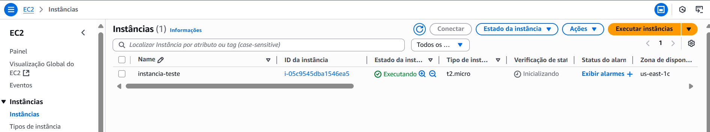

Após iniciar a instância e deixá-la rodando por alguns minutos, acessei o menu Volumes dentro do EC2 para localizar o volume EBS associado. Com isso, confirmei que as tags haviam sido corretamente aplicadas ao volume. Por fim, retornei à instância e a encerrei utilizando a opção “Terminate instance”, conforme instruído na atividade.

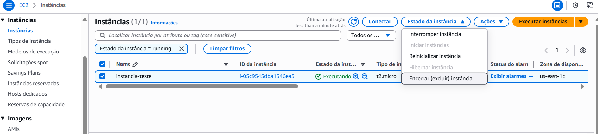

Instância encerrada:

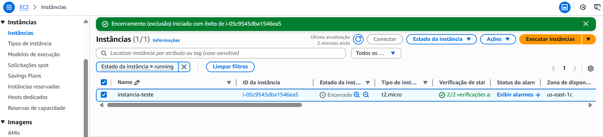

**Exercício Lab AWS S3**

Comecei a primeira etapa acessando o console da AWS e navegando até o serviço S3, com o objetivo de explorar o recurso de hospedagem de sites estáticos.

Criei um bucket com o nome ana-luiza-static-site, selecionando a região US East (N. Virginia) e mantendo as demais configurações padrão. Em seguida, ativei a funcionalidade de Static Website Hosting, informando o arquivo index.html como documento de índice e 404.html como documento de erro.

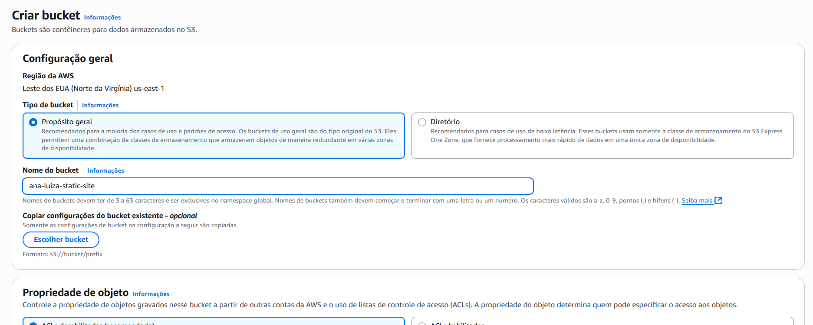

Em seguida, ativei a funcionalidade de Static Website Hosting, informando o arquivo index.html como documento de índice e 404.html como documento de erro.

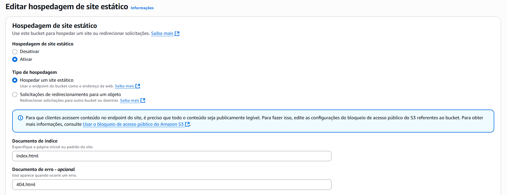

Para permitir o acesso público ao conteúdo do site, desabilitei o bloqueio de acesso público do bucket e adicionei uma política de bucket que concede permissão de leitura pública para qualquer usuário da internet.

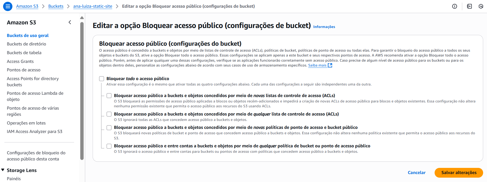

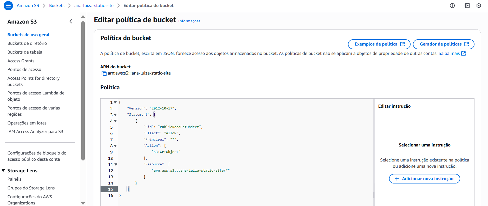

Na etapa seguinte, criei localmente o arquivo index.html, contendo uma mensagem de boas-vindas e um link para download do arquivo CSV. Também criei um arquivo 404.html personalizado para exibir mensagens de erro em caso de páginas inexistentes. Ambos os arquivos foram enviados ao bucket, garantindo que os nomes correspondessem exatamente aos definidos na configuração da hospedagem.

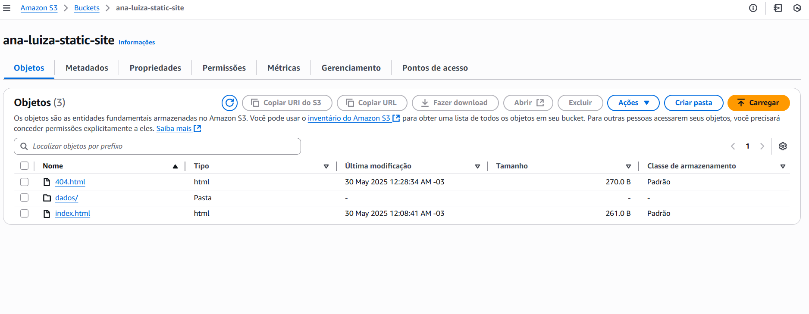

Por fim, testei o funcionamento do site acessando o endpoint do bucket, onde o conteúdo foi carregado corretamente, com os acentos exibidos de forma adequada após a inclusão da codificação UTF-8 no HTML.

http://ana-luiza-static-site.s3-website-us-east-1.amazonaws.com

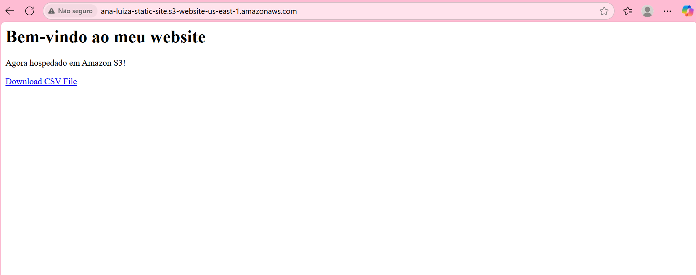

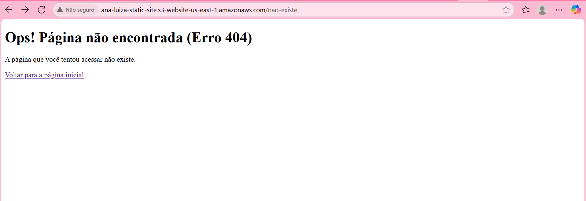

 

## 2.2 Lab AWS Athena

Nesse desafio o objetivo é explorar as capacidades do serviço AWS S3. A seguir estarei compartilhando os arquivos utilizados e detalhando cada etapa que segui:

| Arquivo | Link |
|--------|------|
| consulta.sql | [🔗 consulta.sql](./Exercícios/Exercício2/consulta.sql) |
| nomes.ipynb | [🔗 nomes.ipynb](./Exercícios/Exercício1/nomes.ipynb) |

>Resolução:

**Lab AWS Athena**

No exercício anterior já havia feito o download do arquivo nomes.csv, entao inicialmente fiz a análise do arquivo conhecendo as colunas, suas dimensões e as principais informações.

Após isso, acessei o AWS Athena para criar um banco de dados chamado meubanco, com o objetivo de organizar os dados que seriam analisados a partir do arquivo CSV armazenado no bucket S3.

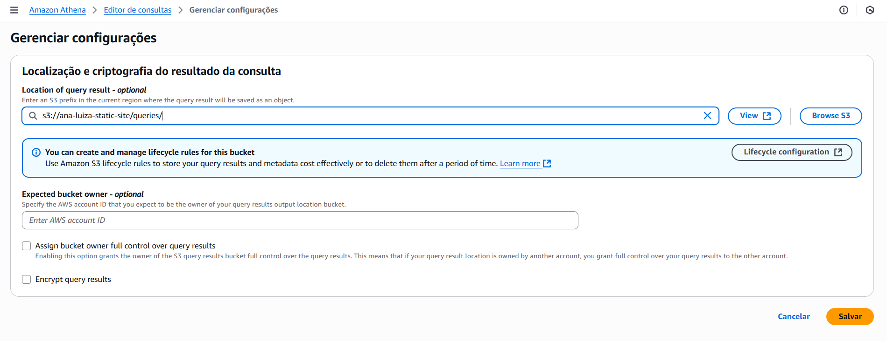

Em seguida, criei uma tabela externa no banco de dados, definindo os campos conforme os tipos de dados identificados no arquivo (nome, sexo, total e ano), e configurei a localização do arquivo CSV no bucket S3 da região us-east-1.

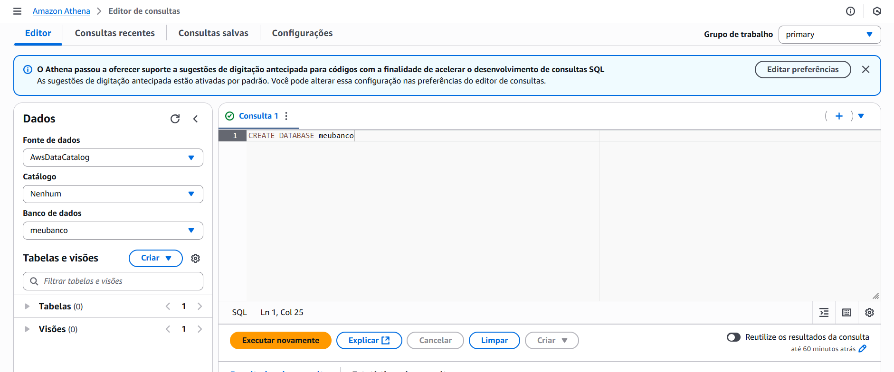

Antes de executar as consultas, precisei criar a tabela nomes dentro do banco de dados meubanco, usando uma instrução CREATE EXTERNAL TABLE. O objetivo foi permitir que o Athena consultasse diretamente os dados armazenados do um arquivo csv no S3, sem a necessidade de importação para um banco tradicional. Defini os campos da tabela conforme a estrutura do arquivo nomes.csv: nome e sexo como STRING, e total e ano como INT, respeitando os tipos identificados previamente no vscode.

Utilizei o formato SERDE do tipo LazySimpleSerDe, que é adequado para arquivos CSV e permite valores nulos. Especifiquei nas propriedades que o delimitador de campos é uma vírgula  e adicionei a instrução TBLPROPERTIES  para que a primeira linha do CSV fosse ignorada.

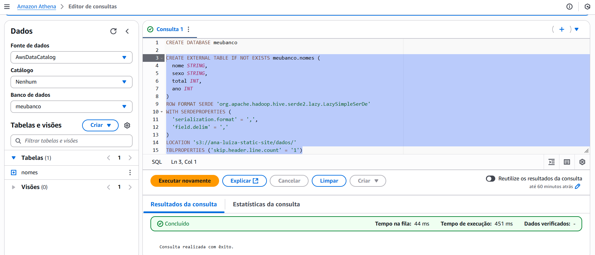

Apontei o LOCATION para 's3://ana-luiza-static-site/dados/', que é a pasta onde o arquivo nomes.csv está armazenado. Isso permite ao Athena mapear corretamente os dados no S3 para a tabela criada.

Por fim, elaborei uma consulta SQL que lista os 3 nomes mais usados em cada década a partir de 1950, utilizando funções de agregação para ordenar e filtrar os nomes mais populares por década. Essa consulta foi estruturada em uma CTE para garantir a correta aplicação dos filtros e ordenações. 

Primeiro código: 

Comecei testando os dados com uma consulta simples para verificar se a tabela havia sido criada corretamente e se os dados estavam sendo lidos pelo Athena.
Essa consulta retorna os 15 nomes mais utilizados no ano de 1999, ordenando pela coluna total em ordem decrescente. O objetivo foi validar o conteúdo da tabela e entender melhor a distribuição dos dados.

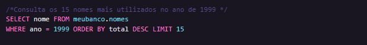

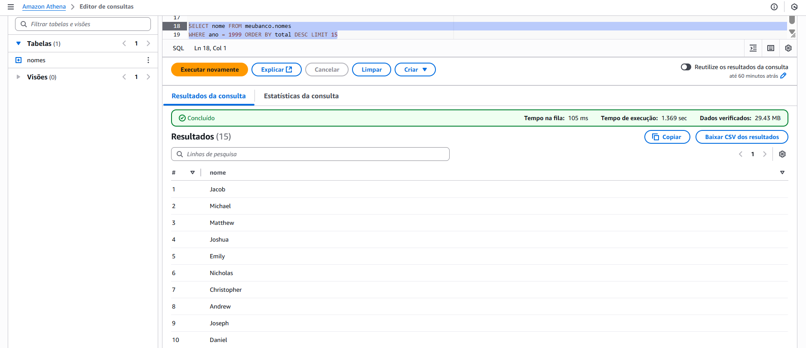

Segundo código:

Em seguida, desenvolvi uma consulta mais elaborada com o objetivo de identificar os três nomes mais populares em cada década, a partir de 1950.

Para isso, utilizei uma CTE nomeada como ranked_names. Dentro dela, primeiro agrupei os dados por nome e década, somando a quantidade total de ocorrências de cada nome naquele intervalo. A década foi calculada utilizando FLOOR(ano / 10) * 10. Depois, apliquei a função ROW_NUMBER() com PARTITION BY decada e ORDER BY total DESC para numerar os nomes em ordem de popularidade dentro de cada década.

Na consulta final, selecionei apenas os registros com posicao <= 3 para garantir que fossem retornados apenas os três nomes mais utilizados em cada década.

A ordenação final foi feita por decada e posicao, organizando os resultados de forma cronológica e por ranking.

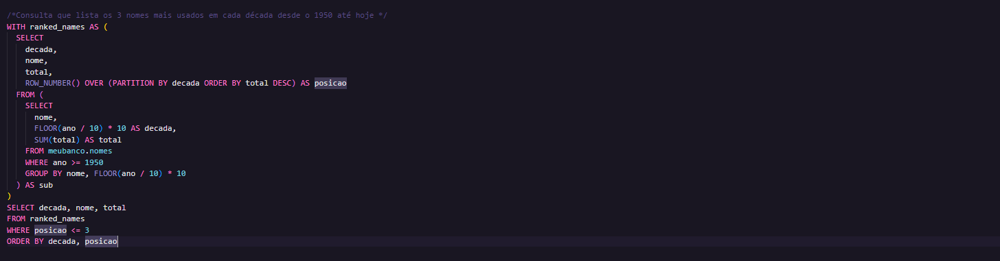

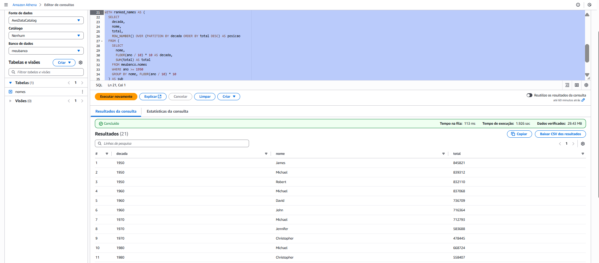

 

--- 

## 2.3 Lab AWS Lambda

Nesse desafio o objetivo é explorar as capacidades do serviço AWS S3. A seguir estarei compartilhando os arquivos utilizados e detalhando cada etapa que segui:

| Arquivo | Link |
|--------|------|
| Dockerfile | [🔗 Dockerfile](./Exercícios/Exercício3/Dockerfile) |
| minha-camada-pandas.zip | [🔗 minha-camada-pandas.zip](./Exercícios/Exercício3/minha-camada-pandas.zip) |

>Resolução:

**Lab AWS Lambda**

No console do AWS Lambda, selecionei criar uma função, onde comecei uma do zero, defini o nome como MyLambdaFunction, em runtime, escolhi Python 3.9 e a arquitetura x86_64. Cliquei em “Criar função”, e após alguns instantes, a função foi criada com sucesso e fui redirecionada para o editor de código do Lambda.

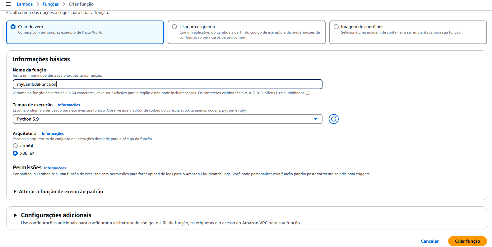

O console da AWS cria automaticamente um arquivo chamado lambda_function.py com um código inicial, então, substituí esse código pelo script, que acessa o arquivo CSV no S3 e utiliza a biblioteca Numpy e Pandas para realizar a operação. Cliquei em Deploy para que ocorresse a alteração do código e realizei o teste da Lambda clicando em Test e escolhendo o nome testeS3.

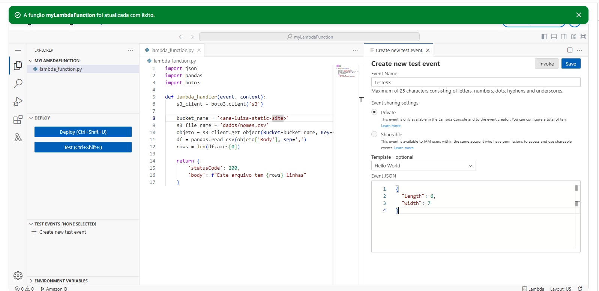

Ao executar o teste ocorreu um erro pois o serviço AWS Lambda não possui a biblioteca pandas. Precisei criar uma layer para importar estas bibliotecas necessárias a Lambda.

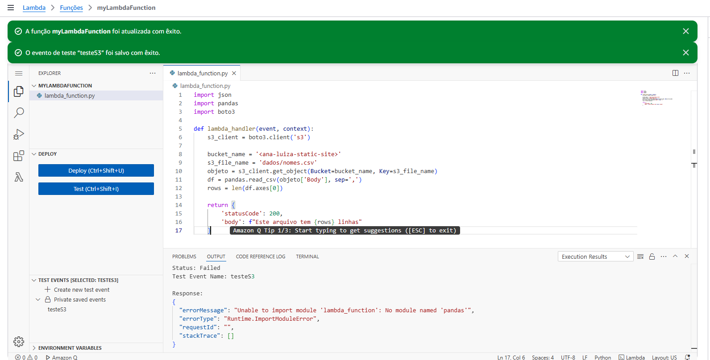

Assim, foi necessário preparar uma Layer personalizada contendo a biblioteca pandas, já que ela não está disponível por padrão no ambiente da AWS Lambda. Para garantir compatibilidade, optou-se por criar essa camada usando um container Docker com o sistema operacional Amazon Linux 2023. O processo começou com a criação de uma pasta e um arquivo Dockerfile, que define a imagem base e os comandos para instalar o Python 3.9, o gerenciador de pacotes pip e o utilitário zip. Esses componentes são necessários para instalar as bibliotecas e compactar os arquivos.

Em seguida, foi construída uma imagem Docker com esse Dockerfile, permitindo a criação de um ambiente isolado e compatível, no qual as bibliotecas necessárias podem ser instaladas corretamente para posterior uso como layer na função Lambda.

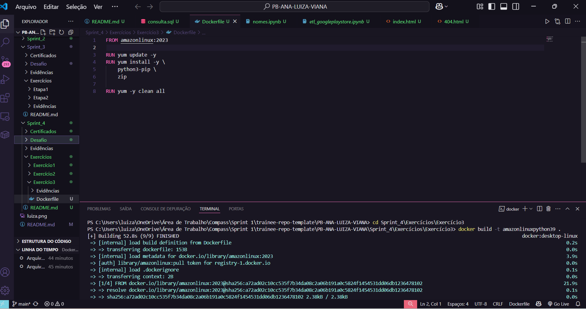

Após criar a imagem Docker, acessei o shell do container para configurar a estrutura da layer. Dentro do container, criei a pasta layer_dir/python, onde instalei a biblioteca pandas com o comando pip3 install -t ..

Em seguida, compactei a pasta python em um arquivo minha-camada-pandas.zip e copiei o .zip do container para a máquina local usando docker cp. Como o arquivo pode ultrapassar 10 MB, fiz o upload para o bucket S3, seguindo a recomendação da AWS para layers maiores.

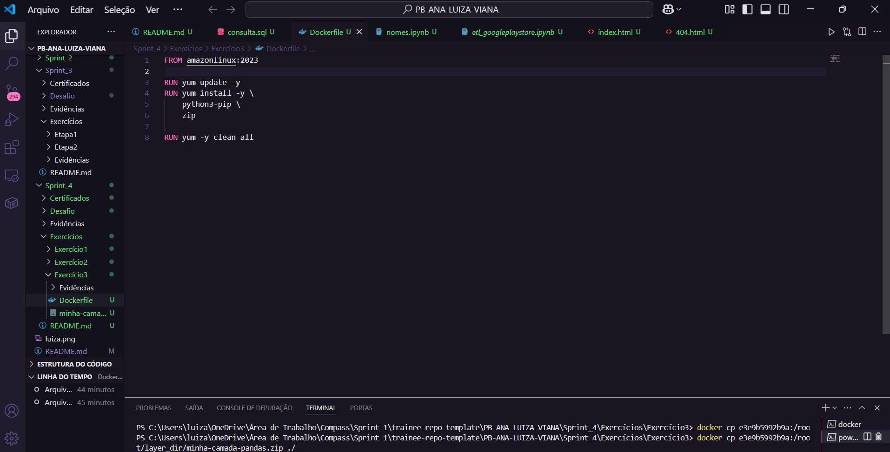

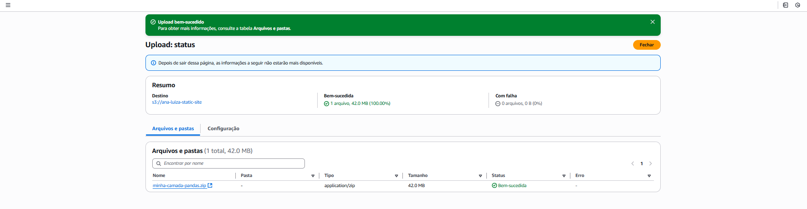

Na etapa, acessei o console do AWS Lambda e criei uma nova camada chamada PandasLayer. Selecinoei a opção de upload via URL do S3 e coloquei o link do arquivo minha-camada-pandas.zip previamente enviado. Defini a arquitetura como x86_64 e o tempo de execução como Python 3.9. Por fim, foi feita a criação da camada.

 Após isso, vinculei a camada criada à função Lambda, em que acessei a função no console, abri a seção de camadas e adicionei a PandasLayer personalizada criada anteriormente. 

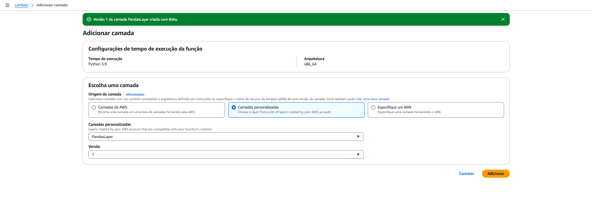

Executando o teste configurado anteriormente, o retorno esperado indicou que era recomendado aumentar o tempo limite e a memória da função.

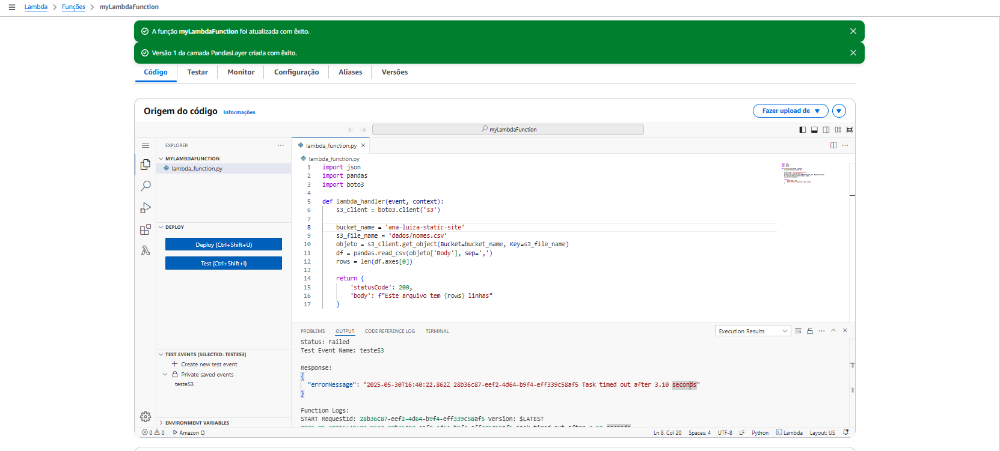

Assim, segui essa recomendação e aumentei tanto o tempo limite quanto a memória da função.

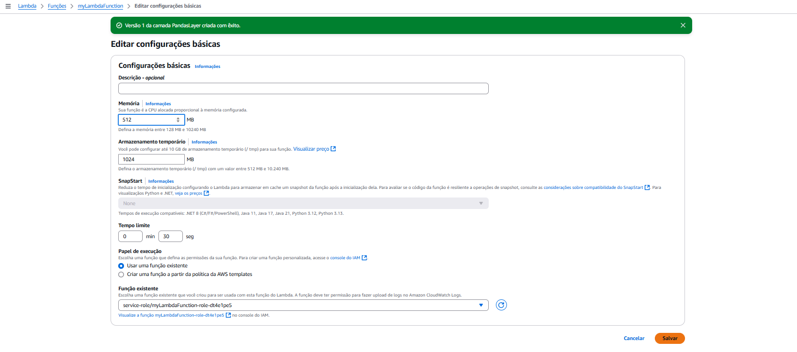

Após executar após esse ajuste a função retornou a resposta indicando que o arquivo foi processado, mostrando o número de linhas lidas.

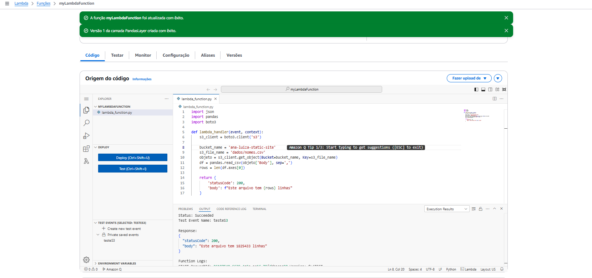

## 2.4 Lab AWS - Limpeza de recursos

Após concluir todas as etapas do laboratório na AWS e salvar todos os códigos e evidências no meu GitHub, realizei a limpeza completa dos recursos utilizados para evitar cobranças desnecessárias. Comecei excluindo todos os arquivos que foram usados ou gerados durante o processo no bucket S3, como o arquivo nomes.csv e o minha-camada-pandas.zip.

Em seguida, removi a camada personalizada que criei na AWS Lambda, bem como a função Lambda utilizada no projeto. Também verifiquei se não havia  arquivos residuais, assim, finalizei o laboratório com todos os recursos devidamente limpos, mantendo apenas os registros e scripts relevantes salvos localmente e no repositório.

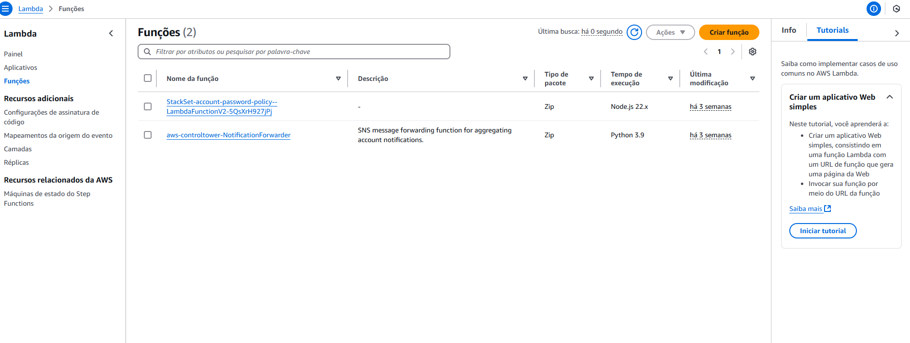

---

 

# Certificados

Durante essa sprint, concluí os cursos AWS Partner: Sales Accreditation (Business) (Português), Cloud Economics (Português) e Cloud Quest Practitioner. A seguir, compartilho os certificados correspondentes:

| Certificado | Link |
|--------|------|
|AWS Partner Sales Accreditation | [🔗 Sales Accreditation](./Certificados/AWS%20Partner%20Sales%20Accreditation.pdf) |
|AWS Partner Cloud Economics Course | [🔗 Cloud Economics](./Certificados/AWS%20Partner%20Cloud%20Economics%20Course%20Assessment.pdf) |
|AWS Cloud Quest Practitioner | [🔗 Cloud Quest](https://www.credly.com/badges/e6de8a04-d292-415f-a306-bca96da7177f/public_url) |