# 🚀 Desafio 

## 📌 Resumo

Neste desafio da Sprint 5, o objetivo foi construir a parte inicial do Data Lake na AWS, aplicando na prática os conceitos de ingestão, armazenamento e organização de dados em nuvem. O tema escolhido para a análise foi a evolução da representação feminina em filmes de guerra ao longo das décadas, buscando entender tanto a participação de mulheres nos elencos, quanto a presença de diretoras e possíveis variações por região geográfica.

A primeira etapa do desafio foi a definição dos questionamentos, baseados em uma análise exploratória inicial do arquivo movies.csv e nas possibilidades de enriquecimento dos dados via API do TMDB. Essa definição foi fundamental para direcionar todas as demais etapas de ingestão e processamento de dados. Na sequência, realizei a ingestão batch dos dados locais, utilizando Python e a biblioteca boto3 para o envio dos arquivos CSV ao Amazon S3, organizando-os na camada RAW, seguindo o padrão de particionamento por tipo de dado e data de processamento.

Na segunda etapa, desenvolvi um processo de ingestão via API, com foco na coleta de informações complementares aos CSVs, utilizando uma função AWS Lambda. O desenvolvimento foi organizado em etapas, desde a prototipação inicial até a execução final, detalhadas nas seções a seguir, contendo os arquivos e as evidências de cada etapa:

## 🗂️ Sumário 

1. [Etapa 1](#etapa-1)
2. [Etapa 2](#etapa-2)

 

---

# Etapa 1

Nesta etapa, realizei a leitura e análise exploratória dos arquivos movies.csv e series.csv, fornecidos pelo desafio, utilizando notebooks em Jupyter. Essas análises permitiram entender a estrutura dos dados e orientar a definição da linha de investigação do projeto, focada na evolução da representatividade feminina em filmes de guerra a partir de 1950. Também explorei dados da API do TMDB em um notebook separado, com o objetivo de identificar quais campos seriam úteis para complementar as informações dos arquivos CSV nas próximas etapas.

Após essa fase exploratória, preparei e testei o envio dos arquivos para o bucket S3 chamado data-compass-ana. Primeiro, fiz testes locais de upload usando o boto3 diretamente em um notebook, garantindo que as credenciais e a estrutura estavam corretas. Em seguida, organizei os arquivos necessários para ingestão dentro da pasta Etapa1, que contém o script upload_s3.py, o Dockerfile, o arquivo .env com as credenciais da AWS (incluído no .gitignore) e o .dockerignore para ignorar arquivos desnecessários no container. A pasta data, que foi utilizada inicialmente, concentra os arquivos movies.csv e series.csv, os dois notebooks com as análises exploratórias: um dedicado ao CSV e outro à API. Além do notebook que foi utilizado como teste para o envio dos arquivos.

| Pasta | Link |
|--------|------|
| data | [🔗 data ](./data/) |
| Etapa1 | [🔗 Etapa1 ](./Etapa1/) |
 

> Explicação Análise Inicial

**Análise inicial**

Como mencionado anteriormente, iniciei essa parte realizando a leitura e análise dos conjuntos de dados: o arquivo movies.csv e o CSV gerado a partir da extração de dados da API do TMDB. Para organizar melhor o processo, optei por criar dois notebooks separados no Jupyter, essa separação me permitiu comparar as duas bases e entender de forma mais clara como elas poderiam se complementar nas próximas etapas. Durante essa análise exploratória, fui também avaliando se os dados disponíveis seriam suficientes para responder aos questionamentos que eu tinha interesse em investigar.

| Arquivo | Link |
|--------|------|
| MoviesCSV.ipynb | [🔗 MoviesCSV.ipynb ](./data/MoviesCSV.ipynb) |
| MoviesAPI.ipynb | [🔗 MoviesAPI.ipynb ](./data/MoviesAPI.ipynb) |
 

A partir dessas análises iniciais, optei por seguir uma linha de investigação voltada para a evolução da representação feminina em filmes de guerra ao longo das décadas. A escolha desse tema foi motivada pelo interesse em explorar como a participação das mulheres tem evoluído nesse contexto, considerando tanto aspectos quantitativos (como a proporção de mulheres nos elencos e a presença de diretoras) quanto qualitativos (como o perfil dos papéis desempenhados pelas personagens femininas e possíveis variações regionais na produção desses filmes).

Além disso, busquei também comparar a representatividade feminina em relação à masculina ao longo das décadas, entendendo como esse cenário tem se transformado com o tempo. Para garantir uma base de análise mais consistente e focada em filmes com maior relevância dentro do gênero, apliquei alguns filtros iniciais, considerando apenas filmes de guerra lançados a partir de 1950, com nota média maior ou igual a 6 e com pelo menos 100 votos registrados no TMDB, o que ajudou a garantir uma amostra com dados mais representativos e de melhor qualidade para análise.

 

**Questionamentos**

Por meio da análise inicial, foi possível identificar as principais informações e dados presentes no arquivo CSV e da API. Com base nisso, selecionei oito questionamentos principais:

 Qual a média da proporção de mulheres nos elencos de filmes de guerra em cada década?

Objetivo: analisar a evolução histórica da participação feminina nos elencos ao longo do tempo.

- Como evoluiu a proporção entre homens e mulheres nos elencos principais desses filmes?

Objetivo: investigar se houve mudanças no equilíbrio de gênero entre os papéis principais.

- Quais filmes de guerra tiveram o maior e o menor percentual de mulheres no elenco?

Objetivo: destacar os filmes de guerra que apresentaram os maiores e menores percentuais de mulheres no elenco, evidenciando casos de maior inclusão ou de baixa representatividade feminina.

- Há diferença na recepção crítica (nota média e número de votos) entre filmes com maior presença feminina e os com menor presença feminina?

Objetivo: avaliar se existe alguma correlação entre a representatividade feminina e a avaliação do público.

- Qual o perfil das personagens femininas nesses filmes?

Objetivo: investigar se as mulheres ocupam papéis de destaque (protagonistas, oficiais, guerreiras) ou se predominam em papéis secundários.

- Como a participação feminina varia entre as diferentes décadas e qual a relação com a presença de diretoras ou cineastas mulheres?

objetivo: relacionar a evolução da representatividade feminina no elenco com a atuação de diretoras.

- Quais diretores estão associadas a uma maior representatividade feminina nos filmes de guerra?

Objetivo: mapear quais cineastas contribuíram para ampliar a diversidade de gênero nesse gênero cinematográfico.

- Existe alguma tendência regional ou país onde a presença feminina nos filmes de guerra é maior?

Objetivo: analisar se determinadas regiões ou países apresentam maior inclusão de mulheres em seus elencos de filmes de guerra.-

 

> Explicação Etapa 1

**Código para upload**

Para realizar o upload dos arquivos locais para o bucket S3, escrevi um script em Python chamado upload_s3.py. Esse script utiliza as bibliotecas boto3 e dotenv para acessar as credenciais da AWS a partir de um arquivo .env, garantindo segurança e flexibilidade no gerenciamento de variáveis sensíveis. Estruturei o caminho de destino no S3 seguindo o padrão Raw/Local/CSV/{tipo}/{ano}/{mês}/{dia}/, permitindo uma organização eficiente dos dados no Data Lake. Implementei uma função chamada upload_file_to_s3, responsável por fazer o upload dos arquivos movies.csv e series.csv de forma automatizada. Antes de integrar esse processo ao Docker, testei o script localmente em um notebook Jupyter, validando a autenticação, a estrutura dos caminhos e a comunicação com o bucket data-compass-ana.

| Arquivo | Link |
|--------|------|
| upload_s3.ipynb | [🔗 upload_s3.ipynb ](./data/upload_s3.ipynb) |
| upload_s3.py | [🔗 upload_s3.py ](./Etapa1/upload_s3.py) |
 

**Construção da imagem Docker**

Após validar o funcionamento do script, preparei a estrutura necessária para executá-lo em um ambiente containerizado com Docker. Para isso, criei um Dockerfile baseado em python:3.10-slim, defini o diretório de trabalho como /app, copiei o script para dentro da imagem e instalei as dependências listadas. Também criei um .dockerignore para evitar que arquivos desnecessários fossem copiados para a imagem, como os arquivos de dados locais, e incluí o arquivo .env no .gitignore para evitar o versionamento de informações sensíveis. Com tudo pronto, utilizei o comando docker build -t upload-s3 . para construir a imagem.

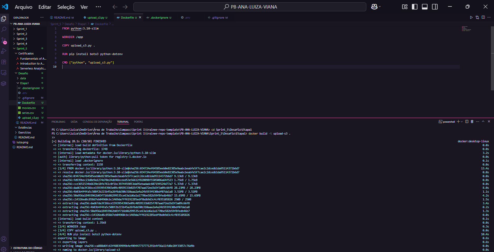

Em seguida, executei o container com docker run --rm -v "${PWD}:/app" --env-file .env upload-s3.

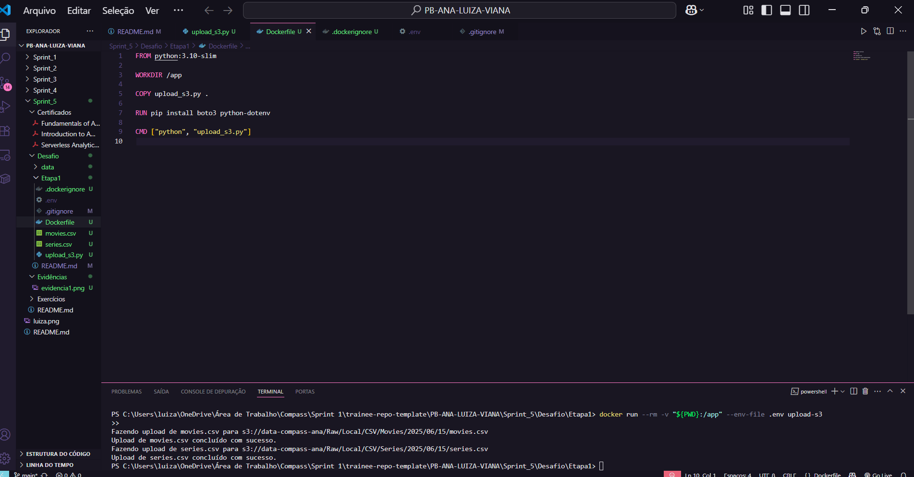

O processo foi bem-sucedido, e os arquivos foram enviados para o S3 conforme o caminho definido no script, concluindo assim a ingestão inicial dos dados fornecidos no desafio.

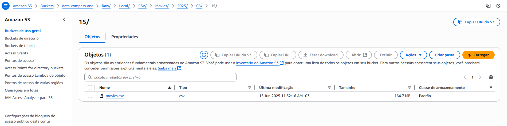
 

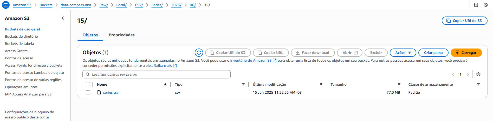

 

---

# Etapa 2

Nesta etapa, desenvolvi a ingestão dos dados complementares da API do TMDB, com o objetivo de enriquecer a base de filmes de guerra. A ideia foi buscar, para cada filme, informações adicionais ao CSV movies que são fundamentais para responder às perguntas analíticas propostas, como estou considerando apenas filmes de guerra lançados a partir de 1950, com nota média maior ou igual a 6 e com pelo menos 100 votos registrados no TMDB, apliquei esses filtros diretamente nas chamadas da API, otimizando o processo de coleta.

Para organizar essa etapa, criei três pastas principais. A primeira foi a lambda_function_test, onde concentrei os testes locais da ingestão. Nessa fase, escrevi dois scripts principais: o tmdb_client_test.py, responsável por realizar as chamadas à API do TMDB e retornar tanto os IDs dos filmes quanto os detalhes de cada um; e o lambda_function_test.py, que orquestrou a execução completa, desde a coleta dos dados até o envio ao S3. Com esses scripts, validei a lógica de filtragem, a extração dos campos desejados da API, o agrupamento dos dados em arquivos .json com até 100 registros e o envio automatizado para o bucket S3, seguindo a estrutura de pastas definida.

A segunda pasta criada foi a lambda_layer_docker, utilizada para gerar uma camada personalizada com a biblioteca requests, já que essa dependência não está disponível por padrão nas funções AWS Lambda. Dentro dessa pasta, configurei um ambiente Docker a partir de um Dockerfile, criei um requirements.txt com a dependência necessária e gerei o arquivo requests-layer.zip usando os comandos apropriados no container. Esse arquivo compactado foi posteriormente carregado como uma Lambda Layer no console da AWS e utilizado na configuração final da função.

Com os testes validados e a layer pronta, criei a terceira pasta chamada lambda_function, na qual adaptei os arquivos para o formato final esperado pela AWS Lambda. Renomeei lambda_function_test.py para lambda_function.py, removi instruções de teste e mantive a lógica automatizada e reutilizável. Também mantive o módulo tmdb_client.py como auxiliar, garantindo a separação entre a coleta dos dados e a lógica de orquestração da função. Após essas adaptações, compactei os arquivos em um pacote .zip chamado tmdb_lambda_package.zip e fiz o upload manual no console da AWS.

A seguir estarei compartilhando o link das pastas e o detalhamento do que fiz em cada etapa:

| Pasta | Link |
|--------|------|
| lambda_function_test | [🔗 lambda_function_test ](./Etapa2/lambda_function_test/) |
| lambda_layer_docker | [🔗 lambda_layer_docker ](./Etapa2/lambda_layer_docker/) |
| lambda_function | [🔗 lambda_function ](./Etapa2/lambda_function/) |
 

> Explicação Etapa 2

**Lambda_function_test**

Essa pasta foi criada para que fosse possível realizar os testes nos códigos e validá-los. Assim, primeiramente, defini os critérios de coleta dos filmes a partir da API do TMDB, como mencionado anteriormente, escolhi buscar apenas filmes de guerra lançados a partir de 1950, com nota média maior ou igual a 6 e no mínimo 100 votos. Para isso, escrevi uma função buscar_ids_filmes_guerra() que realiza chamadas paginadas ao endpoint /discover/movie da API do TMDB, utilizando os parâmetros adequados e respeitando a limitação de requisições com uma pequena pausa (time.sleep(0.25)) entre os requests. Essa função retorna uma lista de IDs de filmes que atendem aos critérios. Em seguida, desenvolvi a função para buscar os detalhes completos dos filmes, com os IDs coletados, implementei a função buscar_detalhes_filme(id_tmdb), que acessa o endpoint /movie/{movie_id} com o parâmetro append_to_response=credits,keywords,release_dates. Com isso, consegui enriquecer os dados com informações adicionais. Essa função faz a chamada individual para cada ID retornado da busca anterior.

Com as funções de extração prontas, escrevi script principal, o lambda_function_test.py, que integra todo o fluxo: busca os IDs dos filmes de guerra, recupera os detalhes de cada um, e por fim, salva os dados em arquivos JSON. Para isso, criei a função salvar_em_json_s3, que divide os dados em lotes de até 100 filmes e envia cada lote como um arquivo .json para o bucket S3, organizando a estrutura no seguinte padrão de pastas: Raw/TMDB/JSON/movies/{ano}/{mes}/{dia}/{uuid}.json. Para o envio, utilizei o boto3 com autenticação via dotenv, que facilita os testes locais antes de empacotar a função para execução na AWS Lambda.

Antes de fazer o deploy final na AWS, testei toda a lógica localmente com o comando lambda_handler() dentro do lambda_function_test.py. Isso permitiu validar tanto a comunicação com a API do TMDB quanto a escrita dos arquivos JSON no bucket data-compass-ana, garantindo que o volume de dados, as autenticações e a estrutura de pastas estavam funcionando corretamente.

| Arquivo | Link |
|--------|------|
| lambda_function_test.py | [🔗 lambda_function_test.py ](./Etapa2/lambda_function_test/lambda_function_test.py) |
| tmdb_client_test.py | [🔗 tmdb_client_test.py ](./Etapa2/lambda_function_test/tmdb_client_test.py) |
 

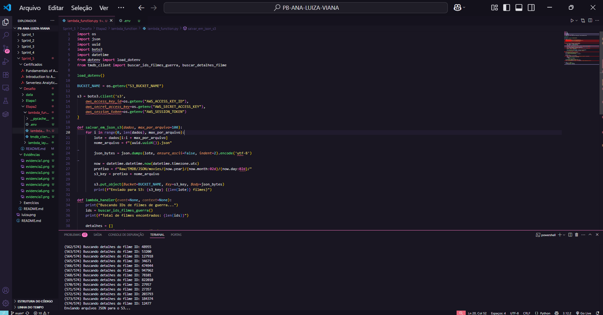

**Lambda_layer_docker**

Como a função Lambda precisa da biblioteca requests e ela não está incluída por padrão no ambiente do AWS Lambda, criei uma layer customizada. Para isso, escrevi um Dockerfile baseado em public.ecr.aws/lambda/python:3.9 que instala a biblioteca requests em um diretório chamado python e a compacta como requests-layer.zip.

Esse processo garantiu que a biblioteca ficasse no formato adequado para ser utilizada como uma Lambda Layer. Posteriormente, acessei o console da AWS, fui até a seção "Layers", criei uma nova layer chamada requests-layer, fiz o upload do arquivo .zip e finalizei associando essa layer à função Lambda.

| Arquivo | Link |
|--------|------|
| Dockerfile | [🔗 Dockerfile ](./Etapa2/lambda_layer_docker/Dockerfile) |
| requirements.txt | [🔗 requirements.txt ](./Etapa2/lambda_layer_docker/requirements.txt) |
 

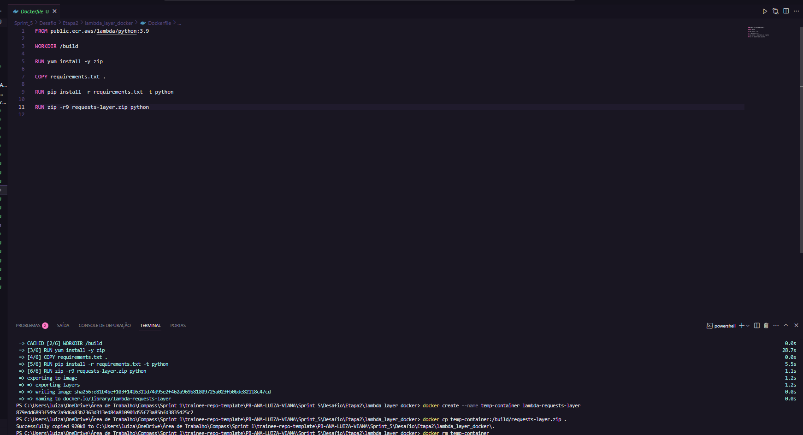

**Lambda_function**

Nessa pasta, criei as duas versões finais dos arquivos tmdb_client.py e lambda_function.py, adaptadas para o ambiente de execução da Lambda. Nesse novo código, substituí o uso do dotenv pela leitura direta de variáveis de ambiente, seguindo as boas práticas de segurança e compatibilidade com a Lambda. O fluxo lógico permaneceu o mesmo: busca dos IDs, coleta de detalhes dos filmes, e envio de arquivos JSON organizados por data para o bucket S3. Com os arquivos prontos, gerei o pacote compactado tmdb_lambda_package.zip.

| Arquivo | Link |
|--------|------|
| lambda_function.py | [🔗 lambda_function.py ](./Etapa2/lambda_function/lambda_function.py) |
| tmdb_client.py | [🔗 tmdb_client.py ](./Etapa2/lambda_function/tmdb_client.py) |
| tmdb_lambda_package.zip | [🔗 tmdb_lambda_package.zip ](./Etapa2/lambda_function/tmdb_lambda_package.zip) |
 

No console da AWS, acessei o serviço Lambda e criei uma nova função personalizada chamada tmdb-fetcher-function. Escolhi a opção "Criar do zero", selecionei a linguagem Python 3.9, e utilizei uma role de execução personalizada. Após a criação da função, fiz upload do arquivo tmdb_lambda_package.zip. contendo os arquivos lambda_function.py e tmdb_client.py. Além disso, associei a layer à função criada.

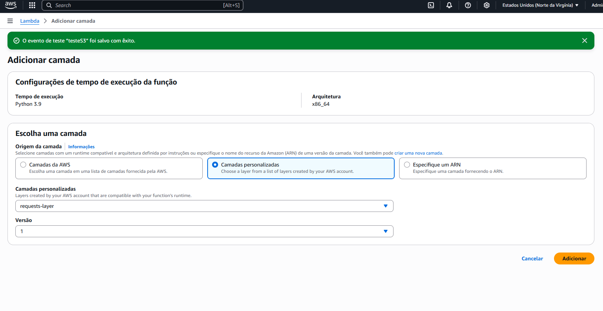

Após isso, defini duas variáveis de ambiente essenciais diretamente no console:
- TMDB_BEARER_TOKEN: token de autenticação da API do TMDB
- S3_BUCKET_NAME: data-compass-ana

Após configurar a função Lambda, ela inicialmente não conseguiu interagir com o bucket S3. Para resolver isso, acessei a aba de permissões da função Lambda e editei sua função de execução. Atribuí à função a política gerenciada, garantindo permissões suficientes para leitura e escrita no bucket data-compass-ana.

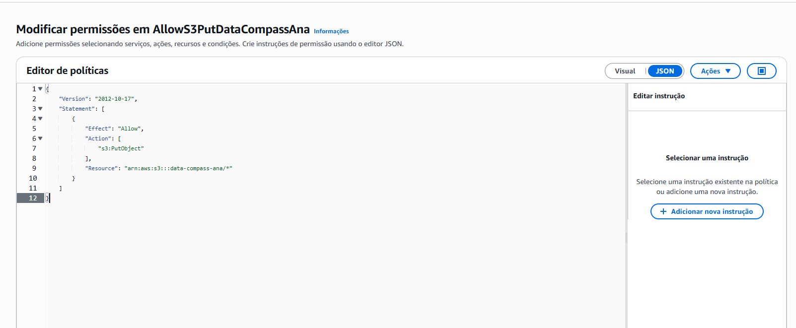

A função apresentou outro erro também por exceder o tempo de execução que tinha definido de 2 minutos.

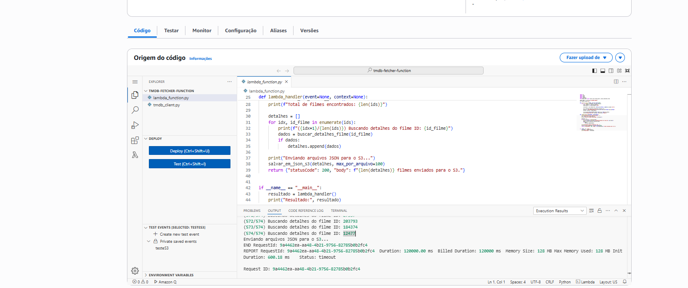

Para resolver isso, aumentei o tempo limite da função para 10 minutos e também ajustei a memória alocada para 512 MB. Após esses ajustes, executei a função com sucesso, coletando os dados de todos os filmes (574 no total) e armazenando os arquivos JSON no bucket conforme esperado.

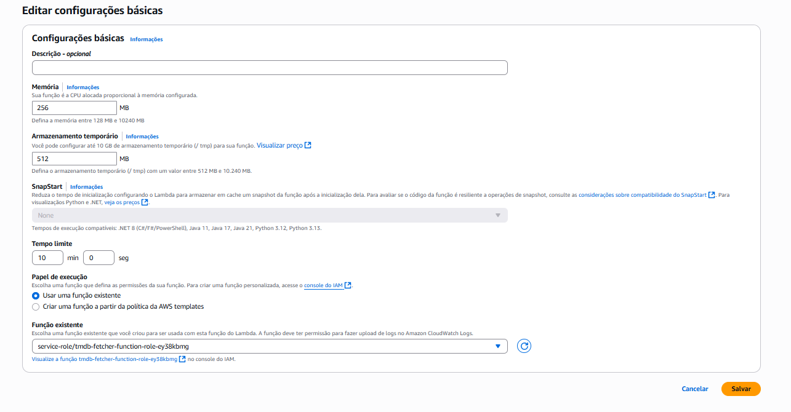

Com tudo configurado, executei a função diretamente pelo console da AWS. O processo foi iniciado com a mensagem “Buscando IDs de filmes de guerra...”, seguido da coleta dos filmes, enriquecimento dos dados, e upload de múltiplos arquivos JSON no S3.
A execução foi concluída com sucesso, e os arquivos foram armazenados conforme o prefixo planejado. Esta etapa marcou o sucesso da ingestão de dados da API externa, organizados em formato JSON no nível Raw do Data Lake.

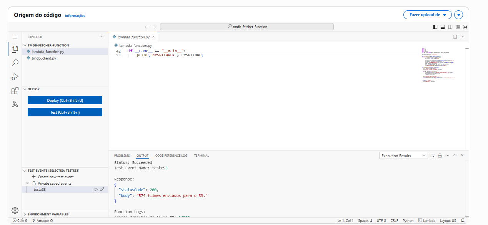
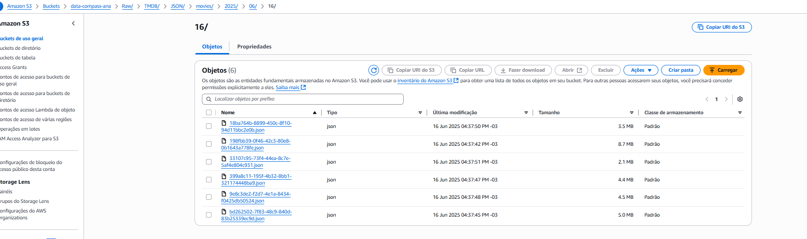

