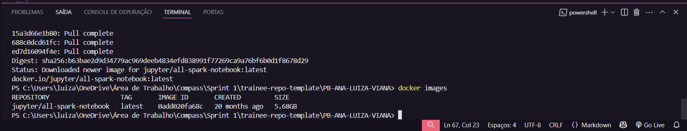
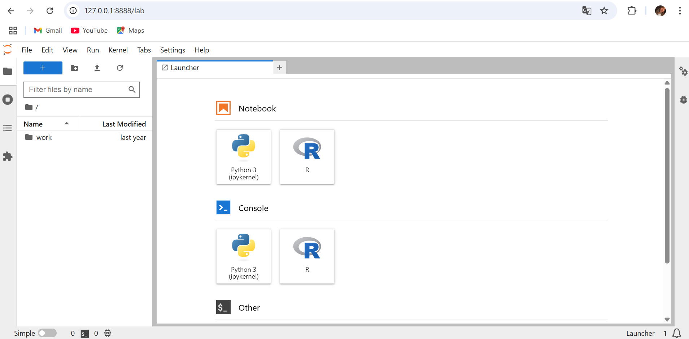
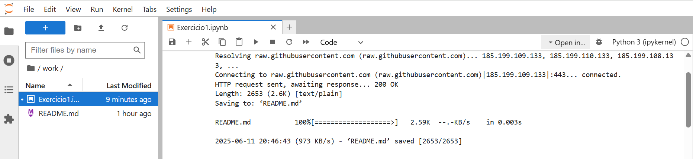
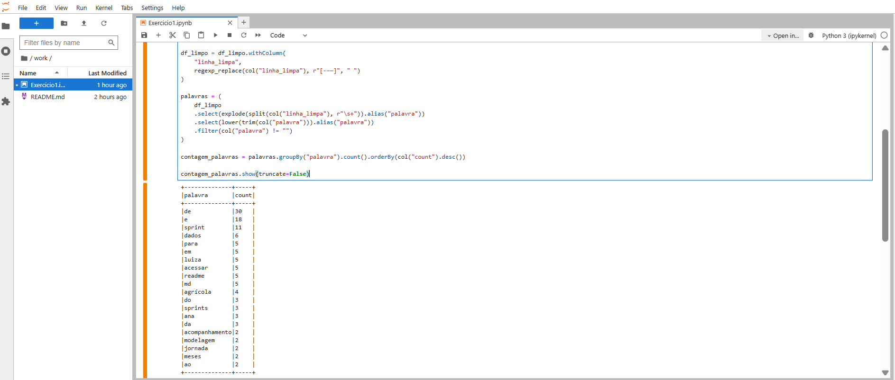
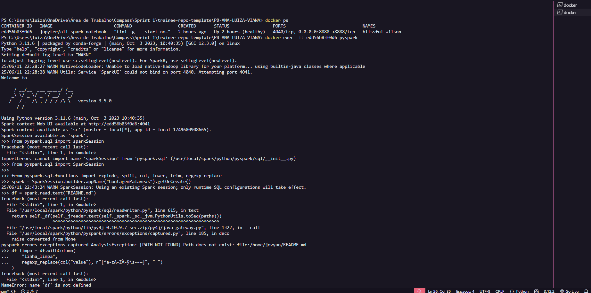
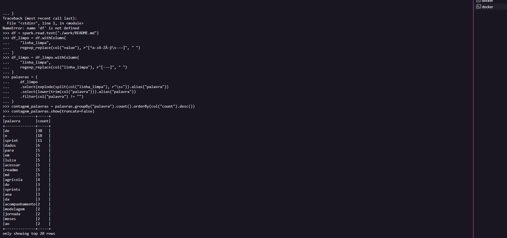
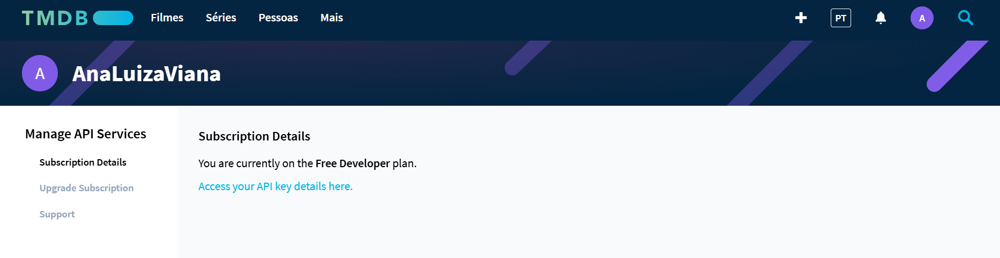
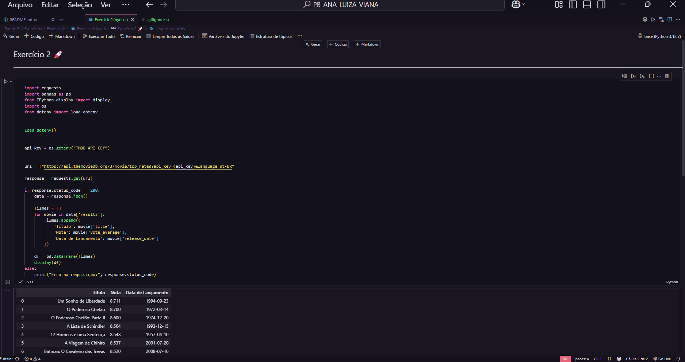

# 🚀 Sprint 5

## 📌 Resumo

Durante a Sprint 5, aprofundei meus conhecimentos em Apache Spark além de alguns conceitos da AWS, por meio de cursos, exercícios e do desafio proposto. Foi meu primeiro contato com o Spark, e essa experiência me permitiu consolidar o aprendizado de maneira prática, dinâmica e colaborativa. As discussões frequentes com os colegas da squad foram essenciais para superar dificuldades e reforçar o entendimento dos conteúdos, destaco também a monitoria, que proporcionou trocas enriquecedoras e debates interessantes. A seguir, apresento um resumo dos principais tópicos abordados:

- **Data & Analytics**: através do D&A, pude ter uma maior base teórica sobre o Apache Hadoop e o Apache Spark, compreendendo seus principais componentes, arquiteturas e casos de uso. Estudei como o Hadoop permite o processamento distribuído de grandes volumes de dados por meio do HDFS e do MapReduce, bem como a forma como o Spark se destaca por sua velocidade e capacidade de processamento em memória. Além disso, também forneceu as principais informações para seguir com a realização dos exercícios e do desafio.

- **Formação Spark com Pyspark**: aprendi a configurar o Spark, manipular DataFrames, aplicar transformações e ações, usar SQL, views e joins no Pyspark. Trabalhei com dados em disco criando tabelas em formatos Parquet e ORC, desenvolvimento de aplicações executáveis via linha de comando, também explorei técnicas de otimização e integrei o Spark com Jupyter e bibliotecas Python.

- **Fundamentals of Analytics on AWS – Part 1 (Português)**: fui apresentada aos conceitos fundamentais de analytics, incluindo os tipos de análise de dados, os 5 Vs do big data e os desafios associados ao processamento de grandes volumes de dados. O treinamento também abordou como os serviços da AWS se alinham a cada um desses aspectos, oferecendo soluções abrangentes para armazenamento, transporte, processamento e análise de dados. Além disso, também explorei conceitos de machine learning na AWS juntamente com uma breve visão geral desse assunto.

- **Introduction to Amazon Athena (Português)**: nesse curso aprendi um pouco mais sobre o Amazon Athena, serviço serverless de consultas SQL para análise de dados diretamente no Amazon S3. Também são discutidas as etapas básicas da implementação do mesmo, além de ser realizada uma breve demonstração da criação de um banco de dados para executar consultas SQL para validação.

- **Serverless Analytics (Português)**: por meio desse curso aprofundei sobre as soluções de análise de dados serverless na AWS, explorando serviços como AWS IoT Analytics, Amazon Cognito, AWS Lambda e Amazon SageMaker. Aprendi a coletar, processar e disponibilizar dados de forma escalável e sem a necessidade de gerenciar servidores, facilitando decisões orientadas por dados em tempo real.

🤔 *Reflexões*

A Sprint 5 foi bastante desafiadora para mim, já que ainda estou nos meus primeiros contatos com a AWS. Porém, agora já sinto que estou me adaptando melhor, as dificuldades que enfrentei consegui superá-las com o apoio do meu squad. À medida que fui avançando nos exercícios, fui ganhando mais confiança, e concluir o desafio final foi bastante gratificante. Além disso, me sinto muito grata por todo o suporte que venho recebendo dos monitores, da Scrum Master, do meu time e dos demais membros da PB.

 

---

## 🗂️ Sumário 

1. [Desafio](#desafio)

2. [Exercícios](#exercícios)
    - 2.1 [Apache Spark - Contador de palavras](#21-apache-spark---contador-de-palavras)
    - 2.2 [Exercício TMDB](#22-exercício-tmdb)

3. [Certificados](#certificados)

 

---

# [Desafio](./Desafio/) 

Neste desafio da Sprint 5, o objetivo foi construir a parte inicial do Data Lake na AWS, aplicando na prática os conceitos de ingestão, armazenamento e organização de dados em nuvem. O tema escolhido para a análise foi a evolução da representação feminina em filmes de guerra ao longo das décadas, buscando entender tanto a participação de mulheres nos elencos, quanto a presença de diretoras e possíveis variações por região geográfica.

A primeira etapa do desafio foi a definição dos questionamentos, baseados em uma análise exploratória inicial do arquivo movies.csv e nas possibilidades de enriquecimento dos dados via API do TMDB. Essa definição foi fundamental para direcionar todas as demais etapas de ingestão e processamento de dados. Na sequência, realizei a ingestão batch dos dados locais, utilizando Python e a biblioteca boto3 para o envio dos arquivos CSV ao Amazon S3, organizando-os na camada RAW, seguindo o padrão de particionamento por tipo de dado e data de processamento.

Na segunda etapa, desenvolvi um processo de ingestão via API, com foco na coleta de informações complementares aos CSVs, utilizando uma função AWS Lambda. Os arquivos utilizados para a realização do desafio estão organizados em pastas por etapas, acompanhando as fases do desenvolvimento, e podem ser encontrados na *Pasta Desafio*. As evidências do processo estão armazenadas na *Pasta Evidências*. Para um detalhamento completo do desafio, recomendo consultar o README da pasta *Readme Desafio*. Seguem os links:

- [Pasta Desafio](./Desafio/) 
- [Pasta Evidências](./Evidências/)
- [Readme Desafio](./Desafio/README.md)

 

---

# [Exercícios](./Exercícios/)

## 2.1 Apache Spark - Contador de palavras

Neste desafio, a proposta foi de realizar uma atividade utilizando o framework Apache Spark dentro de um container Docker. A atividade envolveu desde o download da imagem jupyter/all-spark-notebook, que já vem com o Spark e o Jupyter instalados, até a criação de um container, o acesso ao Jupyter Lab e a utilização do shell PySpark. O arquivo analisado foi o meu *README Principal* do repositório do GitHub, o qual foi baixado e processado utilizando comandos do Spark. Mais adiante, vou detalhar os passos que segui, os comandos utilizados e os resultados obtidos durante a execução dessa tarefa.

| Arquivo | Link |
|--------|------|
| Exercício1.py | [🔗 Exercício1.py](./Exercícios/Exercício1/Exercicio1.py) |
| Readme.md | [🔗 Readme.md](../README.md) |
 

>Resolução:

**Contador de palavras**

Etapa 1 – Comecei a primeira etapa acessando o terminal da minha máquina e utilizando o comando docker pull para baixar a imagem jupyter/all-spark-notebook. O processo de download ocorreu normalmente, embora tenha levado alguns minutos devido ao tamanho da imagem.

Etapa 2 – Na segunda etapa, criei um container a partir da imagem jupyter/all-spark-notebook utilizando o comando docker run. Para garantir o acesso ao Jupyter Lab, executei o container no modo interativo e realizei o mapeamento da porta padrão 8888 do container para a minha máquina local. Durante a inicialização, diversos logs foram exibidos no terminal, incluindo o link de acesso ao Jupyter. Copiei a URL gerada e colei essa URL no navegador onde consegui acessar o ambiente do Jupyter Lab com sucesso, o que confirmou que o container estava funcionando corretamente e o ambiente estava pronto para os próximos passos.

Etapa 3 – Na terceira etapa, dentro do ambiente do Jupyter, utilizei o comando !wget para baixar o arquivo principal README.md do meu repositório no GitHub, utilizando o link direto da versão bruta, o raw. Para garantir que o arquivo fosse salvo com o nome correto, adicionei o parâmetro -O README.md ao final do comando, assim, download foi realizado com sucesso e o arquivo ficou disponível no ambiente do Jupyter para ser utilizado nas próximas etapas de processamento com o Spark.

Ainda no jupyter testei o código que criei, onde importei as bibliotecas necessárias e realizei a leitura do arquivo README.md utilizando o método spark. Para preparar o texto para a contagem de palavras, apliquei a função regexp_replace para substituir todos os caracteres que não fossem letras, espaços ou traços por espaços, garantindo que emojis e símbolos indesejados fossem removidos sem unir palavras. Depois, substituí os traços e travessões restantes por espaços para separar corretamente palavras que estivessem conectadas por esses sinais. Utilizei a função split para dividir cada linha em uma lista de palavras, separando por espaços, e explode para transformar essa lista em múltiplas linhas, uma para cada palavra. Em seguida, normalizei as palavras convertendo todas para minúsculas e removendo espaços em branco extras com lower e trim. Filtrei as palavras vazias para evitar registros inválidos na contagem. Por fim, agrupei as palavras e contei suas ocorrências usando groupBye count, ordenando o resultado de forma decrescente para listar as palavras mais frequentes primeiro. O resultado foi exibido com show, apresentando a contagem de todas as palavras contidas no arquivo.

| Arquivo | Link |
|--------|------|
| Exercício1.py | [🔗 Exercício1.py](./Exercícios/Exercício1/Exercicio1.py) |
 

Após validar o código no Jupyter, pude então abrir o terminal diretamente, via PySpark interativo. Para isso, executei docker ps para encontrar o ID do meu container ativo e, em seguida, usei docker exec -it edd56b83f0d6 pyspark para acessar o shell interativo.

Etapa 4 – Dentro do PySpark, executei linha a linha o código previamente prototipado. O tratamento do texto foi concluído com sucesso e, ao final, o terminal exibiu a contagem das palavras mais recorrentes do arquivo README.md.

 

## 2.2 Exercício TMDB

Neste desafio, a proposta foi realizar uma atividade utilizando a API pública do The Movie Database com o objetivo de extrair dados sobre filmes. Assim, foi necessário realizar a criação de uma conta no portal, solicitação de chave de acesso e entendimento dos endpoints da API, que fornece dados sobre filmes, séries, gêneros e classificações.

Por meio desse exercício também foi possível compreender a estrutura da API RESTful do TMDB e preparar o ambiente para extração de dados com Python. A seguir, vou detalhar os passos que segui, os comandos utilizados e os resultados obtidos durante a execução dessa tarefa.

| Arquivo | Link |
|--------|------|
| Exercício2.ipynb| [🔗 Exercício2.ipynb](./Exercícios/Exercício2/Exercicio2.ipynb) |
 

>Resolução:

**Exercício TMDB**

Etapa 1 – Criei minha conta no site do TMDB, confirmei o e-mail e acessei meu perfil para solicitar a chave da API. No formulário, selecionei o tipo de uso como Pessoal, informei o nome "TMDB API - Projeto Educacional", usei o link fictício https://meuapp-tmdb.com e descrevi que o uso seria para fins educacionais. Ao final, recebi minha chave de API e finalizei a etapa com sucesso.

Etapa 2 – Iniciei a segunda etapa configurando o ambiente para testar a API do TMDB. Criei um arquivo .env para armazenar minhas credenciais de forma segura, a chave da API e o token de acesso. Também configurei o .gitignore para evitar que essas informações sensíveis fossem enviadas ao repositório no GitHub. Após isso, testei o código criado para consumir a API do TMDB e exibir os filmes mais bem avaliados. Iniciei importei as bibliotecas necessárias: requests para realizar a requisição HTTP, pandas para estruturar os dados em formato tabular, dotenv para carregar as variáveis de ambiente do arquivo .env, e os para acessar essas variáveis dentro do script.

Configurei a leitura do arquivo .env usando o método load_dotenv, garantindo que a chave da API fosse acessada com segurança, sem ser exposta diretamente no código. Em seguida, montei o endpoint da API  com os parâmetros necessários, como a chave e o idioma da resposta.

Fiz a requisição usando requests.get e, ao confirmar que o status da resposta era 200, extraí os dados do JSON retornado. Percorri a lista de filmes com um loop, selecionando as principais informações: título, nota média e data de lançamento. Com esses dados, montei uma lista de dicionários que foi convertida em um DataFrame do pandas, permitindo uma visualização estruturada dos filmes. Por fim, usei display(df) para exibir os dados em tabela no notebook. Com isso, pude validar o funcionamento da API e a integração das credenciais, exibindo com sucesso os títulos, notas e datas de lançamento dos filmes mais bem avaliados. 

 

---

# Certificados

Durante essa sprint, concluí os cursos AWS: Fundamentals of Analytics on AWS – Part 1 (Português), Introduction to Amazon Athena (Português) e Serverless Analytics (Português). A seguir, compartilho os certificados correspondentes:

| Certificado | Link |
|--------|------|
|Fundamentals of Analytics on AWS | [🔗 Fundamentals of Analytics on AWS](./Certificados/Fundamentals%20of%20Analytics%20on%20AWS%20–%20Part%201%20(Português).pdf) |
|Introduction to Amazon Athena | [🔗 Introduction to Amazon Athena](./Certificados/Introduction%20to%20Amazon%20Athena%20(Português).pdf) |
|Serverless Analytics | [🔗 Serverless Analytics](./Certificados/Serverless%20Analytics%20(Português).pdf) |