# 🚀 Sprint 6

## 📌 Resumo

Durante a Sprint 6, aprofundei meus conhecimentos práticos em ferramentas essenciais da AWS para engenharia de dados. Trabalhei principalmente com o AWS Glue, usando crawlers para catalogar os dados brutos e convertidos no Data Catalog, jobs para realizar transformações e conversões dos arquivos JSON para o formato Parquet. Também utilizei o Glue para organizar e monitorar os fluxos de execução, garantindo o particionamento por data e a padronização das estruturas de diretórios no S3. Com o Athena, realizei consultas SQL sobre os dados já estruturados, validando a integridade dos registros e extraindo insights para a próxima etapa analítica do projeto. Essa experiência foi fundamental para consolidar o entendimento do funcionamento de um Data Lake na prática.

- **Data & Analytics**: através do D&A, pude executar os exercícios definidos para essa sprint, o que auxiliou a colocar em prática os conhecimentos adquiridos, o Lab AWS Glue foi essencial e ajudou muito para a execução do desafio posteriormente. Além disso, também forneceu as principais informações para seguir com a realização do desafio.

- **AWS - Tutoriais Técnicos - Analytics**: Através da playlist de vídeos pude acompanhar a aplicação de alguns serviços da AWS como o Athena, Glue, Quicksight e como são suas arquiteturas, o que auxiliou a incrementar minha base de conhecimento sobre a AWS.

- **Fundamentals of Analytics on AWS – Part 2 (Português)**: Neste curso, aprofundei meus conhecimentos sobre data lakes, data warehouses e arquiteturas de dados modernas na AWS, complementando os conceitos da Parte 1. Aprendi como serviços como AWS Lake Formation, Amazon Redshift, Amazon S3, AWS Glue e Amazon Athena são usados para projetar soluções escaláveis de análise de dados.

- **AWS Glue Getting Started (Português)**: Por meio desse curso, adquiri conhecimentos práticos sobre o AWS Glue, o serviço de integração de dados serverless da AWS para ETL. Aprendi como ele simplifica a preparação, catalogação e transformação de dados para análises, machine learning e desenvolvimento de aplicações.

🤔 *Reflexões*

A Sprint 6 foi bastante desafiadora, já que trabalhei com ferramentas novas na AWS. Porém, agora já sinto uma maior confiança e melhor adaptada aos desafios, as dificuldades que enfrentei consegui superá-las com o apoio do meu squad. À medida que fui avançando nos exercícios, fui ganhando mais confiança, e concluir o desafio final foi bastante gratificante. Além disso, me sinto muito grata por todo o suporte que venho recebendo dos monitores, da Scrum Master, do meu time e dos demais membros da PB.

 

---

## 🗂️ Sumário 

1. [Desafio](#desafio)

2. [Exercícios](#exercícios)
    - 2.1 [Geração e massa de dados](#21-geração-e-massa-de-dados)
    - 2.2 [Apache Spark](#22-apache-spark)
    - 2.3 [Lab AWS Glue](#23-lab-aws-glue)

3. [Certificados](#certificados)

 

---

# [Desafio](./Desafio/) 

Nesse desafio dei continuidade à terceira etapa do projeto, o foco foi o processamento e organização dos dados na camada Trusted do Data Lake, utilizando o serviço AWS Glue para transformar os arquivos da camada Raw. Para isso, criei dois jobs em Glue, um para processar os arquivos CSV e outro para os dados da API TMDB no formato JSON, convertendo-os para o formato Parquet e organizando-os conforme o padrão de estrutura definido para o projeto.

Em seguida, configurei e executei crawlers para catalogar esses dados na camada Trusted, garantindo a criação das tabelas no Glue Data Catalog dentro do database dedicado ao projeto. Finalizei a etapa com a validação dos dados via AWS Athena, conferindo a existência das tabelas e a possibilidade de consultas SQL para suportar análises futuras. Essa etapa consolidou a organização da camada Trusted, facilitando o acesso e a consulta dos dados de forma eficiente e padronizada, além de preparar a base para os próximos passos do projeto. Os arquivos utilizados para a realização do desafio estão organizados em pastas por etapas, acompanhando as fases do desenvolvimento, e podem ser encontrados na *Pasta Desafio*. As evidências do processo estão armazenadas na *Pasta Evidências*. Para um detalhamento completo do desafio, recomendo consultar o README da pasta *Readme Desafio*. Seguem os links:

- [Pasta Desafio](./Desafio/) 
- [Pasta Evidências](./Evidências/)
- [Readme Desafio](./Desafio/README.md)

 

---

# [Exercícios](./Exercícios/)

## 2.1 Geração e massa de dados

Neste exercício, a proposta foi gerar dados em Python que serão utilizados futuramente em atividades com o framework Apache Spark. O exercício foi dividido em três etapas, todas voltadas à manipulação de listas e geração de arquivos, com foco em aquecer o uso da linguagem Python antes de processamentos mais pesados com Spark. Para a execução, utilizei o Jupyter Notebook para desenvolver e validar as etapas 1, 2 e o teste da etapa 3, aproveitando a visualização interativa do ambiente. Já a etapa 3 completa, que envolve a geração de 10 milhões de nomes, foi implementada em um script Python separado (Etapa3.py) e executada via terminal, garantindo maior performance no processamento e gravação dos dados. Abaixo, detalho os passos realizados em cada etapa, os códigos utilizados e as decisões técnicas adotadas.

| Arquivo | Link |
|--------|------|
| Exercício1.ipynb | [🔗 Exercício1.ipynb](./Exercícios/Exercício1/Exercício1.ipynb) |
| Etapa3.py | [🔗 Etapa3.py](./Exercícios/Exercício1/Etapa3.py) |
 

>Resolução:

Etapa 1 – Utilizei a biblioteca random para gerar uma lista contendo 250 números inteiros aleatórios entre 1 e 1000. Em seguida, apliquei o método .reverse() para inverter a ordem dos elementos dessa lista. Para finalizar, imprimi o resultado para validação.

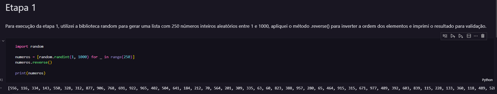

Etapa 2 – Na segunda etapa, ainda utilizando o Jupyter Notebook, declarei manualmente uma lista contendo 20 nomes de animais. Em seguida, utilizei o método .sort() para ordená-los em ordem alfabética e imprimi cada item individualmente utilizando list comprehension. Por fim, salvei o conteúdo da lista em um arquivo de texto chamado animais_ordenados.txt, com um animal por linha, utilizando o comando with open() para abrir e escrever o arquivo de forma eficiente.

| Arquivo | Link |
|--------|------|
| animais_ordenados.txt | [🔗 animais_ordenados.txt](./Exercícios/Exercício1/animais_ordenados.txt) |
 

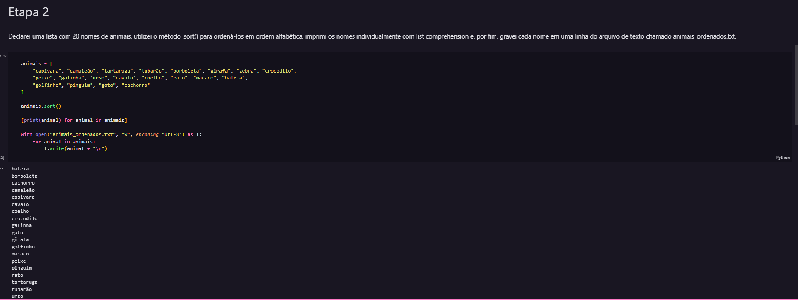

Etapa 3 – Para validar a lógica antes de rodar a versão completa da terceira etapa, iniciei com uma versão reduzida no Jupyter Notebook. Instalei a biblioteca names através do terminal com o comando pip install names, e em seguida utilizei essa biblioteca para gerar 1.000 nomes únicos. A partir dessa base, gerei uma lista com 10 mil nomes aleatórios usando random.choice() e salvei os dados em um arquivo chamado nomes_aleatorios_teste.txt, com um nome por linha. Esse teste me permitiu garantir que toda a lógica de geração e gravação estava funcionando corretamente, antes de executar o processo completo no terminal.

| Arquivo | Link |
|--------|------|
| nomes_aleatorios_teste.txt | [🔗 nomes_aleatorios_teste.txt](./Exercícios/Exercício1/nomes_aleatorios_teste.txt) |
 

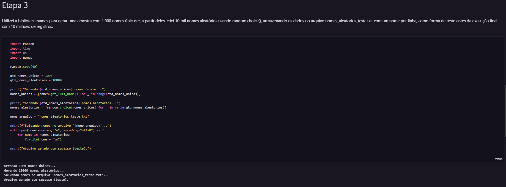
 

Após validar a lógica da geração de nomes com a versão de teste no Jupyter Notebook, desenvolvi a versão final da terceira etapa em um script separado chamado Etapa3.py. Neste script, utilizei a biblioteca names para gerar 39.080 nomes únicos e, a partir dessa base, criei 10 milhões de nomes aleatórios com a função random.choice(). Para garantir performance na escrita, abri o arquivo nomes_aleatorios.txt uma única vez utilizando o comando with open(), gravando todos os nomes de forma sequencial, um por linha. Executei esse script diretamente no terminal com o comando python Etapa3.py, o que permitiu melhor desempenho no processamento e na geração do arquivo final. O arquivo nomes_aleatorios.txt não está no repositório por exceder o limite de tamanho do GitHub, mas que ele pode ser facilmente reproduzido executando o script Etapa3.py.

| Arquivo | Link |
|--------|------|
| Etapa3.py | [🔗 Etapa3.py](./Exercícios/Exercício1/Etapa3.py) |
 

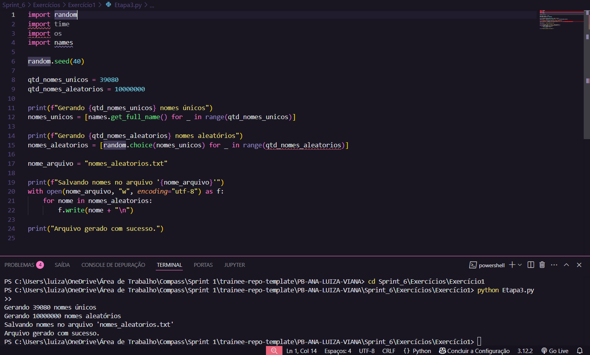

 

## 2.2 Apache Spark

Neste exercício, o objetivo foi praticar a manipulação de dados em larga escala utilizando o framework Apache Spark por meio da biblioteca PySpark. As atividades foram organizadas em etapas sequenciais, onde a cada passo novas transformações e consultas foram realizadas sobre o DataFrame . Inicialmente, configurei o ambiente de execução, garantindo a integração correta entre o Python, o Java e o Spark, e criei um script de execução automática *run_pyspark.ps1* para facilitar os testes no terminal do Windows. A leitura e a estruturação dos dados foram feitas a partir do arquivo nomes_aleatorios.txt, e o DataFrame df_nomes foi enriquecido com colunas adicionais como Escolaridade, País, Ano de Nascimento e Geração.

A seguir, descrevo cada etapa do processo, incluindo os códigos desenvolvidos:

| Arquivo | Link |
|--------|------|
| Exercicio2.py | [🔗 Exercicio2.py](./Exercícios/Exercício2/Exercicio2.py) |
| run_pyspark.ps1 | [🔗 run_pyspark.ps1](./Exercícios/Exercício2/run_pyspark.ps1) |
 

>Resolução:

Etapa 1 – Criei o script Etapa1.py onde importei as bibliotecas SparkSession, SparkContext e SQLContext. Em seguida, criei a sessão Spark, e utilizei spark.read.csv para carregar o arquivo nomes_aleatorios.txt, que está localizado na pasta do exercício 1, o caminho foi ajustado corretamente para acessar o arquivo. Por fim, visualizei as 5 primeiras linhas com o método .show(5).

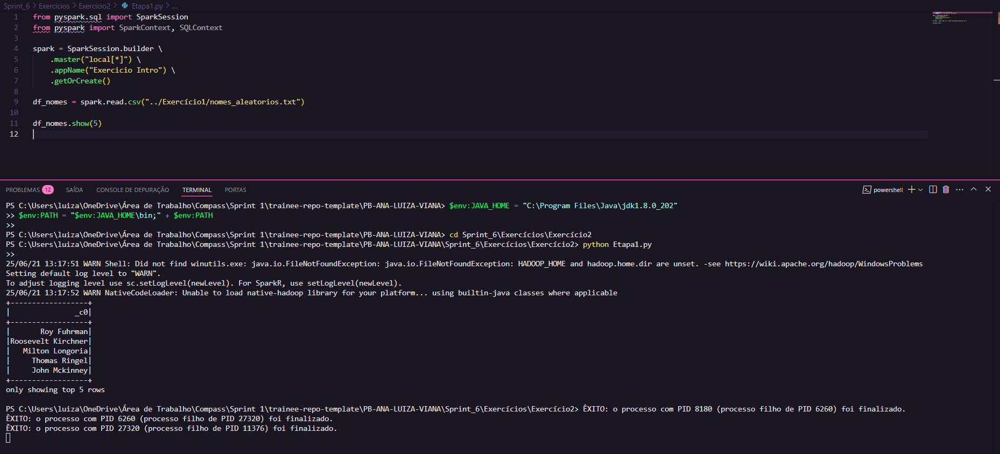

Etapa 2 – Criei o script Exercicio2.py, onde continuei utilizando a sessão Spark iniciada anteriormente. Inicialmente, carreguei novamente o arquivo nomes_aleatorios.txt usando o mesmo caminho relativo. Como o Spark não reconheceu automaticamente os nomes das colunas, a coluna foi nomeada como _c0. Renomeei essa coluna para Nomes utilizando o método withColumnRenamed. Em seguida, utilizei o método printSchema() para visualizar a estrutura do dataframe, confirmando que a coluna agora se chama Nomes e está com o tipo string. Por fim, usei o método .show(10) para exibir as 10 primeiras linhas do dataframe, acessando a coluna pelo formato de índice, conforme exigido no enunciado.

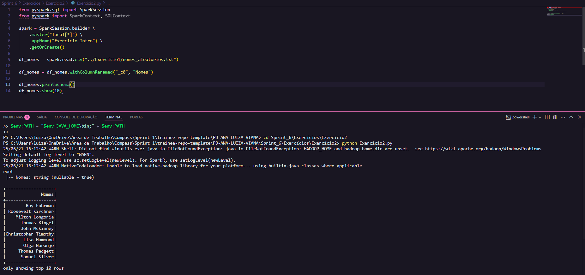

Etapa 3 – Após carregar e renomear a coluna, adicionei uma nova coluna chamada Escolaridade. Para isso, criei uma coluna auxiliar rand_num com valores aleatórios inteiros de 0 a 2, usando a função rand com semente fixa para reprodutibilidade e a função floor. Depois, com o método when, atribuí os valores "Fundamental", "Médio" e "Superior" conforme o número aleatório gerado. Removi a coluna auxiliar rand_num em seguida. Para conferir o resultado, utilizei printSchema() para ver a estrutura do dataframe e select().show() para exibir as 10 primeiras linhas com os nomes e escolaridades.

Além do script Python, criei o arquivo run_pyspark.ps1 para facilitar a execução dos scripts PySpark, configurando a variável de ambiente JAVA_HOME com o JDK 8 antes de rodar o código. 

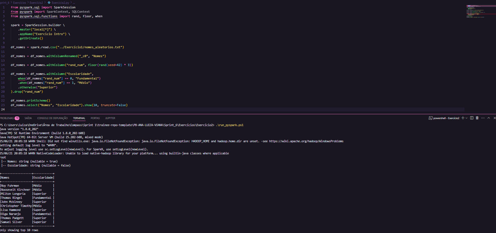

Etapa 4 – Nesta etapa, adicionei ao dataframe uma nova coluna chamada Pais, contendo valores aleatórios entre 13 países da América do Sul. Para isso, criei uma coluna auxiliar chamada rand_pais, gerando números inteiros de 0 a 12 com a função rand combinada com floor, e usando uma semente fixa. Em seguida, utilizei a função expr do PySpark para construir uma expressão CASE WHEN que mapeia cada número para um país da lista. Após o mapeamento, removi a coluna auxiliar rand_pais e finalizei exibindo o esquema do DataFrame com printSchema() e mostrando as 10 primeiras linhas com show().

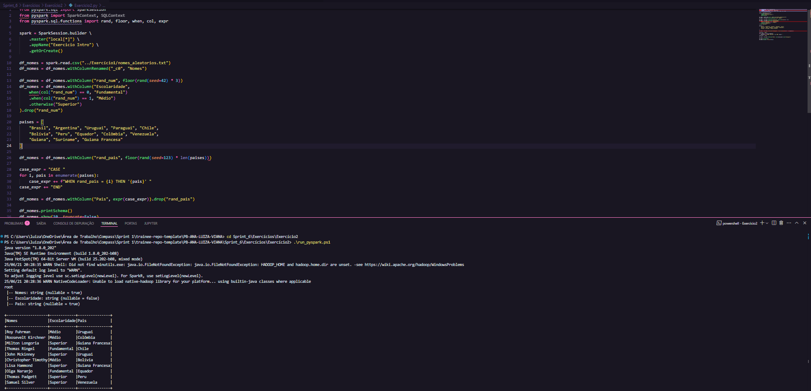

Etapa 5 – Adicionei uma nova coluna chamada AnoNascimento ao dataframe, utilizei a função rand com semente fixa e multipliquei por 66, que corresponde à quantidade de anos entre 1945 e 2010. Em seguida, apliquei a função floor para obter números inteiros e somei 1945, garantindo que os valores finais ficassem no intervalo desejado, depois atribuí esse resultado diretamente à nova coluna utilizando withColumn.

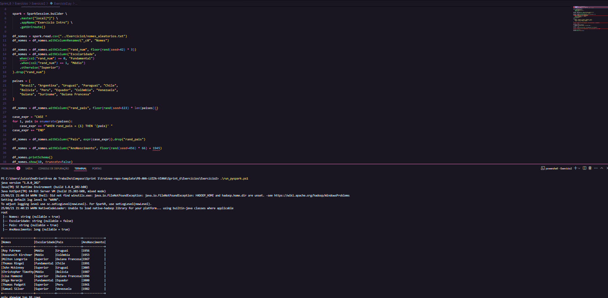

Etapa 6 – Criei um novo dataframe chamado df_select contendo apenas as pessoas nascidas a partir de 2001, ou seja, neste século. Para isso, utilizei o método select para extrair as colunas "Nomes" e "AnoNascimento" do df_nomes, aplicando em seguida o método where com a condição AnoNascimento >= 2001.  Por fim, utilizei o método show(10) para visualizar os 10 primeiros nomes resultantes desse novo dataframe.

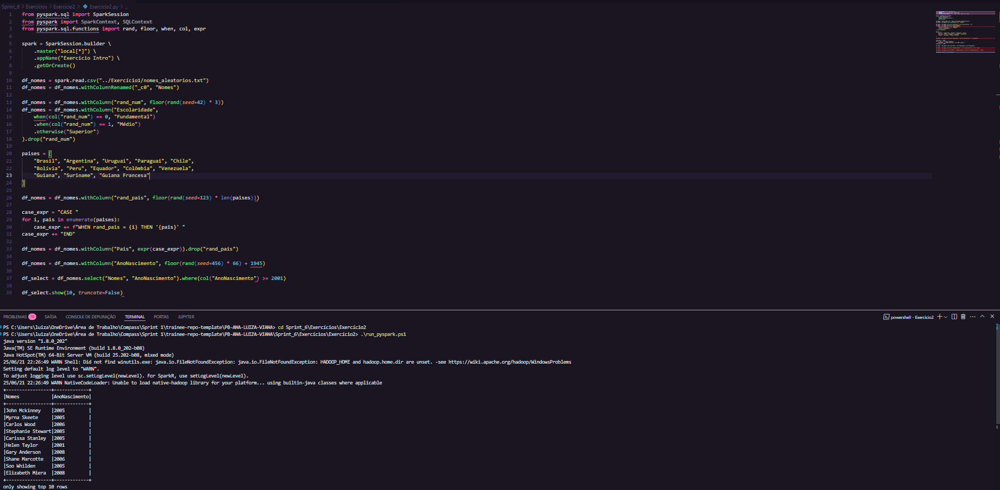

Etapa 7 – Para repetir a seleção das pessoas que nasceram neste século usando Spark SQL, primeiro registrei o dataframe df_nomes como uma tabela temporária chamada pessoas com o método createOrReplaceTempView(). Em seguida, executei uma consulta SQL para selecionar os nomes e anos de nascimento onde o ano é maior ou igual a 200, o resultado foi armazenado no dataframe df_select. Dessa forma, realizei a filtragem usando a linguagem SQL diretamente no Spark.

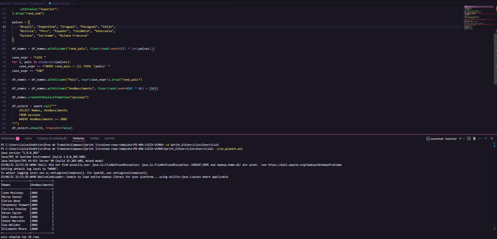

Etapa 8 – Nesta etapa, utilizei o método filter do DataFrame df_nomes para filtrar as pessoas que pertencem à geração Millennials. Para isso, apliquei uma condição lógica com operadores >= e <= na coluna AnoNascimento. Em seguida, utilizei o método count() para contar quantas linhas atendem a essa condição e imprimi o resultado no console.

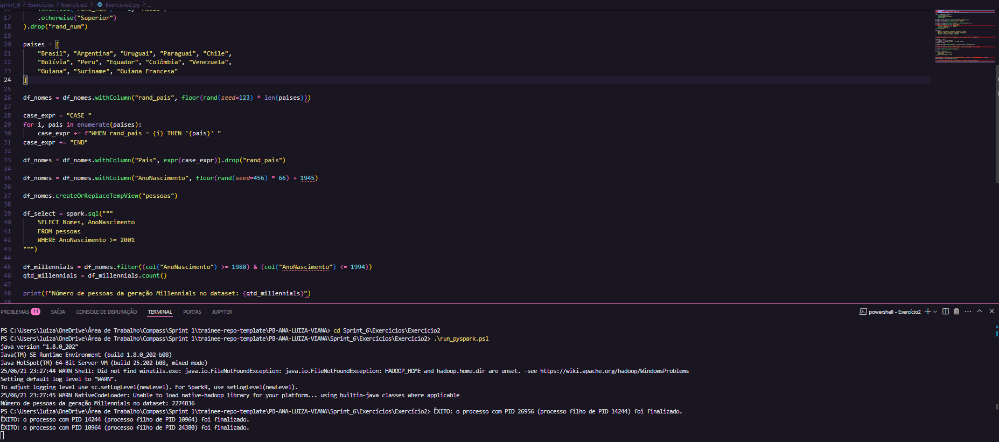

Etapa 9 – Utilizei Spark SQL para contar quantas pessoas pertencem à geração Millennials, assim, usei novamente a temp view chamada pessoas, criada a partir do df_nomes. Em seguida, escrevi uma query SQL usando o comando SELECT COUNT(*) com a cláusula WHERE AnoNascimento BETWEEN 1980 AND 1994. O resultado foi exibido com o método .show(), apresentando a quantidade total de registros que atendem ao critério da geração Millennials.

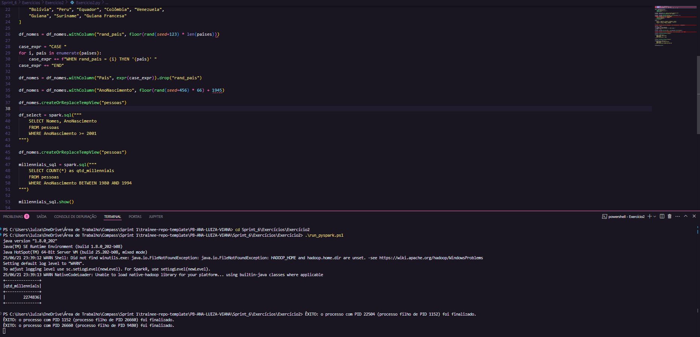

Etapa 10 – Nesta etapa, utilizei Spark SQL para contar a quantidade de pessoas de cada país pertencentes a diferentes gerações. Para isso, primeiro registrei o dataframe df_nomes como uma tabela temporária chamada pessoas. Em seguida, construí uma consulta SQL utilizando a cláusula CASE para categorizar cada pessoa em uma das quatro gerações dadas, com uma opção adicional chamada "Outros" para qualquer caso fora dessas faixas. A consulta agrupou os dados por país e geração e contou o número de registros em cada combinação. Por fim, ordenei o resultado por país, geração e quantidade, e exibi as linhas com o método .show().

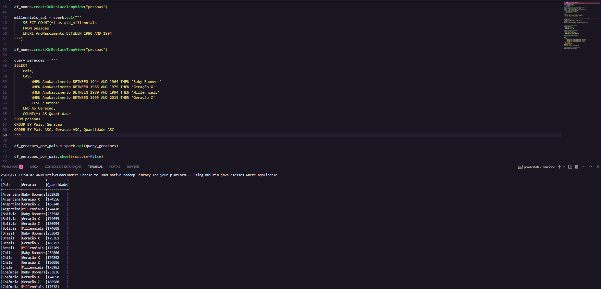

 

## 2.3 Lab AWS Glue

Neste exercício, fui guiada no laboratório AWS para realizar a construção de um processo de ETL simplificado utilizando o serviço AWS Glue. A seguir, descrevo cada etapa do processo, incluindo os códigos desenvolvidos:

| Arquivo | Link |
|--------|------|
| Etapa1.ipynb | [🔗 Etapa1.ipynb](./Exercícios/Exercício3/Etapa1.ipynb) |
 

>Resolução:

Etapa 1 – Nesta etapa, criei um script em Python para enviar o arquivo nomes.csv para o bucket compass-ana-lab-glue na AWS S3, no caminho lab-glue/input/nomes.csv. Utilizei as bibliotecas boto3, dotenv e os para configurar o cliente S3 com as credenciais armazenadas em um arquivo .env. O script verifica se o bucket já existe e, caso não exista, o cria dinamicamente de acordo com a região definida (us-east-1). Em seguida, realiza o upload do arquivo para o caminho especificado.

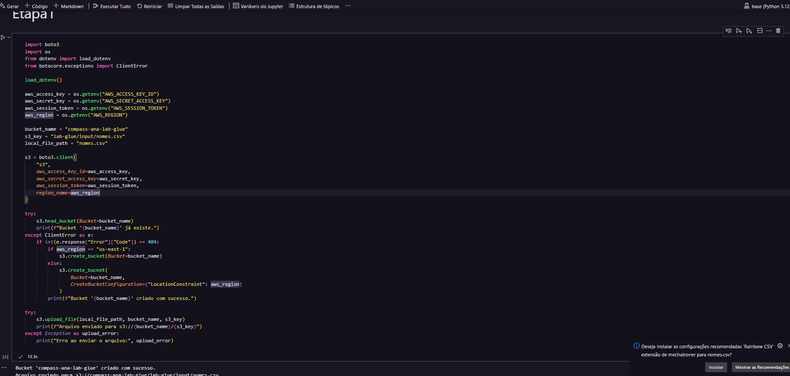

Etapa 2 – Fiz a criação da a role AWSGlueServiceRole-Lab4 no console IAM da AWS. A role foi configurada para ser assumida pelo serviço AWS Glue e recebeu permissões para facilitar a execução de jobs no ambiente de laboratório. Durante a criação, associei as seguintes policies gerenciadas pela AWS: AmazonS3FullAccess, AWSLakeFormationDataAdmin, AWSGlueConsoleFullAccess e CloudWatchFullAccess. Com isso, o Glue poderá acessar o S3, utilizar o Lake Formation, executar notebooks e gerar logs no CloudWatch.

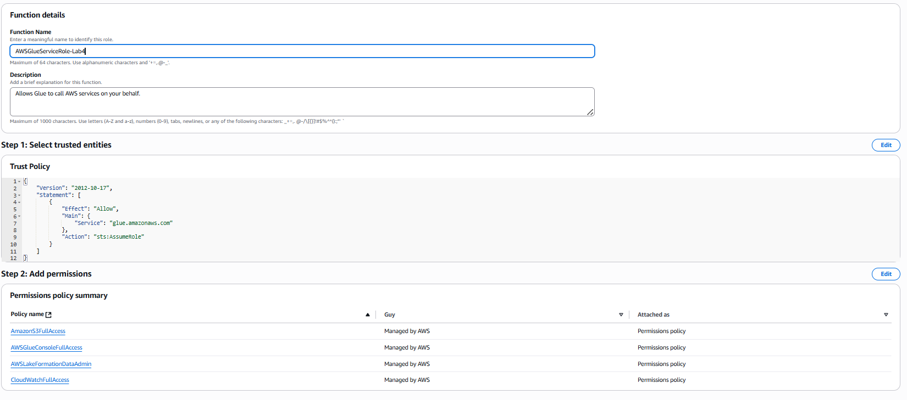

Etapa 3 – Configurei o AWS Glue pela opção “Prepare your account for AWS Glue”, criando a role padrão recomendada e concedendo acesso total ao S3, permitindo que o Glue execute jobs, crawlers e notebooks com acesso aos dados armazenados no S3, além de registrar logs e operar com permissões adequadas no ambiente de laboratório.

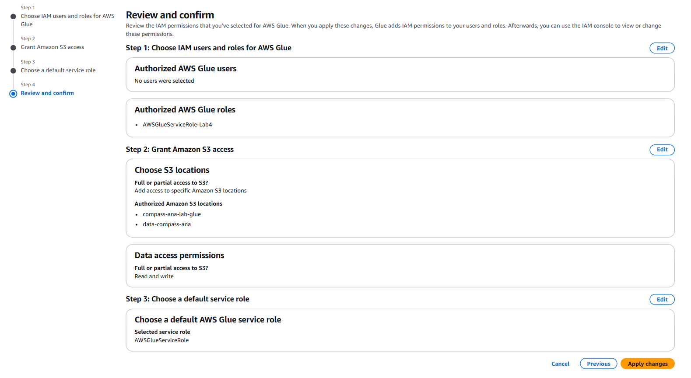

Etapa 4 – Acessei o serviço AWS Lake Formation e, ao primeiro acesso, adicionei permissões administrativas à minha conta clicando em Add myself. Em seguida, criei um database no Data Catalog do Glue, com o nome glue-lab, utilizando o catálogo padrão da conta.

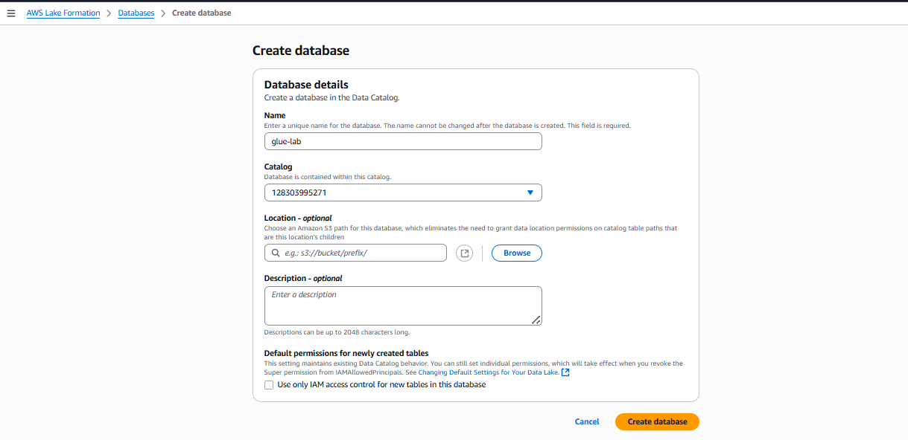

Etapa 5 – Antes de criar o job no AWS Glue, analisei localmente o arquivo nomes.csv utilizando PySpark no Jupyter Notebook. Configurei as variáveis de ambiente necessárias para iniciar a SparkSession e executei um script que realiza a leitura do CSV, infere o schema, aplica um filtro para selecionar apenas os registros do ano de 1934 e exibe as primeiras linhas do resultado, aescrita no formato Parquet foi omitida localmente para evitar conflitos com dependências do Hadoop. Essa etapa foi essencial para validar a lógica do processamento antes da execução na nuvem.

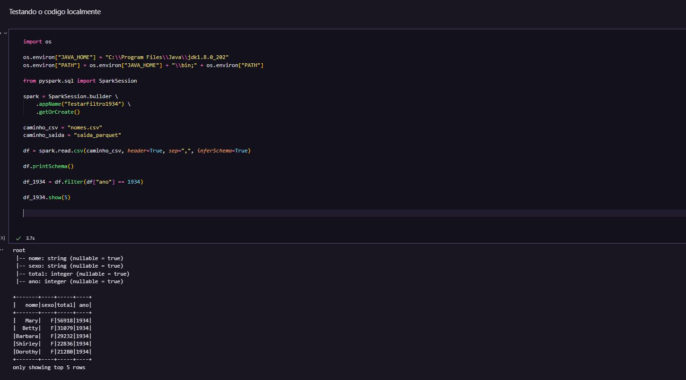

Após a validação, criei o job job_aws_glue_lab_4 no serviço AWS Glue com o objetivo de processar o arquivo nomes.csv armazenado no S3. O job foi configurado para ler o CSV, aplicar um filtro para selecionar apenas os registros referentes ao ano de 1934 e escrever o resultado no formato Parquet em um novo diretório no bucket.

Os parâmetros do job foram definidos como:

--S3_INPUT_PATH = s3://compass-ana-lab-glue/lab-glue/input/nomes.csv
--S3_TARGET_PATH = s3://compass-ana-lab-glue/lab-glue/output/nomes_1934.parquet

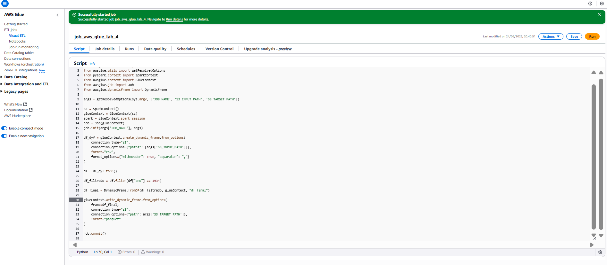

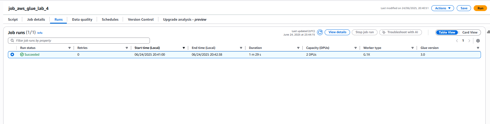

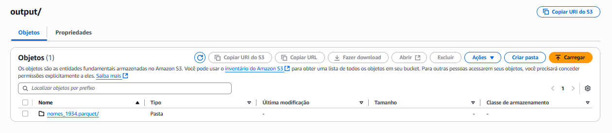

Etapa 5.2 – Nesta etapa segui a mesma lógica da anterior, iniciei testando todo o script localmente no Jupyter Notebook destinado à etapa 5, utilizando o PySpark. Fiz isso para garantir que as transformações funcionassem corretamente antes de aplicar no ambiente da AWS e, assim, evitar custos desnecessários. Após validar o funcionamento, adaptei o código para o ambiente do AWS Glue.

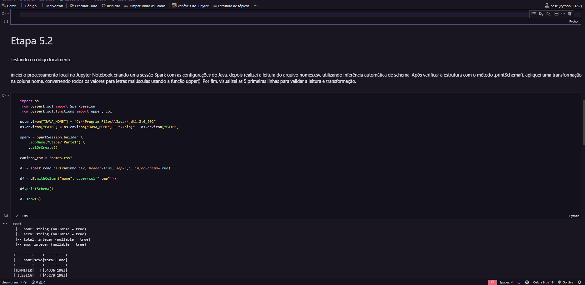

No script do AWS Glue, iniciei o job capturando os argumentos de entrada para identificar os caminhos no S3 e o nome do job, criei os contextos necessários e realizei a leitura do arquivo nomes.csv no S3 como DynamicFrame, convertendo-o para DataFrame para aplicar as transformações. Verifiquei o schema e converti os nomes para letras maiúsculas com a função upper(). Em seguida, contei o total de registros e agrupei os dados por ano e sexo, somando os totais e ordenando os anos de forma decrescente. Utilizei uma janela de partição para identificar o nome mais frequente por sexo e ano e depois agrupei os dados novamente por ano, somando os totais e ordenando os 10 primeiros anos de forma crescente, após isso, converti o DataFrame final de volta para DynamicFrame.

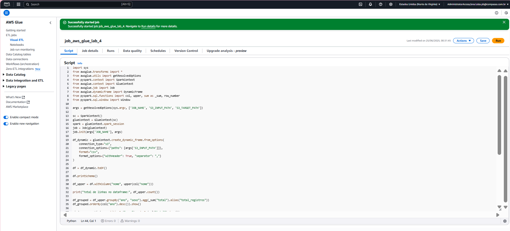

Por fim, escrevi os dados transformados de volta no S3, no formato JSON, com particionamento pelas colunas sexo e ano, no caminho s3://compass-ana-lab-glue/lab-glue/frequencia_registro_nomes_eua.

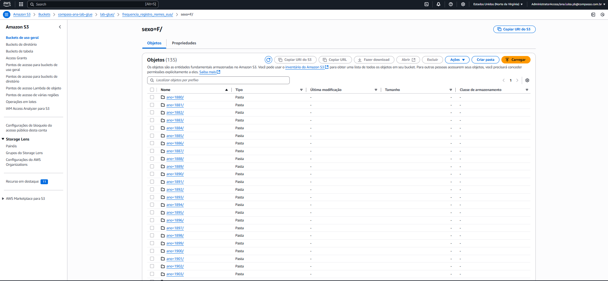

Etapa 6 – Criei um crawler no AWS Glue para catalogar os dados gravados anteriormente no S3 em formato JSON, particionados por sexo e ano. Nomeei o crawler como FrequenciaRegistroNomesCrawler e apontei como fonte de dados o caminho s3://compass-ana-lab-glue/lab-glue/frequencia_registro_nomes_eua/. Configurei a role AWSGlueServiceRole-Lab4 para permissões e defini como banco de destino o glue-lab, com execução do tipo On Demand. Após a criação, executei o crawler com sucesso, e ele criou automaticamente a tabela frequencia_registro_nomes_eua no Glue Catalog.

Finalizei acessando o Athena para validar os dados catalogados, configurei o local de saída das queries como s3://compass-ana-lab-glue/lab-glue/athena-results/, e consegui executar a visualização dos dados diretamente via SQL no Athena.

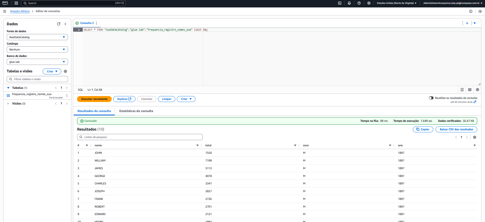

---

# Certificados

Durante essa sprint, concluí os cursos AWS: Fundamentals of Analytics on AWS – Part 2 (Português) e AWS Glue Getting Started (Português). A seguir, compartilho os certificados correspondentes:

| Certificado | Link |
|--------|------|
| Fundamentals of Analytics on AWS – Part 2 (Português) | [🔗 Link ](./Certificados/Fundamentals%20of%20Analytics%20on%20AWS%20–%20Part%202%20(Português).pdf) |
| AWS Glue Getting Started (Português) | [🔗 Link ](./Certificados/AWS%20Glue%20Getting%20Started%20(Português).pdf) |
 
