# 🚀 Desafio 

## 📌 Resumo

Nesse desafio, dei continuidade à quarta etapa do projeto final, dedicada à construção da camada Refined do Data Lake. Após a ingestão dos dados brutos do CSV e da API TMDB e seu processamento na camada Trusted na sprint anterior, iniciei esta etapa com a definição e validação do modelo dimensional, estruturado para responder às perguntas analíticas sobre representatividade feminina em filmes de guerra a partir de 1950.

O modelo foi composto por dimensões como dimArtista, dimDiretor e dimTempo, além de tabelas ponte filmeDiretor e filmeArtista e da tabela fato fatoRepresentacaoFeminina. Cada dimensão foi criada com base nos dados já tratados na Trusted, e os relacionamentos foram estabelecidos a partir de chaves. A modelagem foi implementada com jobs no AWS Glue Studio, onde apliquei transformações com PySpark para consolidar os dados, remover duplicações e garantir joins corretos apenas entre filmes que estavam presentes tanto no CSV quanto na API TMDB. Os dados resultantes foram gravados em formato Parquet, com estrutura de diretórios definida no S3. Em seguida, utilizei crawlers para catalogar as novas tabelas da camada Refined no Glue Data Catalog.

Finalizei a sprint com testes e consultas no Athena, validando a integridade dos relacionamentos, as quantidades de registros e os filtros esperados, essa etapa foi essencial para tornar os dados prontos para análise.

## 🗂️ Sumário 

1. [Etapa 4](#etapa-4)
    - 1.1 [Modelagem Dimensional](#11-modelagem-dimensional)
    - 1.2 [Dimensão Tempo](#12-dimensão-tempo)
    - 1.3 [Dimensão País](#13-dimensão-país)
    - 1.4 [Dimensão Diretor](#14-dimensão-diretor)
    - 1.5 [Dimensão Artista](#15-dimensão-artista)
    - 1.6 [Ponte Filme Artista](#16-ponte-filme-artista)
    - 1.7 [Ponte Filme Diretor](#17-ponte-filme-diretor)
    - 1.8 [Fato Representação Feminina](#18-fato-representação-feminina)

 

---

# Etapa 4

A seguir estarei detalhando um pouco mais dos scripts utilizados em cada fase, de como foi a execução e as evidências de cada ação tomada:

| Arquivo | Link |
|--------|------|
| job_dim_tempo | [🔗 job_dim_tempo ](./job_dim_tempo.py) |
| job_dim_pais | [🔗 job_dim_pais ](./job_dim_pais.py) |
| job_dim_diretor | [🔗 job_dim_diretor ](./job_dim_diretor.py) |
| job_dim_artista | [🔗 job_dim_artista ](./job_dim_artista.py) |
| job_filme_artista | [🔗 job_filme_artista ](./job_filme_artista.py) |
| job_filme_diretor | [🔗 job_filme_diretor ](./job_filme_diretor.py) |
| job_fato_rep_feminina | [🔗 job_fato_rep_feminina ](./job_fato_rep_feminina.py) |

 

## 1.1 Modelagem Dimensional

A etapa teve início com o planejamento da modelagem dimensional da camada Refined, com base nas perguntas analíticas definidas anteriormente, que investigam a representatividade feminina em filmes de guerra desde 1950. A modelagem foi pensada para permitir análises eficientes sobre personagens femininas, diretores, países, notas, popularidade e evolução temporal dos filmes.

Comecei identificando os principais eixos de análise, o que me levou à definição de uma tabela fato e quatro dimensões e duas pontes. A estrutura foi desenhada seguindo boas práticas de modelagem star schema, utilizando chaves substitutas para garantir integridade referencial entre as tabelas e facilitar o relacionamento entre os dados.

As tabelas criadas foram:

- **dimTempo**: dimensão temporal criada a partir dos anos de lançamento dos filmes presentes na tabela csv_movies. Inclui as colunas id_tempo, ano e decada, permitindo análises históricas e agrupamentos por período. Essa tabela é essencial para analisar a evolução da representatividade feminina ao longo das décadas.

- **dimPais**: construída a partir dos campos origin_country e production_countries da tabela tmdb_movies. Nessa tabela usei a função explode, gerando uma coluna chamada id_pais com os códigos dos países e , em paralelo,  extrai os nomes dos países. Essa dimensão permite avaliar quais países mais produziram filmes com maior representação feminina.

- **dimDiretor**: criada com base na equipe técnica dos filmes, campo credits.crew da API TMDB. Contém as colunas id_diretor, nome_diretor e genero. Como um filme pode ter múltiplos diretores, foi necessário criar uma tabela ponte, filmeDiretor, para garantir o relacionamento muitos-para-muitos. Essa dimensão é importante para explorar a influência da direção na presença feminina no elenco.

- **dimArtista**: construída a partir dos dados do elenco extraídos do campo credits.cast da TMDB. Contém id_artista, nome_artista e genero, e é fundamental para realizar análises relacionadas à participação feminina nos filmes de guerra. Como a relação entre filmes e artistas é de muitos-para-muitos, foi criada a tabela ponte filmeArtista.

- **filmeArtista**: tabela de relacionamento entre filmes e artistas, com as colunas id_filme, id_artista, ordem_elenco e papel. As informações foram obtidas da API TMDB, e essa ponte permite identificar o papel representado por cada artista e sua posição no elenco.

- **filmeDiretor**: tabela de relacionamento entre filmes e diretores, com as colunas id_filme e id_diretor, também extraída da API TMDB. Garante a correta associação entre múltiplos diretores e os filmes correspondentes.

- **fatoRepresentacaoFeminina**: a tabela fato central do projeto. Nela, consolidei os filmes que atendem aos critérios de análise (gênero "guerra", nota ≥ 6, votos ≥ 100, ano ≥ 1950). Os dados da API TMDB já foram extraídos com esses filtros, portanto, ao cruzar com o CSV, apenas os filmes com id presente em ambas as fontes foram mantidos. A tabela contém: id_filme, chave primária da fato; titulo_principal, do CSV; titulo_original, do TMDB; ano_lancamento, do CSV; id_pais, primeiro país listado no campo origin_country da TMDB; nota_media e numero_votos, do CSV; popularidade, do TMDB; id_tempo chave estrangeira para dimTempo; id_diretores, lista agregada com todos os diretores vinculados ao filme, para ligação com a dimDiretor.

A construção dessa modelagem foi essencial para garantir uma visão consolidada dos filmes e suas conexões com artistas, diretores, tempo e país, facilitando a realização de análises nas camadas posteriores. A estrutura também respeita o princípio da separação de responsabilidades: os fatos numéricos e relacionais ficam na tabela fato, enquanto os atributos descritivos permanecem organizados nas dimensões, promovendo flexibilidade e desempenho nas consultas analíticas.

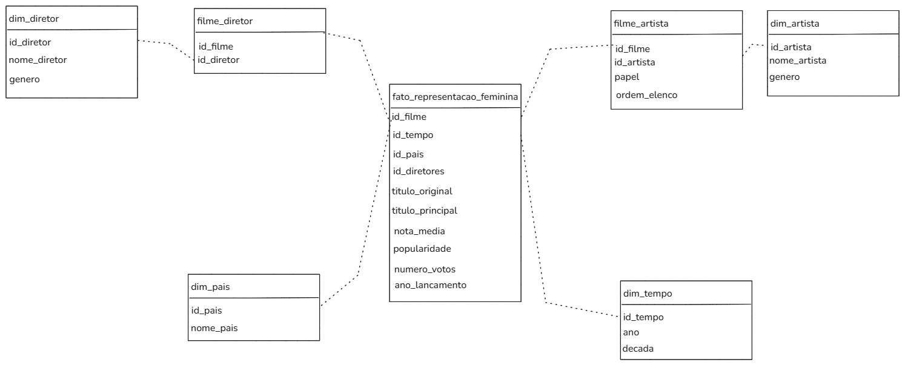

## 1.2 Dimensão Tempo

**Data Catalog**

Na AWS, iniciei criando o Glue Database com o nome filmes_refined_db, que será utilizado como o catálogo central da camada Refined do Data Lake. Esse database foi criado para registrar todas as tabelas modeladas, permitindo que os dados resultantes dos Jobs, fiquem organizados e acessíveis para consultas no Athena.

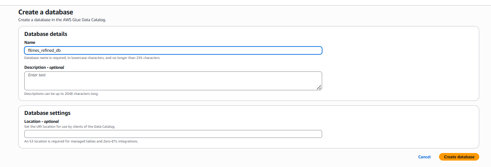

**Job**

Na camada Refined, optei por criar um job dedicado para cada tabela da modelagem dimensional, a fim de facilitar a organização, reutilização e manutenção do código, além de permitir que cada processo de transformação seja executado e monitorado de forma independente. Essa abordagem também permite isolar erros e adaptar cada job conforme a complexidade e origem dos dados utilizados.

O primeiro job criado foi o job_dim_tempo, responsável por gerar a dimensão de tempo que será usada como chave estrangeira na tabela fato do projeto. O job foi desenvolvido no AWS Glue, com o tipo Spark, linguagem Python 3 e versão do Glue 3.0. Utilizei a role AWSGlueServiceRole-Lab4, com permissões adequadas de leitura e escrita no bucket do S3. Configurei o job com worker type G 1x, escalonamento automático desativado, 2 workers fixos, tempo limite de 5 minutos e número de tentativas igual a 0.

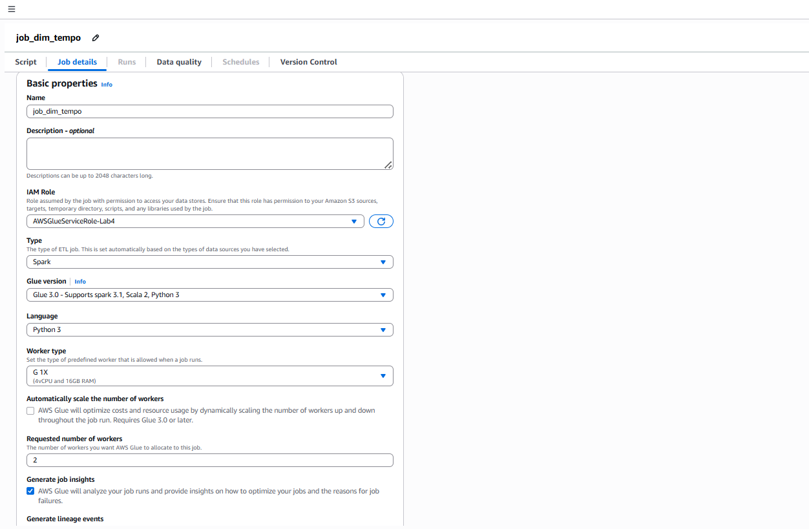

Para esse job, desenvolvi um script Python com o objetivo de criar a dimensão de tempo, que será fundamental para a análise temporal dos filmes na camada Refined. O script inicializa os contextos do Spark e do Glue, e em seguida lê a tabela csv_movies da camada Trusted, utilizando o Glue Catalog como origem, a lógica do processamento parte da coluna anolancamento presente nos dados do CSV. Primeiramente, os valores nulos foram descartados e as duplicações removidas, garantindo que cada ano apareça apenas uma vez na dimensão. Em seguida, o campo foi renomeado para id_tempo, que atuará como chave substituta da dimensão, sendo usada como chave estrangeira na tabela fato para representar o tempo de forma padronizada. Foram também criadas duas colunas adicionais: ano, com o valor do próprio ano de lançamento, e decada, calculada com base no ano para facilitar análises por período. O DataFrame final foi gravado em formato Parquet na camada Refined, no caminho s3://data-compass-ana/Refined/DimTempo/, utilizando o modo overwrite para garantir que execuções futuras substituam os dados anteriores. 

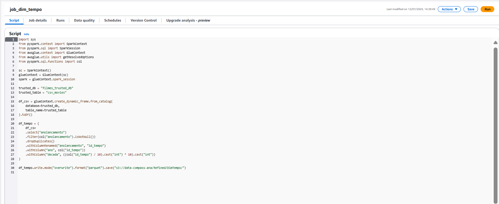

**Crawler**

Após a execução do job responsável pela criação da tabela, criei um Crawler com o nome crawler_dim_tempo. Para isso, utilizei a role AWSGlueServiceRole-Lab4, com permissões adequadas para leitura e escrita no bucket S3 e para atualização do Glue Data Catalog. Configurei o crawler para apontar para o diretório s3://data-compass-ana/Refined/DimTempo/, onde os dados da dimensão foram gravados no formato Parquet. Durante a configuração, associei o crawler ao database filmes_refined_db, garantindo que a tabela dimtempo fosse criada com os metadados corretos e ficasse disponível para consultas no Athena.

**Validação no Athena**

Para finalizar o processo e validar a criação da tabela dimtempo, acessei o AWS Athena e realizei uma consulta simples utilizando SELECT * FROM dimtempo LIMIT 10;. Essa consulta permitiu verificar a estrutura da tabela e confirmar que os dados foram carregados corretamente, com as colunas id_tempo, ano e decada devidamente preenchidas.

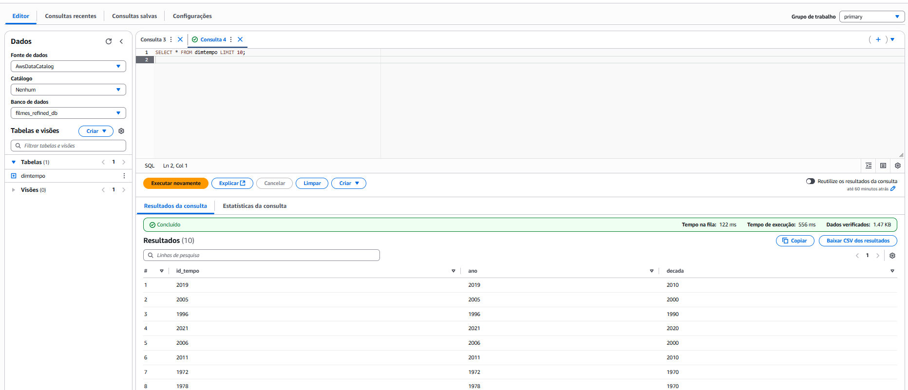

## 1.3 Dimensão País

**Job**

Criei o job job_dim_pais no AWS Glue com as mesmas configurações adotadas no job anterior: utilizei a role AWSGlueServiceRole-Lab4, habilitada com permissões de leitura e escrita no bucket do S3. O job foi configurado com tipo Spark, versão do Glue 3.0, linguagem Python 3, worker type G 1x, sem escalonamento automático, com 2 workers fixos, zero tentativas e tempo máximo de execução de 5 minutos.

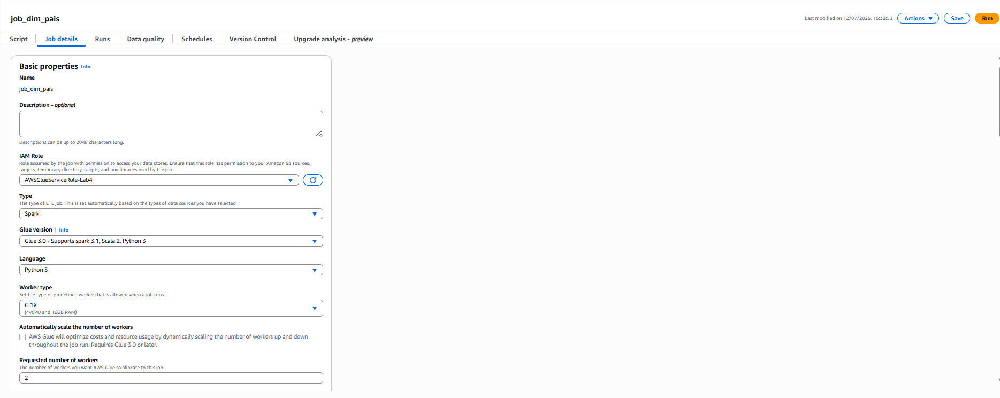

Para o job_dim_pais, desenvolvi um script em Python com o objetivo de construir a dimensão de países a partir dos dados da tabela tmdb_movies presentes na camada Trusted. Inicialmente, o script carrega os dados com origin_country e production_countries, que aparecem de forma aninhada no JSON original da API TMDB. A primeira transformação extrai os países de origem dos filmes com a função explode, gerando uma coluna chamada id_pais com os códigos dos países. Em paralelo, outra transformação extrai os nomes dos países a partir da estrutura production_countries, acessando os campos iso_3166_1 e name. Ambas as extrações passam por remoção de duplicatas e nulos. Em seguida, as duas bases são unidas pela chave id_pais, garantindo que cada país seja representado apenas uma vez na dimensão final. A tabela resultante contém os campos id_pais (código ISO) e nome_pais, sendo então gravada em formato Parquet no S3, no caminho s3://data-compass-ana/Refined/DimPais/. Utilizei o modo overwrite para garantir que execuções subsequentes atualizem os dados corretamente. Essa dimensão é essencial para permitir análises por país de origem dos filmes na camada Refined.

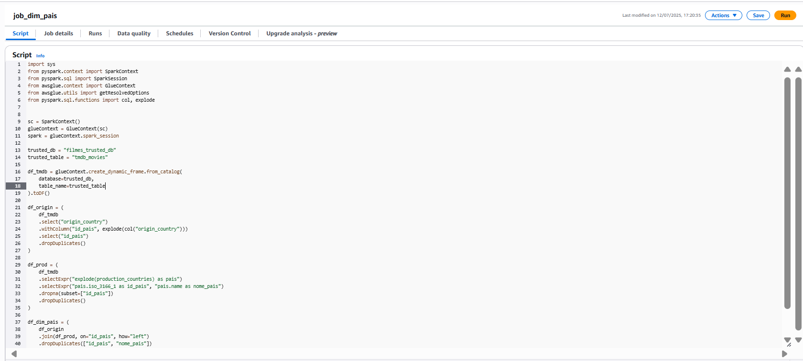

**Crawler**

Após executar o job, criei o crawler_dim_pais, usei role AWSGlueServiceRole-Lab4, configurei o crawler para apontar para o diretório onde os arquivos Parquet da dimensão foram gravados, ou seja, s3://data-compass-ana/Refined/DimPais/. O crawler foi vinculado ao banco de dados filmes_refined_db. Com a execução do crawler, os metadados da dimpais foram automaticamente extraídos e registrados no Glue Data Catalog, permitindo que a tabela seja consultada facilmente via Athena.

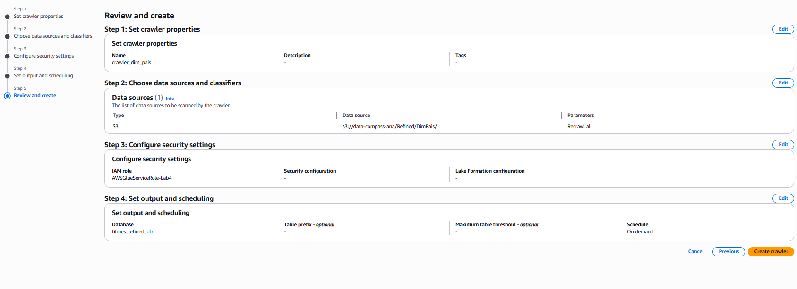

**Validação no Athena**

Validei a criação da tabela dimpais acessando o Athena e realizando uma consulta simples, assim, observei que ao total temos 52 países, além de verificar se a estrutura da tabela estava correta.

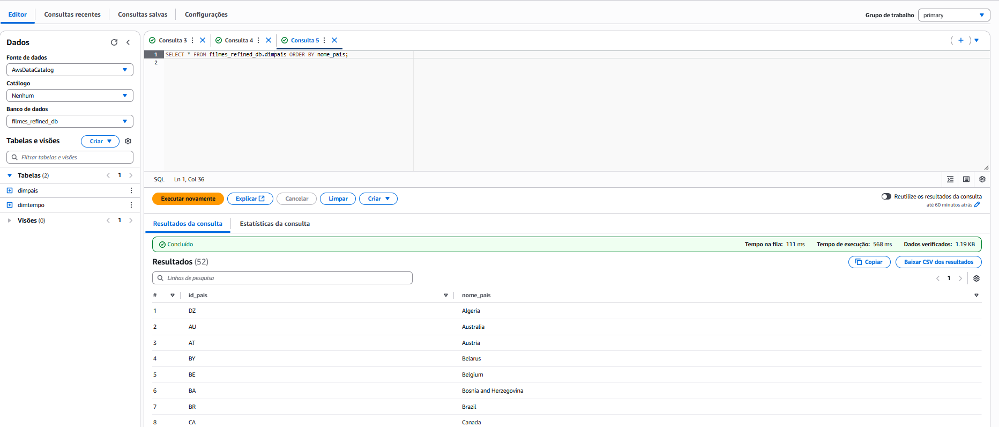

## 1.4 Dimensão Diretor

**Job**

Assim como nas dimensões anteriores, criei o job_dim_diretor no AWS Glue com o objetivo de processar e estruturar os dados dos diretores presentes na camada Trusted. O job foi configurado com o tipo Spark, Glue Version 3.0, linguagem Python 3, e executado com a role AWSGlueServiceRole-Lab4. Mantive as mesmas configurações de performance: worker type G 1x, escalonamento automático desativado, dois workers fixos, sem tentativas adicionais e com tempo limite de 5 minutos. Esse job é parte da estratégia de dividir as transformações por tabela, o que facilita o gerenciamento, a depuração e a reutilização dos scripts na arquitetura do projeto.

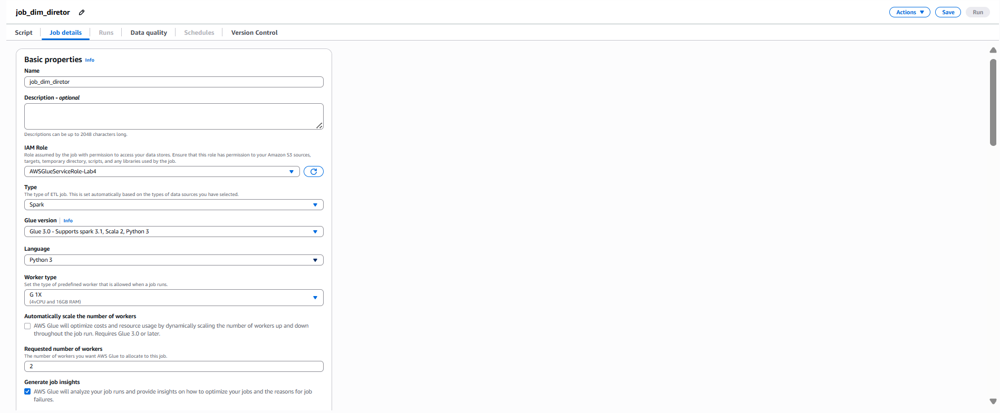

Para construir a tabela dimdiretor, tive como objetivo extrair apenas os profissionais que exerceram a função de diretor nos filmes provenientes da base da API TMDB. Como os dados de equipe técnica estavam organizados em uma lista na coluna credits.crew, precisei aplicar a função explode para transformar cada membro da equipe em uma linha individual, facilitando o filtro e a manipulação posterior. Em seguida, apliquei um filtro para selecionar apenas os registros cujo campo job era igual a “Director”, garantindo que apenas os diretores fossem mantidos.

Depois disso, selecionei os campos relevantes para compor a dimensão: o id_diretor, convertido para string, que funcionará como chave primária da tabela, o nome_diretor e o genero, também convertido para string. Esse último campo segue a codificação do TMDB, onde 0 representa gênero não especificado, 1 feminino e 2 masculino. Para evitar duplicidade de registros, apliquei a função dropDuplicates considerando apenas o identificador do diretor. Por fim, salvei os dados processados em formato Parquet na camada Refined, no caminho s3://data-compass-ana/Refined/DimDiretor/. 

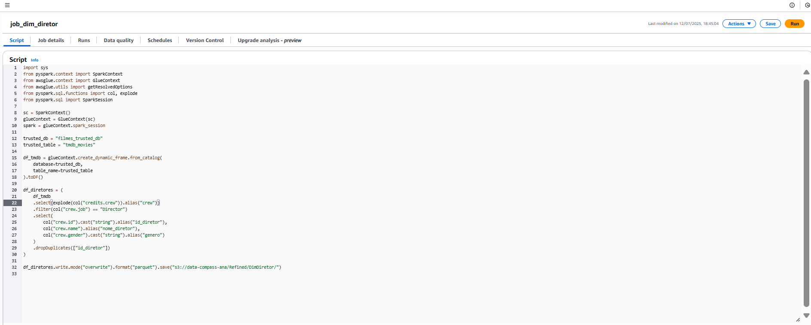

**Crawler**

Após a finalização do job que gerou a dimensão de diretores, criei o crawler_dim_diretor, utilizando a role AWSGlueServiceRole-Lab4, apontei o caminho s3://data-compass-ana/Refined/DimDiretor/, onde os arquivos Parquet da dimensão foram armazenados. Em seguida, defini o filmes_refined_db como banco de dados de destino, garantindo que a tabela dimdiretor fosse criada e catalogada corretamente.

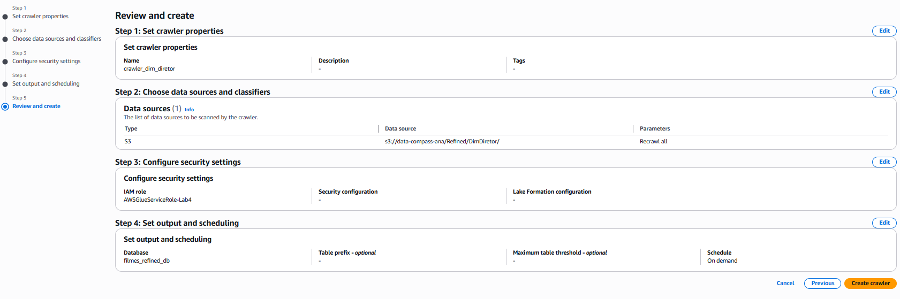

**Validação no Athena**

Validei a criação da tabela dimdiretor acessando o Athena e realizando uma consulta simples com SELECT * FROM, assim, observei que ao total temos 495 diretores, além de verificar se a estrutura da tabela estava correta.

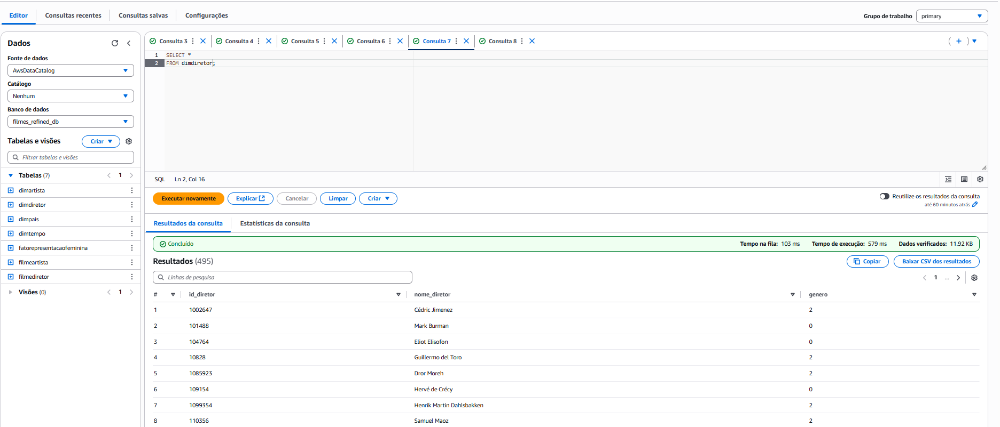

## 1.5 Dimensão Artista

**Job**

Dando continuidade à construção da camada Refined, criei o job job_dim_artista no AWS Glue. Mantive as mesmas configurações dos jobs anteriores: linguagem Python, Glue Version 3.0, tipo Spark, execução com 2 workers do tipo G.1X e sem escalonamento automático. O job foi configurado com a role AWSGlueServiceRole-Lab4, o caminho de saída foi definido como s3://data-compass-ana/Refined/DimArtista/, e ao final da execução, os dados transformados foram gravados no formato Parquet.

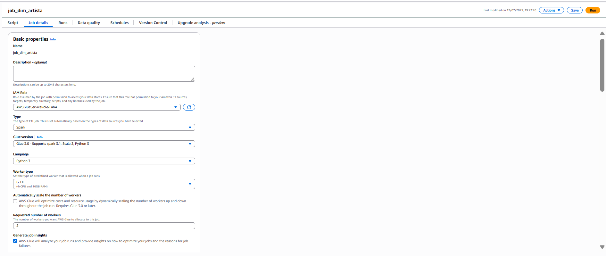

Para construir a tabela de dimensão de artistas, iniciei carregando os dados da tabela tmdb_movies, já presente na camada Trusted, por meio do Glue Data Catalog. Como o campo credits.cast dentro dessa estrutura é um array com os membros do elenco de cada filme, utilizei a função explode para desaninhá-lo, gerando uma linha para cada artista relacionado ao filme. A partir disso, selecionei as colunas relevantes para a dimensão: o id do artista, o nome e o gênero, renomeando os campos para id_artista, nome_artista e genero. Também converti os campos id e gender para o tipo string, garantindo consistência no schema da tabela. Em seguida, eliminei os registros duplicados com base no id_artista, para garantir que cada artista aparecesse apenas uma vez na dimensão. Por fim, escrevi o DataFrame resultante em formato Parquet no bucket S3, no caminho s3://data-compass-ana/Refined/DimArtista/, utilizando o modo overwrite para substituir dados anteriores em execuções futuras do job. Essa tabela servirá como referência para outras tabelas da modelagem, como a ponte FilmeArtista, que ligará os artistas aos seus respectivos papéis em cada filme.

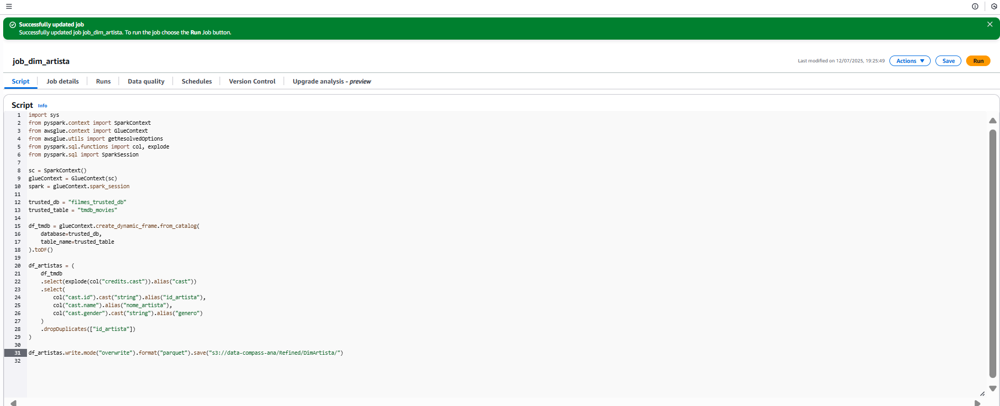

**Crawler**

Após a criação do job da dimensão de artistas, configurei o crawler_dim_artista utilizando a role AWSGlueServiceRole-Lab4, apontei o crawler para o caminho s3://data-compass-ana/Refined/DimArtista/, onde os arquivos Parquet da dimensão foram salvos. Em seguida, defini o database filmes_refined_db como destino para catalogar os metadados extraídos.

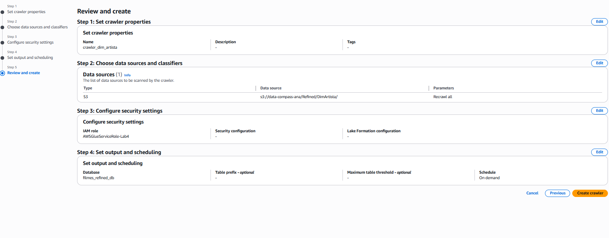

**Validação no Athena**

Validei a criação da tabela dimartista acessando o Athena e realizando uma consulta simples com SELECT * FROM e limitando a 10 registros, assim, observei como estavam organizados os dados e as colunas.

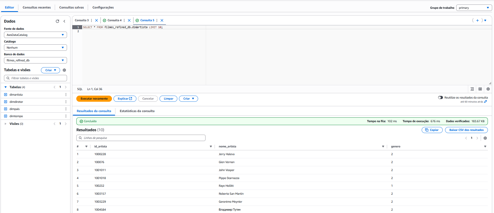

## 1.6 Ponte Filme Artista 

**Job**

Durante a modelagem dimensional, optei por criar a tabela ponte filme_artista para representar a relação de muitos-para-muitos existente entre filmes e artistas. Como um filme pode ter diversos artistas no elenco e um mesmo artista pode participar de vários filmes, essa abordagem garante a integridade e flexibilidade das análises, permitindo cruzar informações entre as dimensões sem redundância. Essa tabela também inclui o nome do papel interpretado, enriquecendo as possibilidades analíticas sobre a atuação dos artistas nos filmes de guerra.

Para construir essa tabela, criei o job Glue job_filme_artista, seguindo a mesma configuração dos jobs anteriores: utilizei o tipo Spark, linguagem Python 3, Glue Version 3.0, com a role AWSGlueServiceRole-Lab4 e permissões adequadas de leitura e escrita no bucket S3. A estruturação foi feita para garantir o carregamento correto das relações entre filmes e artistas a partir dos dados da API TMDB, já organizados na camada Trusted. Após o processamento, os dados foram gravados no caminho s3://data-compass-ana/Refined/FilmeArtista/ em formato Parquet, preparando o terreno para consultas otimizadas e análises futuras via Athena.

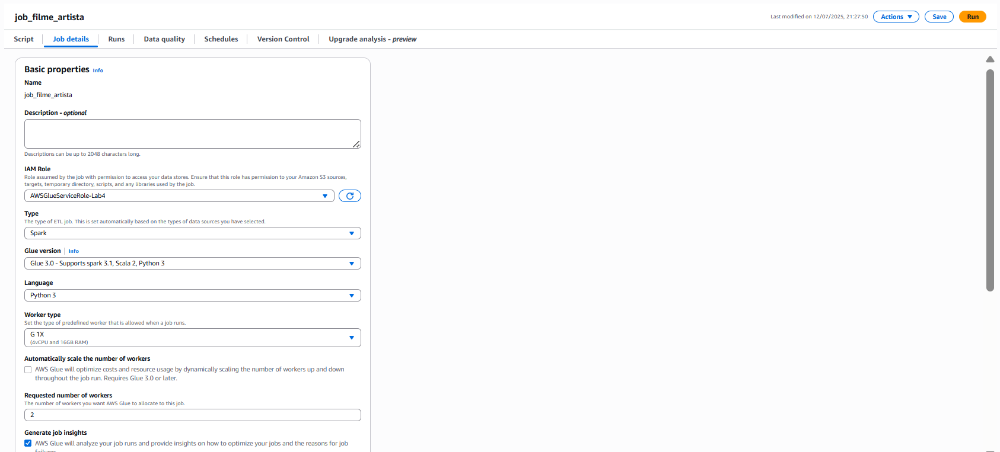

Para construir a tabela ponte filmeartista, desenvolvi um job Glue com o objetivo de mapear as relações entre os filmes e seus respectivos membros do elenco, garantindo a estrutura de muitos-para-muitos entre dimfilme e dimartista. Essa estrutura é essencial para análises detalhadas sobre participação de artistas nos filmes, permitindo, por exemplo, avaliar a presença feminina no elenco, a recorrência de atores em produções de guerra, ou a diversidade de papéis ao longo do tempo.

No código, iniciei lendo os dados da tabela tmdb_movies, que se encontra na camada Trusted. Utilizei o campo credits.cast, que contém informações sobre os atores e atrizes, incluindo ID, nome, personagem e ordem de aparição no elenco. Como esse campo é um array, utilizei a função explode para transformar cada item do elenco em uma linha individual.

Em seguida, selecionei as colunas relevantes para a construção da tabela ponte: imdb_id, renomeado para id_filme, identificador do filme que será para ligar à fato; cast.id, renomeado para id_artista, identificador do artista, usado para se conectar à dimartista; cast.character, renomeado como papel, nome do personagem interpretado pelo artista; cast.order, renomeado como ordem_elenco, posição do artista no crédito do filme, o que pode ser útil para identificar papéis principais.

Apliquei um filtro com dropna para garantir que apenas registros com id_filme e id_artista válidos fossem considerados, depois escrevi os dados processados no formato Parquet para o caminho s3://data-compass-ana/Refined/FilmeArtista/, usando o modo overwrite para substituir dados antigos em execuções futuras. Essa tabela é uma das peças centrais da modelagem, conectando os filmes com os artistas e possibilitando análises robustas de representatividade, protagonismo e presença ao longo das décadas.

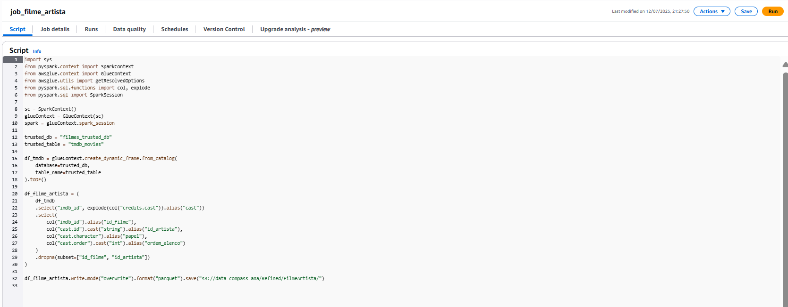

**Crawler**

Após a execução do job_filme_artista, criei o crawler_filme_artista, seguindo os mesmos passos das demais, assim, usei a role AWSGlueServiceRole-Lab4, com permissões apropriadas de leitura e catalogação, configurei o crawler para apontar para o diretório S3 onde os dados transformados da tabela ponte foram gravados: s3://data-compass-ana/Refined/FilmeArtista/. O crawler foi vinculado ao database filmes_refined_db, garantindo que os metadados da tabela filmeartista fossem extraídos e registrados no Glue Data Catalog. 

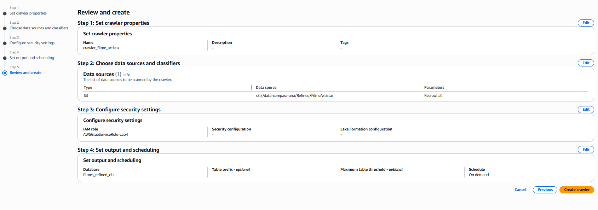

**Validação no Athena**

Validei a criação da tabela filmeartista acessando o Athena e realizando uma consulta simples com SELECT * FROM e limitando a 10 registros, assim, observei como estavam organizados os dados e as colunas.

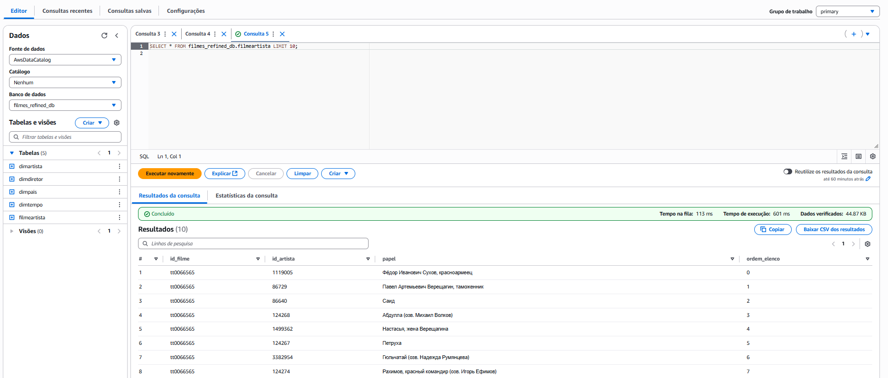

## 1.7 Ponte Filme Diretor 

**Job**

Para representar corretamente a relação entre filmes e diretores no modelo dimensional, optaei também por criar uma segunda tabela ponte, a filme_diretor. Essa decisão foi motivada pela natureza de relacionamento muitos-para-muitos entre essas entidades, um mesmo filme pode ter múltiplos diretores, e um diretor pode estar associado a vários filmes ao longo do tempo. Dessa forma, a criação dessa ponte garante maior flexibilidade analítica, permitindo responder com precisão sobre  a evolução da representatividade de diretores ao longo das décadas e se isso impactou de alguma forma na presença feminina no elenco.

Com base nisso, desenvolvi o job job_filme_diretor, que será responsável por extrair e estruturar essa relação a partir dos dados presentes na camada Trusted, preparando-os para a camada Refined. A configuração seguiu o mesmo modelo dos jobs anteriores: utilizei o tipo Spark, linguagem Python 3, Glue Version 3.0, com a role AWSGlueServiceRole-Lab4 e permissões adequadas de leitura e escrita no bucket S3. Após o processamento, os dados foram gravados no caminho s3://data-compass-ana/Refined/FilmeDiretor/ em formato Parquet, preparando o terreno para consultas otimizadas e análises futuras via Athena.

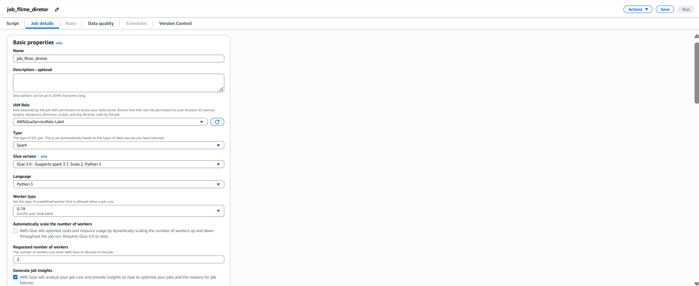

Iniciei o job carregando os dados da tabela tmdb_movies, localizada no database filmes_trusted_db, utilizando o Glue Catalog. Como essa tabela contém uma estrutura aninhada com informações detalhadas da equipe técnica de cada filme no campo credits.crew, utilizei a função explode para transformar essa lista de profissionais em linhas individuais, com a estrutura expandida, filtrei apenas os registros cujo valor da coluna crew.job era igual a "Director", pois o objetivo era isolar os diretores dos demais membros da equipe técnica. Em seguida, selecionei os campos relevantes para nossa tabela ponte: o imdb_id do filme, renomeado como id_filme, e o id do diretor, convertido para string e renomeado como id_diretor.

Apliquei o método dropDuplicates para garantir que não houvesse duplicidades na relação entre filme e diretor, o que poderia ocorrer caso o mesmo diretor estivesse listado mais de uma vez em um único filme. Por fim, escrevi o resultado em formato Parquet no bucket S3, no caminho s3://data-compass-ana/Refined/FilmeDiretor/, utilizando o modo overwrite para permitir que execuções futuras do job substituam os dados antigos com consistência. Essa transformação garantiu uma estrutura limpa e bem definida para analisar a participação dos diretores nos filmes de guerra ao longo do tempo.

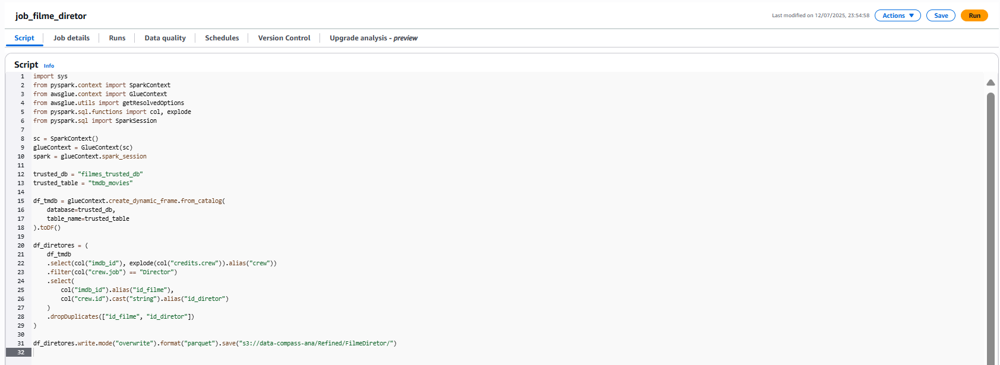

**Crawler**

Após a execução do job job_filme_diretor, criei o crawler_filme_diretor, responsável por catalogar os dados transformados da tabela ponte que relaciona filmes e diretores. Para isso, utilizei a role AWSGlueServiceRole-Lab4, configurei o crawler para apontar para o caminho s3://data-compass-ana/Refined/FilmeDiretor/, onde os arquivos Parquet foram salvos. Em seguida, defini o database filmes_refined_db como destino da nova tabela catalogada. Com isso, os metadados da tabela filmediretor ficaram disponíveis no catálogo do Glue e acessíveis para consultas no Athena.

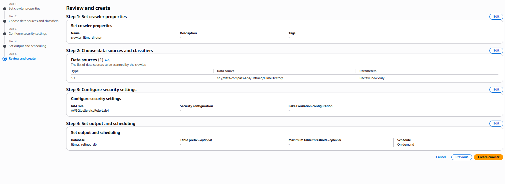

**Validação no Athena**

Validei a criação da tabela filmediretor acessando o Athena e realizando uma consulta simples com SELECT * FROM e limitando a 10 registros, assim, observei como estavam organizados os dados e as colunas.

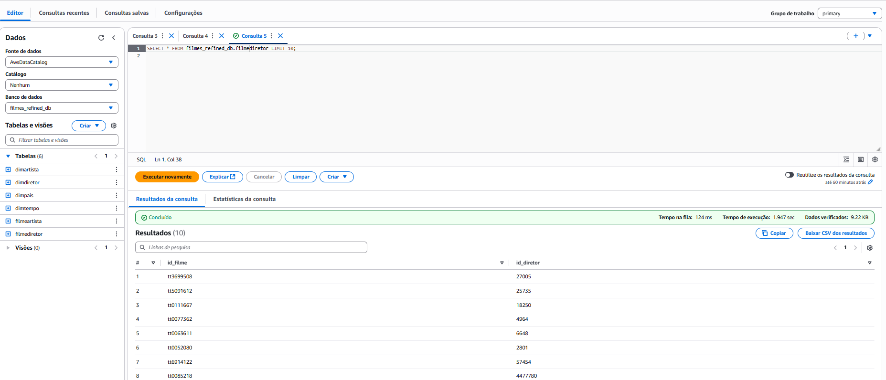

## 1.8 Fato Representação Feminina

**Job**

Para consolidar todas as informações necessárias em uma única tabela de análise, desenvolvi o job job_fato_rep_feminina, responsável por gerar a tabela fato principal do projeto a partir das tabelas csv_movies e tmdb_movies, previamente estruturadas na camada Trusted. Esse job foi configurado seguindo o mesmo padrão adotado nos anteriores: utilizei o tipo Spark com linguagem Python 3, Glue Version 3.0, e a role AWSGlueServiceRole-Lab4, que já possuía as permissões adequadas de leitura e escrita no bucket S3.

Finalizada a transformação, os dados foram gravados no caminho s3://data-compass-ana/Refined/FatoRepresentacaoFeminina/, no formato Parquet e utilizando o modo overwrite, assegurando que execuções futuras atualizem completamente os dados. Esse job foi essencial para consolidar o modelo dimensional do projeto, centralizando as informações necessárias para as análises sobre a representatividade feminina nos filmes de guerra.

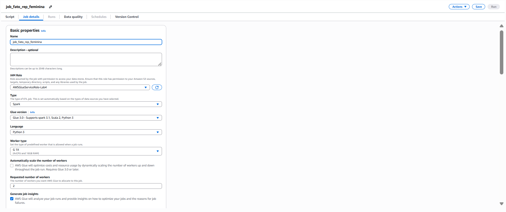

Para construir a tabela fato FatoRepresentacaoFeminina, iniciei realizando a junção entre os dados do csv_movies e do tmdb_movies, pois meu objetivo era manter na tabela fato apenas os filmes que estivessem presentes nas duas fontes. Essa decisão se baseia no fato de que os dados extraídos da API do TMDB já estavam previamente filtrados com base nos critérios do projeto: filmes de guerra lançados a partir de 1950, com nota média maior ou igual a 6 e pelo menos 100 votos. Como o CSV estava estruturado com uma linha por artista, fazer o join considerando apenas os filmes que estavam presentes no TMDB garantiu automaticamente a aplicação desses filtros, sem a necessidade de reprocessá-los diretamente no CSV.

Após o join, apliquei uma janela particionada por id do filme, ordenando pelo maior número de votos. Isso foi necessário porque no CSV existem múltiplas entradas por filme, uma para cada artista, e eu queria selecionar apenas uma linha representativa de cada filme para a tabela fato. Dessa forma, mantive apenas a linha com maior número de votos por id, garantindo que cada filme aparecesse uma única vez na tabela.

Em seguida, selecionei as colunas mais relevantes para a análise: o id_filme e os títulos principal e original, para fins de identificação; o ano_lancamento, que é uma variável temporal fundamental para o projeto; o id_pais, que foi extraído como o primeiro elemento da lista de países de origem fornecida pelo TMDB, assumindo que ele representa o país principal da produção; além disso, incluí as métricas nota_media, numero_votos e popularidade, que serão úteis em diversas análises sobre recepção e relevância dos filmes.

Com o ano de lançamento em mãos, relacionei essa informação com a dimensão dimtempo por meio da coluna ano, de onde trouxe a chave substituta id_tempo para estruturar a análise temporal da tabela fato. Para enriquecer a tabela com informações sobre a autoria dos filmes, também fiz um join com a tabela ponte filmediretor, agrupando os dados para obter uma lista com todos os id_diretores associados a cada filme, visto que um mesmo filme pode ter mais de um diretor.

O resultado final foi uma tabela fato consolidada e granular, onde cada linha representa um filme único que atende aos critérios definidos para a análise da representatividade feminina em filmes de guerra. Essa tabela é a base central da modelagem dimensional do projeto e permitirá a análise cruzada com as dimensões de tempo, país, artista e diretor. Por fim, escrevi o resultado em formato Parquet na camada Refined do S3 no caminho: s3://data-compass-ana/Refined/FatoRepresentacaoFeminina/, utilizando o modo overwrite para garantir que execuções futuras possam substituir os dados corretamente.

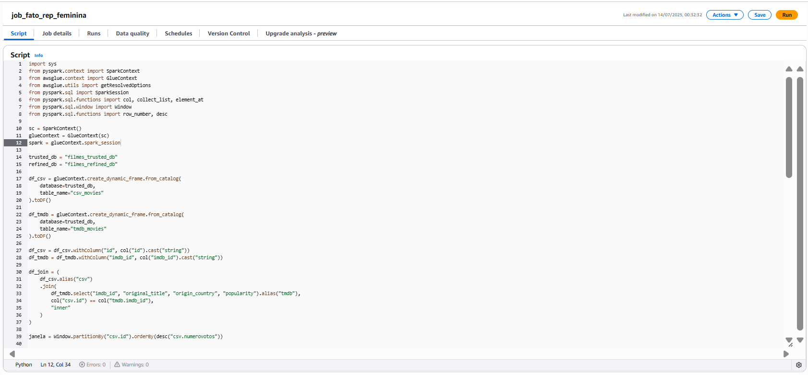

**Crawler**

Após a execução do job_fato_rep_feminina, criei o crawler_fato_rep_feminina com o objetivo de catalogar a nova tabela fato na camada Refined do Data Lake. Para isso, utilizei novamente a role AWSGlueServiceRole-Lab4, que já estava configurada com as permissões adequadas para leitura no bucket S3 e atualização do Glue Data Catalog. Apontei o crawler para o caminho s3://data-compass-ana/Refined/FatoRepresentacaoFeminina/, onde os dados foram gravados em formato Parquet durante o job. Em seguida, configurei o crawler para armazenar os metadados no database filmes_refined_db, centralizando todas as tabelas do projeto. Com isso, a tabela fato ficou disponível para consultas no Athena.

**Validação no Athena**

Para concluir a criação da tabela fato, acessei o AWS Athena e realizei uma consulta simples utilizando SELECT * FROM fatorepresentacaofeminina;. Essa verificação teve como objetivo confirmar se a tabela havia sido corretamente catalogada, se as colunas foram criadas conforme esperado e se os dados estavam consistentes. O resultado da consulta demonstrou que a estrutura da tabela estava íntegra e com todas as colunas esperadas presentes. Além disso obtive como retorno 511 registros únicos de filmes, o que validou com sucesso o processamento realizado pelo job_fato_rep_feminina e encerrou essa etapa da Sprint com êxito.

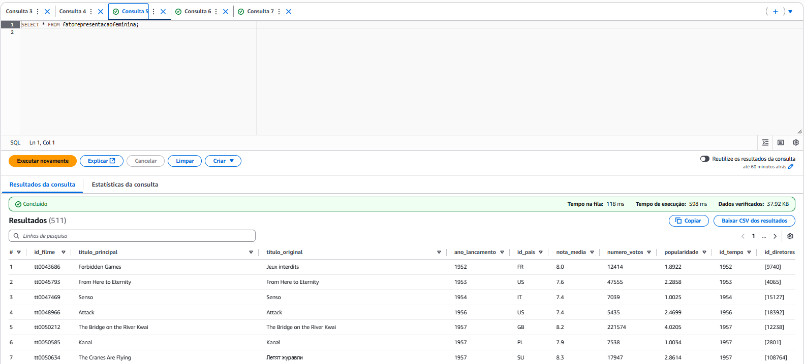

