# 🚀 Desafio 

## 📌 Resumo

Nesta sprint concluí a quinta e última etapa do projeto final, dedicada à visualização e análise dos dados construídos ao longo das fases anteriores. Nas sprints passadas, foram realizadas a ingestão dos dados de filmes a partir de um arquivo CSV local e da API TMDB, o processamento desses dados na camada Trusted e a modelagem da camada Refined com base em um modelo dimensional. Todo o projeto foi guiado por uma linha de investigação sobre a representatividade feminina em filmes de guerra lançados a partir de 1950, utilizando como critério adicional apenas produções com nota média maior ou igual a 6 e com pelo menos 100 votos registrados no TMDB.

Ao longo da etapa anterior, foram criadas tabelas dimensionais como dimArtista, dimDiretor, dimPais e dimTempo, além de tabelas de relacionamento e da tabela fatoRepresentacaoFeminina. Os dados foram transformados com PySpark em jobs no Glue Studio e gravados em formato Parquet na camada Refined, organizada em pastas no S3 e catalogada no Glue Data Catalog. Para garantir que as análises fossem consistentes, foi necessário ajustar os scripts iniciais dos jobs, refinando joins e filtragens para garantir a integridade das informações e a conexão correta entre as diferentes fontes.

Com os dados preparados, iniciei esta etapa com a criação de views SQL no Athena, estruturadas com base nas perguntas analíticas definidas no início do projeto. Essas views foram salvas em uma pasta específica no S3 e utilizadas diretamente como fonte para o desenvolvimento do dashboard no QuickSight. No ambiente de visualização, organizei os painéis para refletir indicadores como proporção de mulheres nos elencos, presença de protagonistas femininas, direções feitas por mulheres e variações de representatividade por país e por década.

Essa etapa final exigiu também ajustes de exibição no QuickSight, como configuração de temas, ordenações e filtros personalizados para garantir uma visualização clara, objetiva e conectada com os objetivos do projeto. Encerrar essa fase marcou a consolidação de todo o pipeline de dados, desde a coleta até a análise final, com foco em proporcionar uma leitura crítica e estruturada da presença feminina em filmes de guerra ao longo das décadas.

## 🗂️ Sumário 

---

## 🗂️ Sumário 

1. [Ajustes nos Glue Jobs da Camada Refined](#ajustes-nos-glue-jobs-da-camada-refined)

2. [Criação das Views no Athena para Visualização](#criação-das-views-no-athena-para-visualização)

3. [Integração com o Amazon QuickSightdos](#integração-com-o-amazon-quicksight)

4. [Construção dos Gráficos e Análises no Dashboard](#construção-dos-gráficos-e-análises-no-dashboard)

 

---

# Ajustes nos Glue Jobs da Camada Refined

Durante a construção das tabelas da camada Refined, alguns ajustes foram necessários nos Glue Jobs originalmente desenvolvidos. Esses ajustes tiveram como objetivo corrigir tipos de dados incompatíveis, padronizar colunas e garantir a integridade dos dados finais que seriam usados para análise no QuickSight.

Em especial, foi necessário revisar as tabelas DimTempo, DimArtista, DimDiretor e FatoRepresentacaoFeminina que apresentavam formatos inadequados para agregações e visualizações. Também foram feitas melhorias na forma como os dados das tabelas eram combinados, garantindo que apenas os filmes realmente presentes nas duas fontes (CSV e TMDB) fossem considerados na modelagem dimensional. Além disso, foram aplicadas validações adicionais para evitar registros duplicados ou nulos em tabelas de dimensão e fato.

Abaixo, apresento a versão ajustada com as correções implementadas:

> Job DimTempo

Converti o valor utilizado para id_tempo para o tipo inteiro, garantindo que as colunas derivadas ano e decada também fossem criadas corretamente como inteiros. Além disso, incluí um filtro para considerar apenas registros com ano a partir de 1950, removendo dados irrelevantes ou inconsistentes. Por fim, mantive a remoção de duplicatas após essas transformações, evitando valores repetidos na dimensão. 

| Arquivo | Link |
|--------|------|
| job_dim_tempo.py | [🔗 job_dim_tempo.py ](./Jobs/job_dim_tempo.py) |
 

> Job DimArtista

Ajustei o job responsável pela criação da dimensão de artista para padronizar os tipos de dados e remover valores ambíguos, assim, converti a coluna nome_artista explicitamente para string, garantindo consistência no schema. Para a coluna genero, adicionei uma regra para que valores iguais a 0 fossem convertidos em nulos, evitando interpretações incorretas. Também passei a converter genero para o tipo inteiro, facilitando futuras agregações e análises no QuickSight. Mantive a remoção de duplicatas baseada em id_artista, assegurando que cada artista apareça apenas uma vez na dimensão.

| Arquivo | Link |
|--------|------|
| job_dim_artista.py | [🔗 job_dim_artista.py ](./Jobs/job_dim_artista.py) |
 

> Job DimDiretor

Em relação a dimensão de diretor, para manter consistência com a dimensão de artista, converti a coluna genero para o tipo inteiro, garantindo que o schema ficasse padronizado para futuras análises. Também adicionei uma regra para substituir os valores 0 por nulos, evitando interpretações incorretas sobre o gênero dos diretores. Com isso, as duas dimensões ficaram alinhadas em termos de tipos de dados e tratamento de valores ambíguos. Mantive a remoção de duplicatas baseada em id_diretor, garantindo que cada diretor apareça apenas uma vez na dimensão.

| Arquivo | Link |
|--------|------|
| job_dim_diretor.py | [🔗 job_dim_diretor.py ](./Jobs/job_dim_diretor.py) |
 

> Job FatoRepresentacaoFeminina

Apliquei filtros explícitos para considerar apenas filmes com nota média maior ou igual a 6, pelo menos 100 votos e lançados a partir de 1950, evitando que títulos pouco relevantes ou inconsistentes fossem incluídos na análise. Na sprint anterior, essa filtragem havia sido feita de forma indireta, utilizando apenas os filmes do TMDB no join com o CSV, já que eles tinham passado por um filtro inicial na extração. No entanto, percebi que alguns filmes ainda estavam sendo incluídos indevidamente, por isso optei por aplicar os filtros diretamente no job. Além disso, converti as colunas nota_media, numero_votos e id_tempo para os tipos numéricos corretos, garantindo maior confiabilidade em cálculos e visualizações no QuickSight. Esses ajustes deixaram o processo mais transparente e aumentaram a consistência entre a fato e suas dimensões associadas.

| Arquivo | Link |
|--------|------|
| job_fato_rep_feminina.py| [🔗 job_fato_rep_feminina.py ](./Jobs/job_fato_rep_feminina.py) |
 

# Criação das Views no Athena para Visualização

Nessa parte do projeto, criei views no Athena para organizar melhor as informações e facilitar a construção do dashboard no QuickSight. Usei como base as tabelas da camada Refined, todas dentro do banco filmes_refined_db. Salvei os resultados no bucket s3://data-compass-ana/athena/results/Unsaved/2025/07/28/.

As views foram criadas pensando diretamente nas perguntas analíticas do projeto, agrupando os dados por temas como proporção de mulheres no elenco, protagonistas femininas, presença de diretoras, padrões por país e década, além de identificar os cineastas mais inclusivos. A seguir, vou mostrar cada uma das views que criei, explicando a lógica usada para responder cada uma das perguntas do desafio.

Perguntas a serem respondidas:

- Como os filmes de guerra estão distribuídos ao longo das décadas?
Objetivo: Analisar o volume de produções por década para entender tendências temporais na produção de filmes de guerra.

- Houve mudanças na proporção de personagens femininos, masculinos e indefinidos nos filmes de guerra ao longo do tempo?
Objetivo: Investigar se houve evolução na presença de personagens femininas (ou queda) em relação aos masculinos e não identificados nas últimas décadas.

- Qual é a distribuição geral dos personagens por gênero nos filmes de guerra?
Objetivo: Compreender a proporção entre personagens masculinos, femininos e indefinidos no total analisado, considerando possíveis distorções causadas por dados ausentes.

- Existe alguma relação entre a representatividade feminina nos elencos, a nota média e a popularidade dos filmes?
Objetivo: Avaliar se filmes com maior presença feminina tendem a ter melhor avaliação do público ou maior popularidade.

- Em quais tipos de papéis as mulheres foram mais representadas ao longo das décadas?
Objetivo: Identificar se houve aumento da presença de personagens femininas em papéis principais ou se continuam concentradas em papéis secundários e figurantes.

- Quais são os filmes com maior percentual de mulheres no elenco?
Objetivo: Destacar os filmes de guerra que se sobressaem em termos de inclusão feminina, servindo como exemplos de maior representatividade.

- Filmes dirigidos por mulheres têm maior representatividade feminina no elenco?
Objetivo: Comparar a média de representatividade feminina em filmes dirigidos por homens e por mulheres para identificar possíveis influências do gênero da direção.

- Quais cineastas mais promoveram a inclusão feminina em seus filmes?
Objetivo: Mapear os diretores com os maiores percentuais médios de mulheres no elenco, evidenciando quem tem contribuído para a diversidade de gênero.

- Quais países apresentam maior inclusão feminina nos elencos de filmes de guerra?

Objetivo: Analisar a representatividade feminina nos filmes por país de origem, identificando regiões com maior equilíbrio de gênero.

> vw_total_filmes_analisados

Fiz a view vw_total_filmes_analisados para obter a quantidade total de filmes analisados no projeto, contando quantos id_filme distintos existiam na tabela fatorepresentacaofeminina.Essa view não responde diretamente a nenhuma pergunta, mas foi essencial para ter a dimensão do universo de filmes com os quais trabalhei. Ela serviu como um ponto de controle e validação, ajudando-me a garantir que todos os joins e filtros feitos em outras views estavam mantendo a consistência do número de filmes da base. Ter essa visão consolidada me deu mais segurança para as análises seguintes, já que eu sabia exatamente quantos filmes de guerra estavam sendo considerados no escopo da refined.

| Arquivo | Link |
|--------|------|
| vw_total_filmes_analisados | [🔗 vw_total_filmes_analisados ](./Views/vw_total_filmes_analisados.sql) |
 

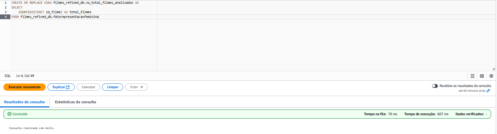

> vw_evolucao_genero_e_filmes_por_decada

Criei a view vw_evolucao_genero_e_filmes_por_decada com o objetivo de consolidar, em um único resultado, a evolução da quantidade de filmes de guerra por década e a distribuição dos personagens por gênero ao longo do tempo. Essa view foi essencial para responder a três perguntas principais do dashboard:

- Como os filmes de guerra estão distribuídos ao longo das décadas?
- Houve mudanças na proporção de personagens femininos, masculinos e indefinidos nos filmes de guerra ao longo do tempo?
- Qual é a distribuição geral dos personagens por gênero nos filmes de guerra?

Na construção da view, utilizei a tabela fatorepresentacaofeminina como base para identificar os filmes e seus respectivos anos (através da coluna id_tempo). Fiz um join com a tabela dimtempo para trazer a década correspondente a cada filme. Em seguida, conectei a tabela filmeartista (que relaciona filmes e artistas) com a dimartista, para identificar o gênero de cada personagem (masculino, feminino ou indefinido). Dessa forma, consegui contar a quantidade de filmes distintos por década e, ao mesmo tempo, agrupar os personagens por gênero, considerando apenas aqueles que estavam efetivamente ligados aos filmes da base. Além de permitir análises temporais, utilizei essa view para exibir no topo do dashboard o total de personagens presentes nos filmes analisados e quantas mulheres compõem esse universo, servindo como um resumo geral da representatividade feminina dentro do conjunto total de filmes. Essa abordagem facilitou visualizar tanto a evolução histórica quanto o panorama geral de gênero, fornecendo uma base sólida para análises comparativas em outras visualizações.

| Arquivo | Link |
|--------|------|
| vw_evolucao_genero_e_filmes_por_decada | [🔗 vw_evolucao_genero_e_filmes_por_decada ](./Views/vw_evolucao_genero_e_filmes_por_decada.sql) |
 

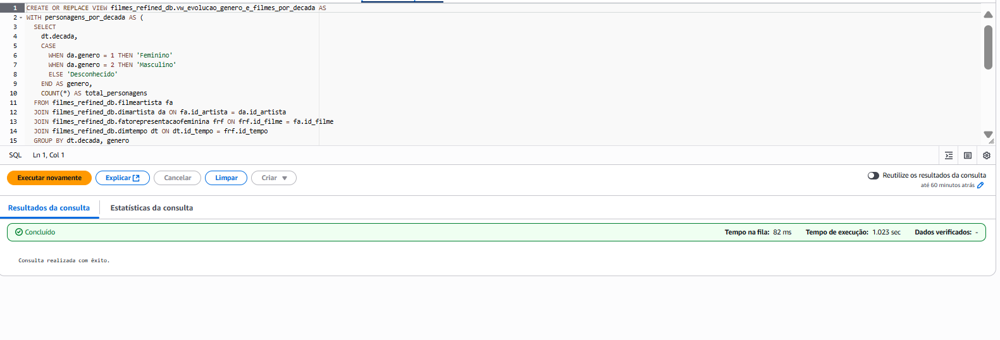

> vvw_tendencias_representacao

Através da view vw_tendencias_representacao pude analisar a representatividade feminina nos elencos de cada filme e realizar comparações com as métricas de nota média e popularidade dos filmes.Ela foi utilizada para responder a duas perguntas do dashboard:

- Quais são os filmes com maior percentual de mulheres no elenco?
- Existe alguma relação entre a representatividade feminina nos elencos, a nota média e a popularidade dos filmes?

Para construí-la, inicialmente defini o CTE elenco_completo, relacionando as tabelas filmeartista e dimartista para obter o gênero de cada personagem associado a cada filme. Em seguida, criei o CTE stats, no qual calculei para cada filme o tamanho total do elenco, a quantidade de mulheres e homens presentes, permitindo assim medir a proporção de cada gênero.Na etapa final, uni essas informações à tabela fatorepresentacaofeminina, trazendo os dados de título, nota média e popularidade dos filmes. Também calculei os percentuais de mulheres, homens e personagens de gênero desconhecido no elenco, além de uma categorização chamada faixa_representatividade, que classifica os filmes de acordo com a presença feminina no elenco (baixa, moderada, significativa ou alta representatividade).
Essa view foi essencial para destacar os filmes com maior participação feminina e possibilitou avaliar se existe alguma relação entre a representatividade feminina, as notas médias e a popularidade das produções.

| Arquivo | Link |
|--------|------|
| vw_tendencias_representacao | [🔗 vw_tendencias_representacao ](./Views/vw_tendencias_representacao.sql) |
 

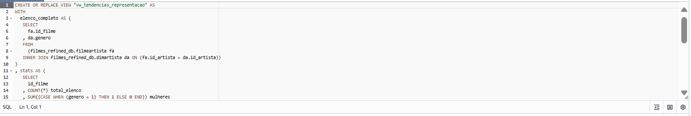

> vw_papeis_mulheres_por_tipo

Criei a view vw_papeis_mulheres_por_tipo para entender como as mulheres foram representadas em diferentes tipos de papéis ao longo das décadas. Essa view responde à pergunta:

- Em quais tipos de papéis as mulheres foram mais representadas ao longo das décadas?

Na construção da view, relacionei a tabela filmeartista com dimartista para identificar apenas os personagens do gênero feminino. Também utilizei a tabela fatorepresentacaofeminina para garantir que estavam sendo considerados apenas os filmes da base refinada e, por fim, fiz o join com dimtempo para trazer a informação da década de lançamento. Defini uma categorização baseada na coluna ordem_elenco: quando o valor era 0, considerei o papel como principal; entre 1 e 4, classifiquei como coadjuvante; e acima de 4, como figurante. Com isso, consegui contar o total de personagens femininas em cada tipo de papel, agrupando os resultados por década. Essa view foi fundamental para identificar se, ao longo do tempo, houve mudanças na representatividade feminina em papéis de maior destaque ou se as mulheres continuaram concentradas em papéis secundários e de menor relevância.

| Arquivo | Link |
|--------|------|
| vw_papeis_mulheres_por_tipo | [🔗 vw_papeis_mulheres_por_tipo ](./Views/vw_papeis_mulheres_por_tipo.sql) |
 

> vw_diretora_vs_elenco_estendida

Por meio da view vw_diretora_vs_elenco_estendida comparei a representatividade feminina nos elencos de filmes dirigidos por homens e por mulheres. Essa view responde à pergunta:

- Filmes dirigidos por mulheres têm maior representatividade feminina no elenco?

Além disso, utilizei seus resultados para exibir no topo do dashboard a quantidade total de diretores e quantas diretoras participaram das produções analisadas.

Para construí-la, primeiro defini o CTE direcao, relacionando as tabelas filmediretor e dimdiretor para identificar o gênero de cada diretor ou diretora associado a cada filme. Em seguida, criei o CTE elenco_genero, unindo filmeartista e dimartista para trazer o gênero de cada personagem presente nos filmes. Na etapa seguinte, utilizei o CTE stats para consolidar as informações, calculando para cada filme o total de personagens no elenco e a quantidade de mulheres. Essa etapa também trouxe o gênero do diretor ou diretora responsável por cada filme. Por fim, na query principal, agrupei os dados por gênero do diretor, calculando a média percentual de mulheres no elenco, a quantidade de filmes e o total de diretores em cada categoria. Com isso, a view possibilitou avaliar se produções dirigidas por mulheres apresentavam maior participação feminina no elenco, além de fornecer uma visão geral sobre a proporção de diretoras dentro do conjunto de filmes analisados.

| Arquivo | Link |
|--------|------|
| vw_diretora_vs_elenco_estendida | [🔗 vw_diretora_vs_elenco_estendida ](./Views/vw_diretora_vs_elenco_estendida.sql) |
 

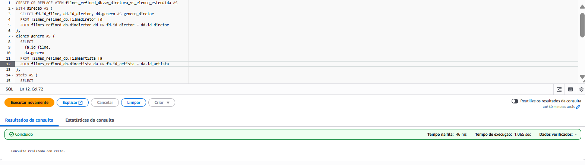

> vw_diretores_com_mais_representatividade

Criei a view vw_diretores_com_mais_representatividade para identificar os cineastas que mais promoveram a inclusão feminina em seus filmes. Ela responde diretamente à pergunta:

- Quais cineastas mais promoveram a inclusão feminina em seus filmes? 

Ela também foi utilizada para gerar um ranking dos diretores com maior média percentual de mulheres em seus elencos.

Na construção da view, primeiramente defini o CTE elenco_genero, relacionando as tabelas filmeartista e dimartista para trazer o gênero dos personagens de cada filme, garantindo que apenas os filmes presentes em fatorepresentacaofeminina fossem considerados. Em seguida, no CTE perc_mulheres_por_filme, calculei para cada filme a quantidade de mulheres no elenco, o total de personagens e o percentual de participação feminina. Com essas informações, criei o CTE diretor_perc, que uniu os dados de percentual de mulheres por filme com os respectivos diretores obtidos na tabela filmediretor. Na query final, agreguei os resultados por diretor, calculando a média percentual de mulheres em seus filmes e a quantidade de produções analisadas para cada um. Fiz ainda um ajuste manual em dois nomes que estavam no idioma original, convertendo-os para Stanislav Rostotsky e Sunao Katabuchi, de forma a padronizar a apresentação dos dados. O resultado final da view traz os dez diretores com maior média de representatividade feminina em seus filmes, permitindo identificar quais cineastas mais se destacaram em termos de inclusão de mulheres nos elencos.

| Arquivo | Link |
|--------|------|
| vw_diretores_com_mais_representatividade | [🔗 vw_diretores_com_mais_representatividade ](./Views/vw_diretores_com_mais_representatividade.sql) |
 

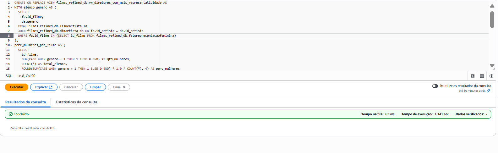

> vw_paises_com_mais_mulheres

Atraveés da view vw_paises_com_mais_mulheres pude analisar quais países apresentam maior inclusão feminina nos elencos de filmes de guerra. Essa view responde à pergunta:

- Quais países apresentam maior inclusão feminina nos elencos de filmes de guerra?

Na construção da view, primeiro defini o CTE elenco_genero, unindo as tabelas filmeartista e dimartista para obter o gênero de cada personagem associado a cada filme. Em seguida, no CTE stats, relacionei os filmes da tabela fatorepresentacaofeminina com o elenco, agrupando os resultados por país de origem (id_pais). Nesse passo, calculei o total de personagens e a quantidade de mulheres em cada país. Na query final, associei os resultados à tabela dimpais para trazer o nome de cada país e calculei o percentual de participação feminina nos elencos. Por fim, ordenei os resultados de forma decrescente, permitindo visualizar quais países se destacam em termos de representatividade feminina. Essa view foi essencial para fornecer uma visão geográfica sobre a inclusão de mulheres em filmes de guerra, possibilitando identificar regiões com maior equilíbrio de gênero nos elencos analisados.

| Arquivo | Link |
|--------|------|
| vw_paises_com_mais_mulheres | [🔗 vw_paises_com_mais_mulheres ](./Views/vw_paises_com_mais_mulheres.sql) |
 

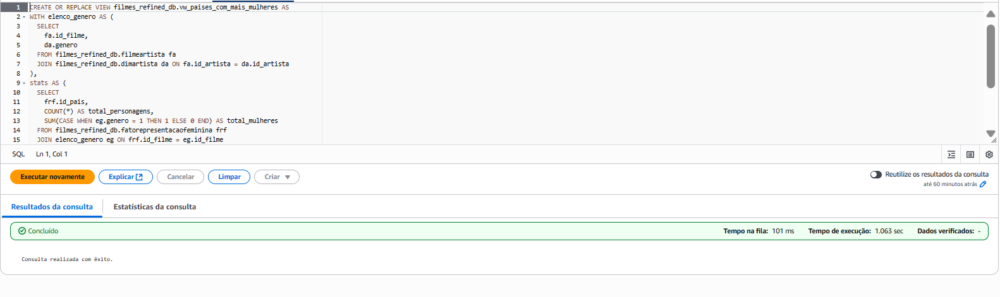

# Integração com o Amazon QuickSight

Depois de finalizar a criação das views no Athena, iniciei a integração com o Amazon QuickSight para poder utilizá-las na construção do dashboard. Já havia configurado anteriormente as permissões de acesso do QuickSight ao Athena e ao meu bucket S3 (data-compass-ana) quando iniciei minha conta, porém fui conferir se essas permissões ainda estavam ativas e corretamente habilitadas. Isso garantiu que o QuickSight pudesse acessar tanto as consultas no Athena quanto os arquivos armazenados no bucket.

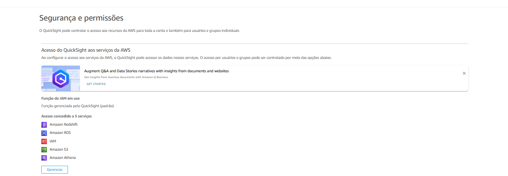

Com o acesso validado, comecei a conectar cada view individualmente ao QuickSight. Na página inicial da ferramenta, acessei a seção Datasets e cliquei em "New dataset”. Em seguida, selecionei o Athena como a fonte de dados e criei uma conexão chamada Athena_filmes_refined.

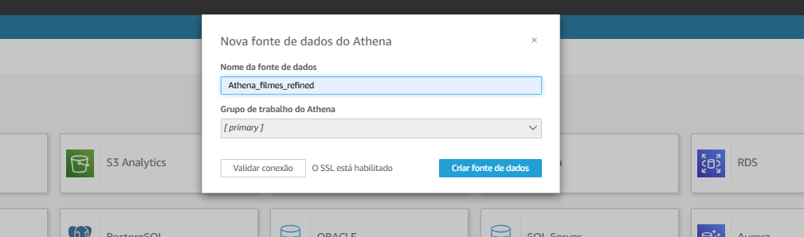

Depois, escolhi o catálogo AwsDataCatalog no campo Catalog e, em Database, selecionei o banco filmes_refined_db. Na lista de tabelas disponíveis, localizei a view desejada e a selecionei para importação. Repeti esse processo para cada view criada no Athena, garantindo que todas estivessem disponíveis como conjuntos de dados separados dentro do QuickSight.

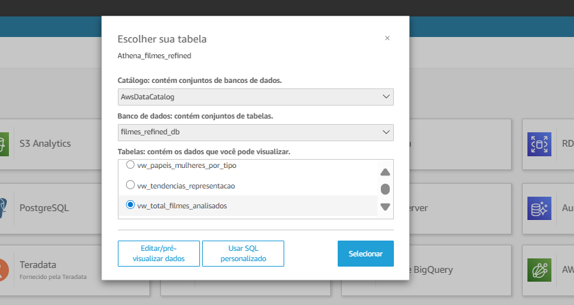

Após a importação, conferi os campos carregados para cada dataset e ajustei, quando necessário, os tipos de dados diretamente no QuickSight. Dessa forma, consegui organizar as análises de forma modular, aproveitando as métricas e agregações já preparadas nas views, o que simplificou bastante a criação dos gráficos e manteve a consistência dos resultados exibidos no dashboard.

# Construção dos Gráficos e Análises no Dashboard

Após finalizar a integração das views com o Amazon QuickSight, comecei a fase de construção do dashboard, buscando criar um storytelling coerente e visualmente atrativo para apresentar as análises. Com base nos dados consolidados em cada view, desenvolvi nove gráficos principais, cada um relacionado a uma pergunta específica sobre a representatividade feminina em filmes de guerra. Organizei as visualizações de forma que houvesse uma progressão lógica na narrativa, começando com uma visão histórica da produção de filmes e da evolução da presença feminina nos elencos, passando pela análise da distribuição de papéis e da relação com métricas como nota média e popularidade, até chegar ao destaque dos filmes, diretores e países que mais promoveram inclusão feminina.

Ao longo da construção do dashboard, ajustei a paleta de cores para que ficasse alinhada ao tema do projeto, garantindo contraste adequado e facilitando a interpretação dos dados. Também fiz pequenos ajustes de formatação e disposição dos gráficos para que a visualização final transmitisse uma história clara e objetiva.

Cada gráfico foi construído utilizando os campos já calculados nas views do Athena, o que facilitou a criação das análises no QuickSight e garantiu consistência nos resultados. Depois de finalizar a montagem visual, deixei o dashboard pronto para apresentar, e abaixo farei os comentários detalhados sobre cada gráfico e as respectivas análises obtidas a partir deles.

| Arquivo | Link |
|--------|------|
| Representação Feminina em Filmes de Guerra | [🔗 Representação Feminina em Filmes de Guerra ](../Desafio/Dash%20-%20Representacao%20Feminina%20em%20Filmes%20de%20Guerra.pdf) |
 

> Visão Geral dos Dados Analisados

Antes de responder diretamente às perguntas do projeto, optei por apresentar alguns números gerais para contextualizar o universo analisado. Os dados mostraram que, após aplicar os filtros estabelecidos (considerando apenas filmes lançados após 1950, com nota média maior ou igual a 6 e pelo menos 100 votos), a base final ficou composta por 485 filmes. Dentro desse conjunto, identifiquei 495 diretores, sendo 21 do sexo feminino. No total, foram contabilizados cerca de 19 mil personagens, dos quais aproximadamente 3 mil eram mulheres.Esses indicadores iniciais foram importantes para oferecer uma visão macro sobre o tamanho da amostra trabalhada e para evidenciar, logo no início, a baixa representatividade feminina nos elencos e entre os diretores, preparando o terreno para as análises detalhadas apresentadas nos gráficos seguintes.

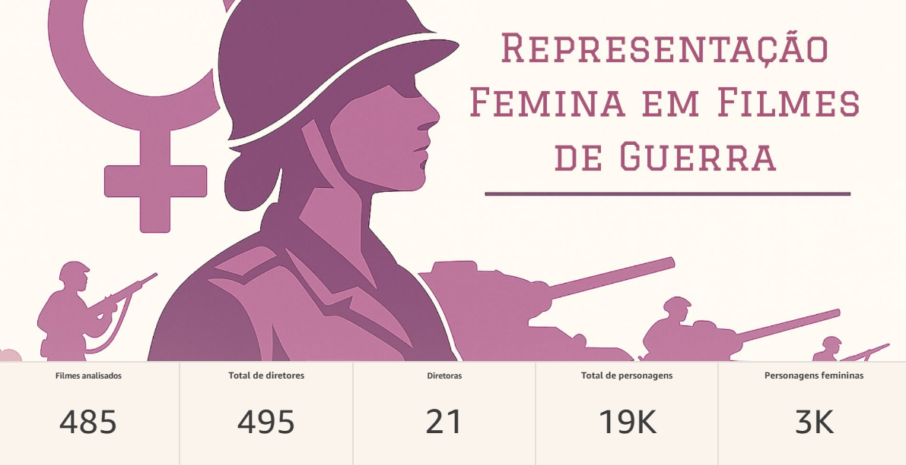

> Distribuição de Filmes de Guerra por Década – análise do volume de produções ao longo do tempo

No gráfico Distribuição de Filmes de Guerra por Década, foi possível observar que a produção de filmes de guerra apresentou crescimento significativo a partir da década de 1990. Esse aumento indica uma tendência de maior interesse ou investimento nesse tipo de produção ao longo das últimas décadas.

Embora o número de filmes da década de 2020 ainda apareça baixo na visualização, é importante considerar que ainda estamos na metade da década, o que justifica a quantidade reduzida em relação às décadas anteriores. Essa observação evita interpretações equivocadas sobre uma possível queda na produção de filmes de guerra no período atual.

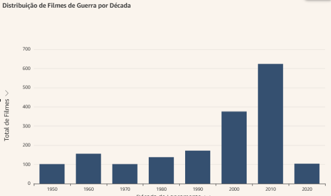

> Personagens por Gênero ao Longo das Décadas – evolução da proporção de personagens femininos, masculinos e indefinidos

No gráfico Personagens por Gênero ao Longo das Décadas, é possível perceber que, na base de dados analisada, a quantidade de personagens com gênero desconhecido é superior ao percentual de personagens femininos na maioria das décadas. A única exceção ocorre na década de 1960, quando o percentual de personagens femininos supera o de personagens com gênero não identificado.

Esse resultado evidencia que há uma grande proporção de registros com gênero desconhecido, o que pode causar distorções na interpretação dos dados. A presença significativa de valores nulos pode subestimar ou mascarar a real representatividade feminina nos elencos, já que parte dos personagens não possui essa informação registrada.

Além disso, mesmo com o aumento no número de filmes ao longo do tempo, acompanhado por um crescimento no total de personagens, observa-se que a quantidade de personagens femininos em filmes de guerra permanece bem inferior à de personagens masculinos, reforçando a disparidade de representatividade entre os gêneros.

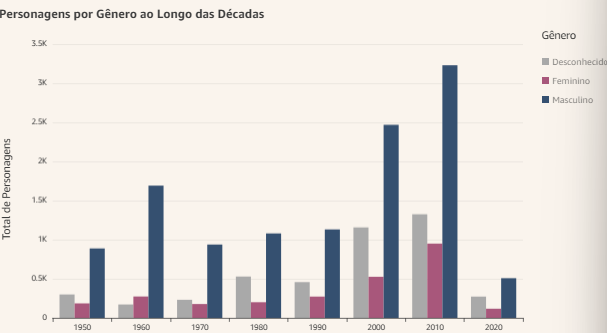

> Participação por Gênero no Total de Personagens – visão geral da distribuição de personagens por gênero

No gráfico Participação por Gênero no Total de Personagens, observa-se de forma geral a distribuição de personagens por gênero em toda a base analisada. O resultado reforça que o conjunto de dados possui uma quantidade expressiva de registros com gênero desconhecido.

Dos aproximadamente 19 mil personagens, 63% são do sexo masculino, 23% possuem gênero não identificado e apenas 14% são do sexo feminino. Esses números evidenciam não apenas a baixa representatividade feminina nos filmes de guerra, mas também a limitação dos dados disponíveis, já que a ausência de informação sobre o gênero de muitos personagens pode impactar na interpretação dos resultados.

> Nota Média x Popularidade por Faixa de Representatividade Feminina – relação entre representatividade feminina, avaliação e popularidade.

No gráfico Nota Média x Popularidade por Faixa de Representatividade Feminina, que foi construído como um gráfico de dispersão, é possível observar a relação entre a representatividade feminina nos elencos, a avaliação média dos filmes e sua popularidade.

Os resultados mostraram que os filmes com maior popularidade tendem a apresentar representatividade baixa ou moderada de mulheres no elenco. Além disso, percebe-se que há poucos filmes com representatividade significativa, ou seja, com mais de 50% de personagens femininas. Essa distribuição reforça que, mesmo entre os filmes de guerra mais populares, a inclusão de mulheres em papéis relevantes ainda é bastante limitada.

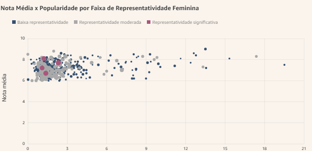

> Evolução dos Papéis Femininos em Filmes de Guerra por Década – análise da presença feminina em papéis principais, coadjuvantes e figurantes.

O gráfico Evolução dos Papéis Femininos em Filmes de Guerra por Década, apresentado em formato de barras empilhadas, mostra como a presença feminina nos elencos vem mudando ao longo do tempo. Apesar de ainda ser inferior à participação masculina, é possível observar um crescimento gradual da presença de mulheres em filmes de guerra.

Historicamente, a maioria dos papéis femininos estava concentrada em funções de figurantes ou coadjuvantes. No entanto, nota-se que, na última década, houve um aumento relevante na quantidade de personagens femininas em papéis principais, o que indica uma evolução na forma como as mulheres vêm sendo representadas nesse gênero cinematográfico.

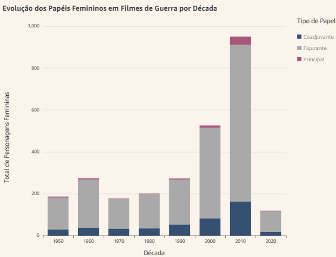

> Representatividade Feminina no Elenco: Top 10 Filmes – destaque para os filmes com maior participação feminina.

O gráfico Representatividade Feminina no Elenco: Top 10 Filmes destaca os dez filmes de guerra com maior percentual de mulheres em seus elencos, em relação ao número total de personagens. Um ponto de destaque é o filme The Dawns Here Are Quiet, que aparece em duas versões, a original de 1972 e o remake de 2015, liderando o ranking em ambas as ocasiões. Isso evidencia como essa obra, em suas duas versões, se sobressaiu em termos de inclusão feminina no gênero, servindo como um exemplo significativo de representatividade.

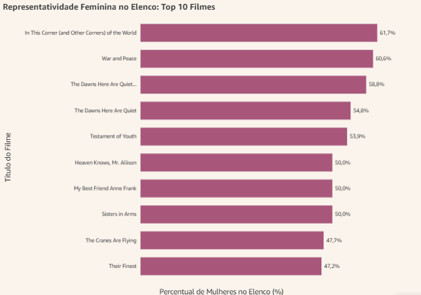

> Relação entre Gênero da Direção e Representatividade Feminina no Elenco – comparação entre filmes dirigidos por homens e mulheres.

No gráfico Relação entre Gênero da Direção e Representatividade Feminina no Elenco, foi possível comparar a média de representatividade feminina nos elencos de filmes dirigidos por mulheres e por homens. Os dados indicaram que os filmes dirigidos por diretoras apresentam, em média, cerca de 25% de personagens femininas, enquanto nos filmes dirigidos por diretores homens esse percentual é menor, em torno de 15%.

É importante destacar que, embora as diretoras tenham maior representatividade feminina em seus filmes, a quantidade de diretoras na base de dados é significativamente inferior à de diretores, o que reforça o cenário de baixa presença feminina na direção de filmes de guerra.

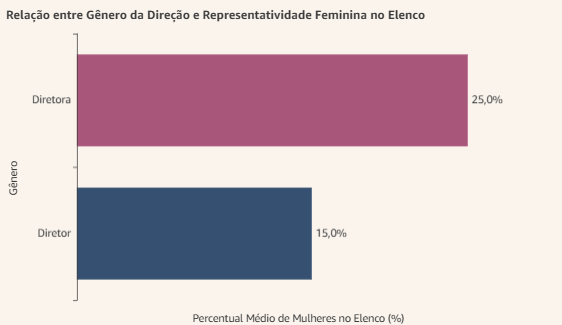

> Top 10 Diretores com Maior Representatividade Feminina no Elenco – identificação dos cineastas que mais promoveram inclusão feminina.

O gráfico Top 10 Diretores com Maior Representatividade Feminina no Elenco apresenta os cineastas que mais promoveram a inclusão feminina em seus filmes de guerra, com base na média percentual de personagens femininas nos elencos.

Dentre esses dez diretores que lideram essa lista, três são mulheres, o que reforça a influência positiva que a direção feminina pode ter na representatividade de gênero nos filmes. Esse destaque evidencia ainda mais o papel importante que essas diretoras têm desempenhado para ampliar a diversidade e inclusão no gênero.

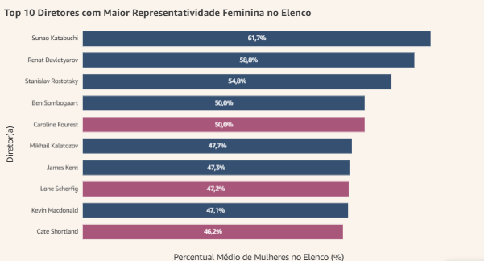

> Top 10 Países Mais Inclusivos em Filmes de Guerra – análise por país de origem, destacando as regiões com maior equilíbrio de gênero.

O gráfico Top 10 Países Mais Inclusivos em Filmes de Guerra apresenta os países que exibem maior representatividade feminina nos elencos de seus filmes de guerra, considerando a proporção de personagens femininas em relação ao total de personagens.

Destaque especial para o Brasil, que aparece em 2º lugar no ranking, evidenciando seu papel de destaque na promoção da inclusão feminina no gênero cinematográfico de guerra. Essa análise permite identificar as regiões que têm avançado no equilíbrio de gênero, servindo como referência para estudos futuros e iniciativas de diversidade.

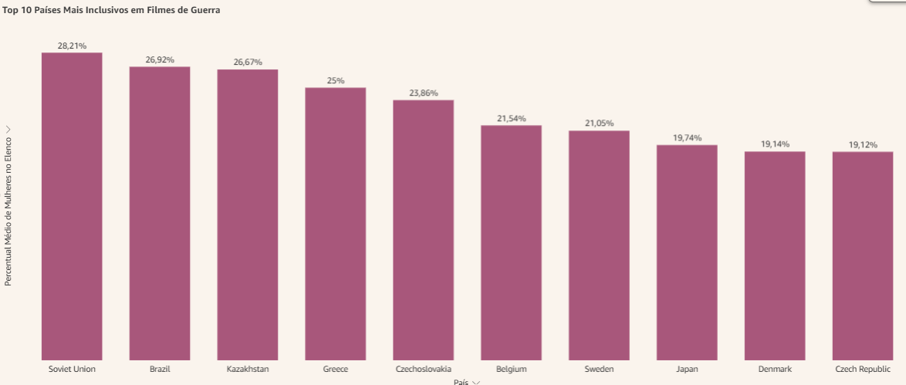

Ao longo desta análise, foi possível observar diversos aspectos importantes sobre a representatividade feminina em filmes de guerra, desde o volume e distribuição temporal das produções até a influência do gênero da direção e a atuação dos principais cineastas e países nesse cenário. Os dados revelam que, apesar de avanços pontuais e crescentes, a participação feminina ainda é significativamente menor em comparação à masculina, tanto nos elencos quanto na direção. A presença expressiva de personagens com gênero desconhecido reforça a necessidade de melhorias na qualidade e completude dos dados para análises futuras mais precisas. Os destaques positivos, como filmes e diretores que promoveram maior inclusão, além dos países que lideram a representatividade feminina, oferecem caminhos e exemplos inspiradores para ampliar a diversidade no gênero de filmes de guerra. Por fim, este trabalho evidencia a importância de se continuar investigando e promovendo a inclusão de mulheres no cinema, com o objetivo de construir narrativas mais equilibradas e representativas, refletindo melhor a diversidade da sociedade.