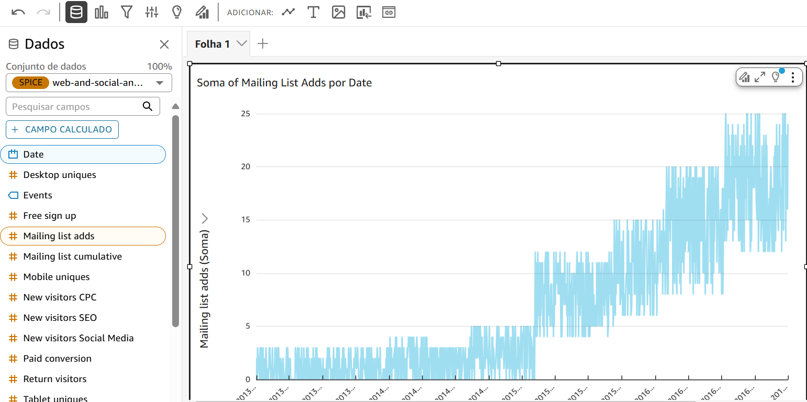
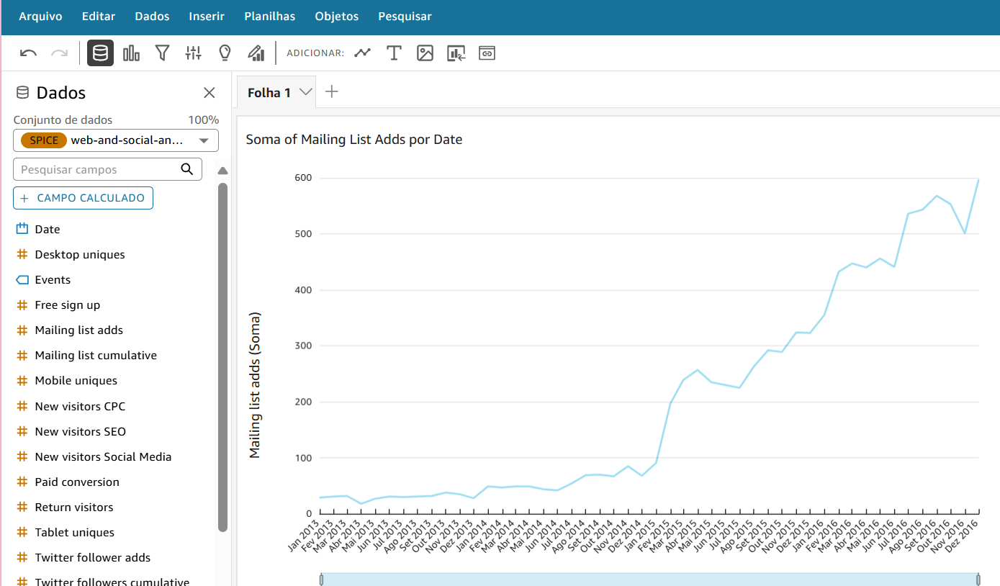

# 🚀 Sprint 8

## 📌 Resumo

Durante a Sprint 8, ocorreu a finalização do desafio na AWS. Após estruturar e processar os dados nas camadas anteriores, me concentrei no consumo dessas informações por meio de visualizações no Amazon QuickSight, assim, utilizei as tabelas da camada Refined, criadas previamente por meio da sprint anterior com foco na modelagem, e configurei o Athena como fonte de dados no QuickSight. Com base no tema escolhido "Representatividade feminina em filmes de guerra", elaborei um dashboard interativo e informativo, capaz de responder às perguntas analíticas propostas no início do projeto. O dashboard reúne diferentes gráficos e visualizações que possibilitam compreender tendências por década, proporções de gênero no elenco, participação de diretoras, protagonismo feminino, entre outros aspectos. Assim, encerro a jornada do desafio final integrando ingestão, processamento e visualização de dados em um fluxo completo de engenharia de dados na AWS.

- **Data & Analytics**: através do D&A obtive as principais informações para fazer minha conta no quicksight, tive uma introdução sobre os termos basicos e os fundamentos do quicksight, fundamentos da visualização de dados e como criar narrativas por meio de dados. Além disso, forneceu as principais informações para seguir com a realização do desafio.

- **Complete Introduction to Amazon QuickSight**: Aprofundei meus conhecimentos sobre o Amazon QuickSight, aprendendo a preparar dados, criar visualizações interativas e desenvolver dashboards eficientes. Pratiquei cálculos com KPIs, totais acumulados, rankings e percentuais, além de aplicar filtros, controles e fórmulas personalizadas. Também explorei a criação de relacionamentos entre tabelas, análise de tendências e recursos visuais para storytelling com dados.

- **Amazon QuickSight - Getting Started (Português)**: Neste curso, aprendi os fundamentos do Amazon QuickSight, o serviço de business intelligence em nuvem da AWS. Explorei seus principais recursos, como a criação e personalização de painéis interativos a partir de diferentes fontes de dados. Compreendi os benefícios do QuickSight, seus conceitos técnicos, casos de uso e modelo de custos, além de experimentar na prática como transformar dados em insights de negócios por meio de visualizações intuitivas e escaláveis.

🤔 *Reflexões*

A Sprint 8 foi um momento muito especial para mim. Concluir esse desafio me trouxe uma sensação de conquista muito grande, principalmente ao olhar para trás e perceber o quanto evoluí desde o início. Entrar em contato com tantas ferramentas novas e conseguir entregar um projeto completo na AWS é algo que me deixa muito feliz.

Sou extremamente grata por todo o apoio que recebi ao longo dessa jornada. Sem a ajuda dos monitores, da Scrum Master, do meu time e de todos que estiveram por perto, eu não teria conseguido chegar até aqui. Cada dúvida respondida, cada incentivo, fez toda a diferença. Estou encerrando essa sprint com a sensação de dever cumprido e com muito mais confiança em mim mesma.

 

---

## 🗂️ Sumário 

1. [Desafio](#desafio)

2. [Exercícios](#exercícios)

3. [Certificados](#certificados)

 

---

# [Desafio](./Desafio/) 

Nesse desafio, concluí a última etapa do projeto final, com foco no consumo e visualização dos dados armazenados na camada Refined do Data Lake. Utilizei o Amazon QuickSight como ferramenta de visualização, conectando-o diretamente às tabelas do Athena, que por sua vez consultam os dados modelados e salvos previamente em formato Parquet.

Com base nas perguntas analíticas definidas anteriormente e no tema escolhido para o projeto, desenvolvi um dashboard interativo que apresenta diferentes perspectivas sobre a representatividade feminina em filmes de guerra. O conjunto de visualizações foi pensado para facilitar a análise por parte do usuário, permitindo observar tendências por década, proporções de gênero no elenco, presença de diretoras, protagonismo feminino e aspectos relacionados aos filmes.

Todos os gráficos foram criados utilizando como fonte exclusiva os dados da camada Refined, garantindo consistência e qualidade nas informações apresentadas. As views utilizadas foram elaboradas previamente no Athena, otimizando a performance das consultas no QuickSight. Finalizei a sprint com a entrega do dashboard completo, junto às evidências organizadas na *Pasta Evidências*. Para detalhes mais técnicos e informações completas sobre a estrutura do projeto, recomendo a consulta ao *Readme Desafio* disponível na *Pasta Desafio*. Seguem os links:

- [Pasta Desafio](./Desafio/) 
- [Pasta Evidências](./Evidências/)
- [Readme Desafio](./Desafio/README.md)

 

---

# [Exercícios](./Exercícios/)

>  Lab AWS QuickSight

Neste exercício, a proposta foi criar uma análise no Amazon QuickSight utilizando um conjunto de dados de amostra, com o objetivo de gerar um gráfico de linhas que exibisse as adições à lista de correspondência ao longo do tempo. O exercício teve como foco a familiarização com o processo de upload de arquivos, configuração de conjunto de dados e personalização de visuais dentro da ferramenta.

Para a execução, utilizei o arquivo web-and-social-analytics.csv, disponibilizado em um arquivo compactado, que foi previamente descompactado para que pudesse ser importado no QuickSight. A análise consistiu em importar os dados, criar um gráfico de linhas automático via AutoGraph e, em seguida, ajustar a granularidade do eixo temporal para exibir os valores agregados por mês.

Resolução:

Etapa 1 – Upload do conjunto de dados:

Acessei a página inicial do Amazon QuickSight, criei uma nova análise e realizei o upload do arquivo web-and-social-analytics.csv, confirmando as configurações padrão de upload. Em seguida, escolhi a opção Visualize, o que me direcionou para a tela de criação da análise.

Etapa 2 – Criação da análise:

Selecionei o conjunto de dados Web and Social Media Analytics e cliquei em Usar na análise. No painel Fields list, adicionei os campos Date e Mailing list adds. O QuickSight, por meio do AutoGraph, criou automaticamente um gráfico de linhas, exibindo as inclusões de e-mails por dia.

Etapa 3 – Ajuste de granularidade temporal:

Expandi o painel Field wells, acessei as configurações do X axis e alterei a agregação para Month. Dessa forma, o gráfico passou a exibir as inclusões mensais na lista de correspondência, tornando a visualização mais consolidada.

Por fim, validei o resultado final, obtendo o gráfico de linhas configurado conforme solicitado.

 

---

# Certificados

Durante essa sprint, concluí o curso Amazon QuickSight - Getting Started (Português). A seguir, compartilho o certificado correspondente:

| Certificado | Link |
|--------|------|
| Amazon QuickSight - Getting Started (Português)| [🔗 Link ](./Certificados/Amazon%20QuickSight%20-%20Getting%20Started%20(Português).pdf) |
 
